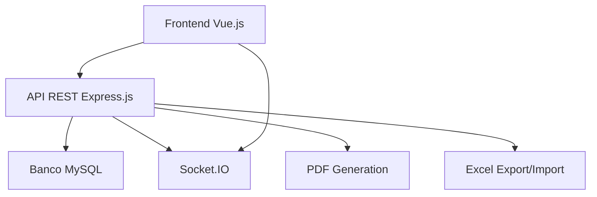

# 📚 Wiki do Sistema Plano Departamental 2.0

<div align="center">

### Sistema de Gerenciamento Acadêmico para Planejamento Departamental e Controle de Matrículas

[](https://nodejs.org/)
[](https://vuejs.org/)
[](https://mysql.com/)
[](https://expressjs.com/)

</div>

---

## 📋 Sumário

- [📋 Sumário](#-sumário)
- [🎯 Sobre este Sistema](#-sobre-este-sistema)
- [🗂️ Estrutura da Documentação](#-estrutura-da-documentação)
  - [📖 Documentação Técnica](#-documentação-técnica)
  - [📋 Documentação Funcional](#-documentação-funcional)
  - [📚 Glossário](#-glossário)
- [🚀 Quick Start](#-quick-start)
- [🎓 Para Desenvolvedores](#-para-desenvolvedores)
- [👥 Para Usuários Finais](#-para-usuários-finais)

---

## 🎯 Sobre este Sistema

O **Plano Departamental 2.0** é um sistema web desenvolvido para a **Universidade Federal de Juiz de Fora (UFJF)** com o objetivo de automatizar e gerenciar:

- **Planejamento Acadêmico Departamental**
- **Controle de Matrículas e Vagas**
- **Gerenciamento de Grades Curriculares**
- **Alocação de Docentes e Disciplinas**
- **Controle de Carga Horária e Turmas**

### 🏗️ Arquitetura do Sistema



---

## 🗂️ Estrutura da Documentação

### 📖 Documentação Técnica

| Seção | Descrição | Link |
|-------|-----------|------|
| **Arquitetura** | Estrutura do sistema, tecnologias e padrões | [📁 Arquitetura](./documentacao-tecnica/arquitetura/) |
| **Configuração** | Setup, ambiente e deployment | [⚙️ Configuração](./documentacao-tecnica/configuracao/) |
| **Módulos** | Análise detalhada de cada módulo | [🔧 Módulos](./documentacao-tecnica/modulos/) |

### 📋 Documentação Funcional

| Seção | Descrição | Link |
|-------|-----------|------|
| **Regras de Negócio** | Regras detalhadas do domínio acadêmico | [📊 Regras](./documentacao-funcional/regras-de-negocio/) |
| **Fluxos de Trabalho** | Processos e workflows do sistema | [🔄 Fluxos](./documentacao-funcional/fluxos-de-trabalho/) |
| **Cenários de Teste** | Comportamentos esperados e cenários de erro | [🧪 Testes](./documentacao-funcional/cenarios-de-teste/) |

### 📚 Glossário

| Seção | Descrição | Link |
|-------|-----------|------|
| **Termos Técnicos** | Definições de tecnologias e conceitos | [💻 Técnico](./glossario/termos-tecnicos.md) |
| **Termos Acadêmicos** | Definições do domínio universitário | [🎓 Acadêmico](./glossario/termos-academicos.md) |

---

## 🚀 Quick Start

### Para Desenvolvedores

```bash
# 1. Clone o repositório
git clone <repository-url>

# 2. Configure o ambiente
cd plano-back && npm install
cd ../plano-front && npm install

# 3. Configure o banco de dados (ver documentação técnica)

# 4. Execute o sistema
cd plano-back && npm start
cd plano-front && npm run serve
```

### Para Usuários

1. **Acesse** o sistema através do navegador
2. **Faça login** com suas credenciais UFJF
3. **Consulte** a [documentação funcional](./documentacao-funcional/) para guias de uso

---

## 🎓 Para Desenvolvedores

### 📋 Checklist de Desenvolvimento

- [ ] Ler [Arquitetura do Sistema](./documentacao-tecnica/arquitetura/)
- [ ] Configurar [Ambiente de Desenvolvimento](./documentacao-tecnica/configuracao/ambiente-desenvolvimento.md)
- [ ] Entender [Regras de Negócio](./documentacao-funcional/regras-de-negocio/)
- [ ] Revisar [Padrões de Código](./documentacao-tecnica/arquitetura/padroes-e-boas-praticas.md)

### 🔧 Ferramentas Recomendadas

- **IDE**: Visual Studio Code
- **Extensões**: Vue.js, ESLint, Prettier
- **Banco**: MySQL Workbench
- **API Testing**: Postman/Insomnia

---

## 👥 Para Usuários Finais

### 📖 Guias de Uso

| Perfil | Documentação |
|--------|--------------|
| **Coordenador** | [Guia do Coordenador](./documentacao-funcional/fluxos-de-trabalho/coordenador.md) |
| **Secretário** | [Guia do Secretário](./documentacao-funcional/fluxos-de-trabalho/secretario.md) |
| **Administrador** | [Guia do Admin](./documentacao-funcional/fluxos-de-trabalho/administrador.md) |

---

<div align="center">

### 📞 Suporte

Para dúvidas ou problemas, consulte nossa documentação detalhada ou entre em contato com a equipe de desenvolvimento.

**Última atualização:** `{{ new Date().toLocaleDateString('pt-BR') }}`

</div>

---

> **💡 Dica**: Esta documentação é viva e está em constante evolução. Contribuições são bem-vindas!