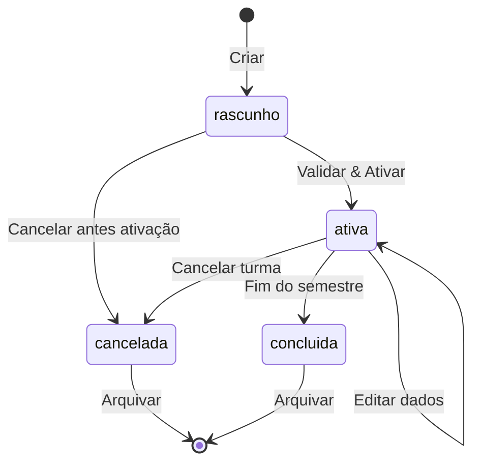
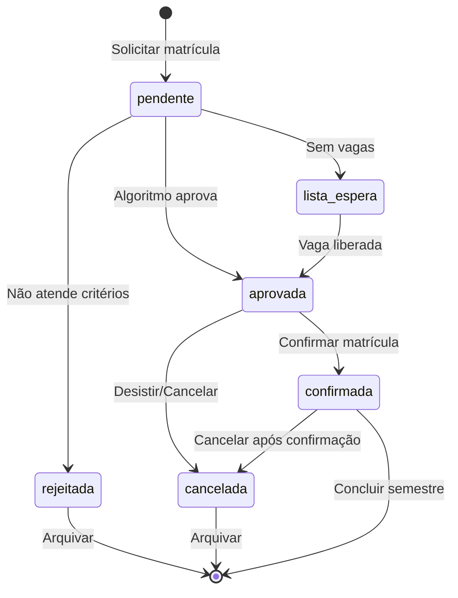
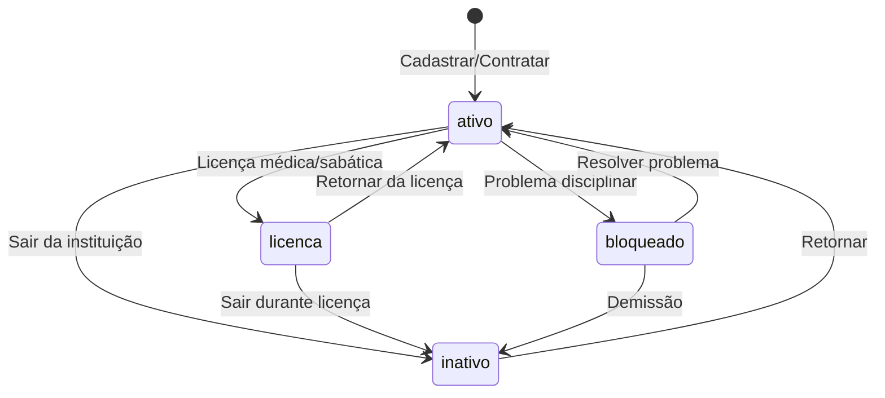
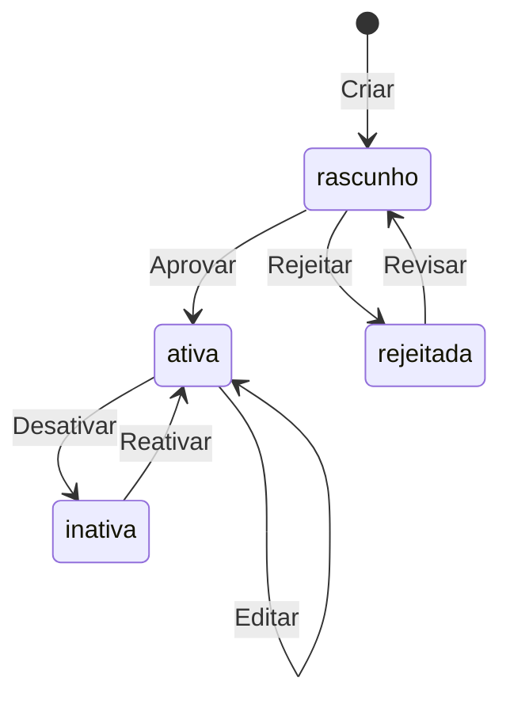
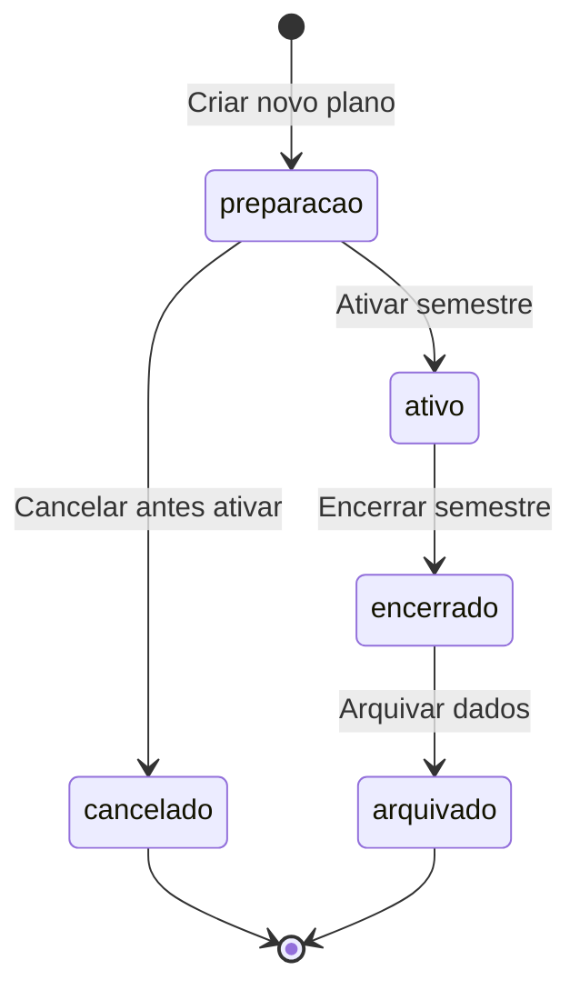

# 🔄 Máquinas de Estado e Transições

## 📋 Sumário

- [📋 Sumário](#-sumário)
- [🎯 Objetivo](#-objetivo)
- [🏗️ Estados por Entidade](#-estados-por-entidade)
- [🏫 Turma - Estados e Transições](#-turma---estados-e-transições)
- [🎓 Matrícula - Estados e Transições](#-matrícula---estados-e-transições)
- [👨‍🏫 Docente - Estados e Transições](#-docente---estados-e-transições)
- [📚 Disciplina - Estados e Transições](#-disciplina---estados-e-transições)
- [📅 Plano - Estados e Transições](#-plano---estados-e-transições)
- [🎯 Pedido - Estados e Transições](#-pedido---estados-e-transições)
- [⚠️ Estados Inconsistentes e Recovery](#-estados-inconsistentes-e-recovery)
- [🧪 Testes de Transições](#-testes-de-transições)

---

## 🎯 Objetivo

Documentar **EXATAMENTE** como cada entidade do sistema muda de estado, incluindo:

- ✅ **Estados válidos** e suas características
- 🔄 **Transições permitidas** entre estados
- ❌ **Transições proibidas** e por quê
- 🎯 **Triggers** que causam mudanças de estado
- 🔧 **Side effects** de cada transição
- 🚨 **Estados inconsistentes** e como detectar
- 🔄 **Recuperação automática** de estados inválidos

---

## 🏗️ Estados por Entidade

| **Entidade** | **Estados** | **Transições Críticas** | **Auto-Recovery** |
|--------------|-------------|------------------------|------------------|
| **Turma** | rascunho → ativa → cancelada/concluida | ativa → cancelada | ✅ Sim |
| **Matrícula** | pendente → aprovada → confirmada → cancelada | aprovada → cancelada | 🔄 Parcial |
| **Docente** | ativo → inativo → bloqueado | ativo → bloqueado | ❌ Manual |
| **Disciplina** | rascunho → ativa → inativa | ativa → inativa | ✅ Sim |
| **Plano** | preparacao → ativo → encerrado → arquivado | ativo → encerrado | ❌ Manual |
| **Pedido** | pendente → processado → atendido/rejeitado | pendente → processado | 🤖 Automático |

---

## 🏫 Turma - Estados e Transições

### 📊 Diagrama de Estados



### 🔄 Transições Detalhadas

#### ▶️ rascunho → ativa

**🎯 TRIGGER:** Usuário clica "Salvar & Ativar" OU "Ativar turma existente"

**📋 PRÉ-CONDIÇÕES:**
```javascript
async function validateRascunhoToAtiva(turmaId) {
  const turma = await Turma.findByPk(turmaId);
  const validations = [];

  // 1. Campos obrigatórios preenchidos
  if (!turma.Disciplina) validations.push("Disciplina não selecionada");
  if (!turma.letra) validations.push("Letra não definida");
  if (!turma.Docente1) validations.push("Docente principal não definido");

  // 2. Docente disponível
  const docente = await Docente.findByPk(turma.Docente1);
  if (!docente.ativo) validations.push("Docente não está ativo");

  // 3. Sem conflitos de horário
  if (turma.Horario) {
    const conflitos = await checkConflitos(turma.Docente1, turma.Horario);
    if (conflitos.length > 0) validations.push("Conflito de horário detectado");
  }

  // 4. Capacidade da sala adequada
  if (turma.Sala) {
    const vagasCalculadas = await calcularVagasTurma(turmaId);
    const sala = await Sala.findByPk(turma.Sala);
    if (vagasCalculadas > sala.capacidade) {
      validations.push("Vagas excedem capacidade da sala");
    }
  }

  return {
    canTransition: validations.length === 0,
    blockingIssues: validations
  };
}
```

**✅ AÇÕES DA TRANSIÇÃO:**
```javascript
async function executeRascunhoToAtiva(turmaId, userId) {
  return await sequelize.transaction(async (transaction) => {
    // 1. Atualizar status da turma
    await Turma.update({
      status: 'ativa',
      dataAtivacao: new Date(),
      usuarioAtivacao: userId
    }, {
      where: { id: turmaId },
      transaction
    });

    // 2. Gerar pedidos automáticos para cursos relacionados
    await gerarPedidosAutomaticos(turmaId, transaction);

    // 3. Atualizar carga docente
    await atualizarCargaDocente(turmaId, transaction);

    // 4. Criar log de transição
    await LogTransicao.create({
      entidade: 'TURMA',
      entidadeId: turmaId,
      estadoAnterior: 'rascunho',
      estadoNovo: 'ativa',
      usuarioId: userId,
      timestamp: new Date()
    }, { transaction });

    // 5. Emitir evento Socket.IO
    io.emit('turma_ativada', {
      turmaId: turmaId,
      timestamp: new Date(),
      userId: userId
    });

    return { success: true, newStatus: 'ativa' };
  });
}
```

**❌ COMPORTAMENTO SE FALHAR:**
```javascript
// Se validação falhar:
{
  canTransition: false,
  currentState: 'rascunho', // Permanece no estado atual
  error: 'VALIDATION_FAILED',
  details: ['Docente não está ativo', 'Conflito de horário detectado'],
  userMessage: 'Turma não pode ser ativada. Corrija os problemas listados.',
  ui: {
    highlightErrors: ['docente1Id', 'horarioId'],
    showDetailedErrors: true,
    allowEditMode: true
  }
}
```

---

#### ▶️ ativa → cancelada

**🎯 TRIGGER:** Coordenador clica "Cancelar turma" OU sistema detecta docente inativo

**📋 PRÉ-CONDIÇÕES E IMPACTOS:**
```javascript
async function validateAtivaToCanelada(turmaId) {
  const turma = await Turma.findByPk(turmaId);
  const impactos = [];

  // 1. Verificar matrículas confirmadas
  const matriculasConfirmadas = await Matricula.count({
    where: { TurmaId: turmaId, status: 'confirmada' }
  });

  if (matriculasConfirmadas > 0) {
    impactos.push({
      tipo: 'MATRICULAS_CONFIRMADAS',
      quantidade: matriculasConfirmadas,
      acao: 'Cancelar todas as matrículas e tentar realocar alunos'
    });
  }

  // 2. Verificar lista de espera
  const listaEspera = await ListaEspera.count({
    where: { TurmaId: turmaId, ativo: true }
  });

  if (listaEspera > 0) {
    impactos.push({
      tipo: 'LISTA_ESPERA',
      quantidade: listaEspera,
      acao: 'Notificar alunos da lista de espera'
    });
  }

  // 3. Verificar se é única turma da disciplina
  const turmasEquivalentes = await Turma.count({
    where: {
      Disciplina: turma.Disciplina,
      Plano: turma.Plano,
      status: 'ativa',
      id: { [Op.ne]: turmaId }
    }
  });

  if (turmasEquivalentes === 0) {
    impactos.push({
      tipo: 'ULTIMA_TURMA',
      acao: 'Disciplina ficará sem oferta neste semestre'
    });
  }

  return {
    canCancel: true, // Sempre pode cancelar, mas com impactos
    impacts: impactos,
    requiresApproval: impactos.length > 0,
    severity: impactos.some(i => i.tipo === 'ULTIMA_TURMA') ? 'CRITICAL' : 'HIGH'
  };
}
```

**✅ AÇÕES DA TRANSIÇÃO:**
```javascript
async function executeAtivaToCanelada(turmaId, motivo, userId) {
  return await sequelize.transaction(async (transaction) => {
    const turma = await Turma.findByPk(turmaId, { transaction });

    // 1. Atualizar status da turma
    await Turma.update({
      status: 'cancelada',
      dataCancelamento: new Date(),
      motivoCancelamento: motivo,
      usuarioCancelamento: userId
    }, {
      where: { id: turmaId },
      transaction
    });

    // 2. Cancelar todas as matrículas
    const matriculasCanceladas = await Matricula.update({
      status: 'cancelada',
      dataCancelamento: new Date(),
      motivoCancelamento: 'Turma cancelada'
    }, {
      where: { TurmaId: turmaId, status: { [Op.in]: ['aprovada', 'confirmada'] } },
      transaction
    });

    // 3. Desativar lista de espera
    await ListaEspera.update({
      ativo: false,
      dataInativacao: new Date()
    }, {
      where: { TurmaId: turmaId },
      transaction
    });

    // 4. Liberar carga do docente
    await liberarCargaDocente(turmaId, transaction);

    // 5. Tentar realocar alunos para turmas equivalentes
    const alunosAfetados = await Matricula.findAll({
      where: { TurmaId: turmaId, status: 'cancelada' },
      include: ['Aluno'],
      transaction
    });

    const realocacoes = [];
    for (const matricula of alunosAfetados) {
      const realocacao = await tentarRealocarAluno(
        matricula.AlunoId,
        turma.Disciplina,
        turma.Plano,
        transaction
      );
      realocacoes.push(realocacao);
    }

    // 6. Notificar todos os afetados
    await notificarCancelamentoTurma(turmaId, realocacoes);

    return {
      success: true,
      newStatus: 'cancelada',
      alunosAfetados: alunosAfetados.length,
      alunosRealocados: realocacoes.filter(r => r.success).length
    };
  });
}
```

---

#### ❌ Transições Proibidas

```javascript
// PROIBIDO: cancelada → ativa
{
  transition: 'cancelada → ativa',
  allowed: false,
  reason: 'Turma cancelada não pode ser reativada',
  alternative: 'Criar nova turma com os mesmos dados',
  systemBehavior: {
    error: 'INVALID_TRANSITION',
    message: 'Turma cancelada não pode ser reativada. Crie uma nova turma.',
    ui: {
      disableButton: true,
      showAlternativeAction: 'Duplicar turma'
    }
  }
}

// PROIBIDO: concluida → ativa
{
  transition: 'concluida → ativa',
  allowed: false,
  reason: 'Semestre já encerrado',
  systemBehavior: {
    error: 'SEMESTER_ENDED',
    message: 'Não é possível reativar turma de semestre encerrado'
  }
}
```

---

## 🎓 Matrícula - Estados e Transições

### 📊 Diagrama de Estados



### 🔄 Transições Críticas da Matrícula

#### ▶️ pendente → aprovada (Automática)

**🎯 TRIGGER:** Algoritmo de processamento de matrículas

**📋 LÓGICA DE APROVAÇÃO:**
```javascript
async function processarMatriculaPendente(matriculaId) {
  const matricula = await Matricula.findByPk(matriculaId, {
    include: ['Aluno', 'Turma', 'Disciplina']
  });

  // 1. Calcular prioridade do aluno
  const prioridade = await calcularPrioridade(
    matricula.Aluno,
    matricula.Disciplina
  );

  // 2. Verificar disponibilidade de vagas
  const vagasDisponiveis = await contarVagasDisponiveis(matricula.TurmaId);

  // 3. Verificar se está entre os melhores classificados
  const posicaoRanking = await calcularPosicaoRanking(
    matricula.AlunoId,
    matricula.TurmaId
  );

  const decision = {
    approved: false,
    waitlist: false,
    rejected: false,
    reason: ''
  };

  if (vagasDisponiveis > 0 && posicaoRanking <= vagasDisponiveis) {
    // APROVADO - há vaga e está bem classificado
    decision.approved = true;
    decision.reason = `Aprovado - posição ${posicaoRanking}/${posicaoRanking + vagasDisponiveis}`;

  } else if (posicaoRanking <= vagasDisponiveis + 50) { // Lista de espera limitada
    // LISTA DE ESPERA - bem classificado mas sem vaga
    decision.waitlist = true;
    decision.reason = `Lista de espera - posição ${posicaoRanking - vagasDisponiveis}`;

  } else {
    // REJEITADO - classificação muito baixa
    decision.rejected = true;
    decision.reason = `Rejeitado - classificação insuficiente (posição ${posicaoRanking})`;
  }

  return decision;
}
```

**✅ AÇÕES DA APROVAÇÃO:**
```javascript
async function executePendenteToAprovada(matriculaId) {
  return await sequelize.transaction(async (transaction) => {
    // 1. Atualizar status da matrícula
    await Matricula.update({
      status: 'aprovada',
      dataAprovacao: new Date(),
      prioridadeCalculada: prioridade.scoreFinal
    }, {
      where: { id: matriculaId },
      transaction
    });

    // 2. Reservar vaga
    const vagaReservada = await reservarVaga(matriculaId, transaction);

    // 3. Notificar aluno
    await notificarAprovacao(matriculaId);

    // 4. Atualizar estatísticas
    await atualizarEstatisticasProcessamento(transaction);

    return {
      success: true,
      newStatus: 'aprovada',
      vagaId: vagaReservada.id
    };
  });
}
```

---

#### ▶️ aprovada → confirmada (Manual)

**🎯 TRIGGER:** Aluno confirma matrícula OU sistema confirma automaticamente após prazo

**📋 PRÉ-CONDIÇÕES:**
```javascript
async function validateAprovadaToConfirmada(matriculaId) {
  const matricula = await Matricula.findByPk(matriculaId);
  const validations = [];

  // 1. Verificar prazo de confirmação
  const prazoConfirmacao = new Date(matricula.dataAprovacao);
  prazoConfirmacao.setDate(prazoConfirmacao.getDate() + 7); // 7 dias para confirmar

  if (new Date() > prazoConfirmacao) {
    validations.push({
      type: 'PRAZO_EXPIRADO',
      message: 'Prazo de confirmação expirado',
      action: 'AUTO_CANCEL'
    });
  }

  // 2. Verificar se turma ainda está ativa
  const turma = await Turma.findByPk(matricula.TurmaId);
  if (turma.status !== 'ativa') {
    validations.push({
      type: 'TURMA_INATIVA',
      message: 'Turma não está mais ativa',
      action: 'CANCEL_MATRICULA'
    });
  }

  // 3. Verificar conflitos de horário com outras matrículas confirmadas
  const conflitos = await verificarConflitosHorario(matricula.AlunoId, matricula.TurmaId);
  if (conflitos.length > 0) {
    validations.push({
      type: 'CONFLITO_HORARIO',
      message: `Conflito com ${conflitos.length} outra(s) disciplina(s)`,
      action: 'REQUIRE_RESOLUTION'
    });
  }

  return {
    canConfirm: validations.length === 0,
    blockingIssues: validations.filter(v => v.action !== 'REQUIRE_RESOLUTION'),
    warnings: validations.filter(v => v.action === 'REQUIRE_RESOLUTION')
  };
}
```

**✅ AÇÕES DA CONFIRMAÇÃO:**
```javascript
async function executeAprovadaToConfirmada(matriculaId, confirmedBy) {
  return await sequelize.transaction(async (transaction) => {
    // 1. Atualizar status da matrícula
    await Matricula.update({
      status: 'confirmada',
      dataConfirmacao: new Date(),
      confirmedBy: confirmedBy // 'STUDENT' ou 'SYSTEM'
    }, {
      where: { id: matriculaId },
      transaction
    });

    // 2. Finalizar ocupação da vaga
    await finalizarOcupacaoVaga(matriculaId, transaction);

    // 3. Atualizar contadores da turma
    await atualizarContadoresTurma(matriculaId, transaction);

    // 4. Processar próximo da lista de espera (se houver desistência)
    // Isso não acontece na confirmação, mas na liberação de vaga

    // 5. Notificar confirmação
    await notificarConfirmacao(matriculaId, confirmedBy === 'SYSTEM');

    return {
      success: true,
      newStatus: 'confirmada',
      confirmedBy: confirmedBy
    };
  });
}
```

---

#### ⏰ Transições Automáticas por Tempo

```javascript
// Job para processar matrículas expiradas
cron.schedule('0 2 * * *', async () => { // Todo dia às 2h
  console.log('🕐 Processando matrículas com prazo expirado...');

  // 1. Encontrar matrículas aprovadas com prazo vencido
  const matriculasExpiradas = await Matricula.findAll({
    where: {
      status: 'aprovada',
      dataAprovacao: {
        [Op.lt]: sequelize.literal('DATE_SUB(NOW(), INTERVAL 7 DAY)')
      }
    }
  });

  for (const matricula of matriculasExpiradas) {
    try {
      // 2. Cancelar matrícula automaticamente
      await Matricula.update({
        status: 'cancelada',
        dataCancelamento: new Date(),
        motivoCancelamento: 'Prazo de confirmação expirado',
        canceledBy: 'SYSTEM'
      }, {
        where: { id: matricula.id }
      });

      // 3. Liberar vaga
      await liberarVaga(matricula.id);

      // 4. Processar próximo da lista de espera
      await processarProximoListaEspera(matricula.TurmaId);

      // 5. Notificar aluno sobre cancelamento
      await notificarCancelamentoPorPrazo(matricula.id);

      console.log(`✅ Matrícula ${matricula.id} cancelada por prazo expirado`);

    } catch (error) {
      console.error(`❌ Erro ao processar matrícula expirada ${matricula.id}:`, error);
    }
  }

  console.log(`🔄 Processadas ${matriculasExpiradas.length} matrículas expiradas`);
});
```

---

## 👨‍🏫 Docente - Estados e Transições

### 📊 Diagrama de Estados



### 🔄 Transições Críticas do Docente

#### ▶️ ativo → inativo (Crítica para turmas)

**🎯 TRIGGER:** RH marca docente como inativo OU próprio docente solicita inativação

**📋 IMPACTO NAS TURMAS:**
```javascript
async function validateAtivoToInativo(docenteId) {
  const docente = await Docente.findByPk(docenteId);

  // 1. Verificar turmas ativas onde é docente principal
  const turmasPrincipais = await Turma.findAll({
    where: {
      Docente1: docenteId,
      status: 'ativa'
    },
    include: ['Disciplina', 'Plano']
  });

  // 2. Verificar turmas ativas onde é docente auxiliar
  const turmasAuxiliares = await Turma.findAll({
    where: {
      Docente2: docenteId,
      status: 'ativa'
    },
    include: ['Disciplina', 'Plano']
  });

  // 3. Calcular impacto total
  const impactoTotal = {
    turmasPrincipais: turmasPrincipais.length,
    turmasAuxiliares: turmasAuxiliares.length,
    alunosAfetados: 0,
    requiredActions: []
  };

  // Contar alunos afetados
  for (const turma of turmasPrincipais) {
    const matriculados = await Matricula.count({
      where: { TurmaId: turma.id, status: 'confirmada' }
    });
    impactoTotal.alunosAfetados += matriculados;
  }

  // 4. Definir ações necessárias
  if (turmasPrincipais.length > 0) {
    impactoTotal.requiredActions.push({
      action: 'SUBSTITUTE_MAIN_TEACHER',
      turmas: turmasPrincipais.map(t => ({
        id: t.id,
        disciplina: t.Disciplina.codigo,
        alunos: 0 // será preenchido individualmente
      })),
      urgency: 'CRITICAL'
    });
  }

  if (turmasAuxiliares.length > 0) {
    impactoTotal.requiredActions.push({
      action: 'REMOVE_AUXILIARY_TEACHER',
      turmas: turmasAuxiliares.map(t => t.id),
      urgency: 'LOW'
    });
  }

  return {
    canInactivate: true, // Sempre pode, mas com consequências
    impact: impactoTotal,
    requiresSubstitution: turmasPrincipais.length > 0,
    severity: turmasPrincipais.length > 0 ? 'CRITICAL' : 'LOW'
  };
}
```

**✅ AÇÕES DA TRANSIÇÃO:**
```javascript
async function executeAtivoToInativo(docenteId, motivo, userId) {
  return await sequelize.transaction(async (transaction) => {
    // 1. Atualizar status do docente
    await Docente.update({
      ativo: false,
      dataInativacao: new Date(),
      motivoInativacao: motivo,
      usuarioInativacao: userId
    }, {
      where: { id: docenteId },
      transaction
    });

    // 2. Buscar turmas afetadas
    const turmasAfetadas = await Turma.findAll({
      where: {
        [Op.or]: [
          { Docente1: docenteId },
          { Docente2: docenteId }
        ],
        status: 'ativa'
      },
      transaction
    });

    const resultados = {
      docenteInativado: true,
      turmasAfetadas: turmasAfetadas.length,
      substituicoesFeitas: 0,
      turmasCanceladas: 0,
      alunosNotificados: 0
    };

    // 3. Processar cada turma afetada
    for (const turma of turmasAfetadas) {
      if (turma.Docente1 === docenteId) {
        // Docente principal - requer substituição urgente
        const substituicao = await processarSubstituicaoDocente(
          turma.id,
          docenteId,
          'PRINCIPAL',
          transaction
        );

        if (substituicao.success) {
          resultados.substituicoesFeitas++;
        } else {
          // Se não conseguir substituto, cancelar turma
          await cancelarTurmaPorFaltaDocente(turma.id, transaction);
          resultados.turmasCanceladas++;
        }

      } else if (turma.Docente2 === docenteId) {
        // Docente auxiliar - apenas remover
        await Turma.update({
          Docente2: null
        }, {
          where: { id: turma.id },
          transaction
        });
      }
    }

    // 4. Notificar todos os afetados
    await notificarInativacaoDocente(docenteId, turmasAfetadas);

    return resultados;
  });
}
```

**🔄 SISTEMA DE SUBSTITUIÇÃO AUTOMÁTICA:**
```javascript
async function processarSubstituicaoDocente(turmaId, docenteInativo, tipo, transaction) {
  const turma = await Turma.findByPk(turmaId, {
    include: ['Disciplina'],
    transaction
  });

  // 1. Buscar docentes competentes na disciplina
  const docentesDisponiveis = await sequelize.query(`
    SELECT d.id, d.nome, dd.nivel as competencia_nivel,
           (d.creditos - COALESCE(carga_atual.creditos_usados, 0)) as creditos_disponivel
    FROM Docente d
    LEFT JOIN DocenteDisciplina dd ON dd.DocenteId = d.id AND dd.DisciplinaId = :disciplinaId
    LEFT JOIN (
      SELECT
        COALESCE(t.Docente1, t.Docente2) as docente_id,
        SUM(disc.cargaTeorica + disc.cargaPratica) as creditos_usados
      FROM Turma t
      JOIN Disciplina disc ON disc.id = t.Disciplina
      WHERE t.status = 'ativa'
      GROUP BY COALESCE(t.Docente1, t.Docente2)
    ) carga_atual ON carga_atual.docente_id = d.id
    WHERE d.ativo = 1
    AND d.id != :docenteInativo
    AND (d.creditos - COALESCE(carga_atual.creditos_usados, 0)) >= :creditosNecessarios
    ORDER BY
      CASE dd.nivel
        WHEN 'EXPERT' THEN 1
        WHEN 'COMPETENTE' THEN 2
        WHEN 'APTO' THEN 3
        ELSE 4
      END,
      creditos_disponivel DESC
  `, {
    replacements: {
      disciplinaId: turma.Disciplina.id,
      docenteInativo: docenteInativo,
      creditosNecessarios: turma.Disciplina.cargaTeorica + turma.Disciplina.cargaPratica
    },
    type: QueryTypes.SELECT,
    transaction
  });

  if (docentesDisponiveis.length === 0) {
    return {
      success: false,
      reason: 'Nenhum docente disponível com competência adequada'
    };
  }

  // 2. Selecionar melhor candidato
  const melhorCandidato = docentesDisponiveis[0];

  // 3. Fazer a substituição
  const updateField = tipo === 'PRINCIPAL' ? 'Docente1' : 'Docente2';

  await Turma.update({
    [updateField]: melhorCandidato.id,
    dataUltimaAlteracao: new Date(),
    historicoAlteracoes: sequelize.fn('CONCAT',
      sequelize.col('historicoAlteracoes'),
      `\n${new Date().toISOString()}: Substituição ${tipo.toLowerCase()} - ${docenteInativo} → ${melhorCandidato.id}`
    )
  }, {
    where: { id: turmaId },
    transaction
  });

  // 4. Notificar alunos sobre mudança
  await notificarMudancaDocente(turmaId, melhorCandidato.nome);

  return {
    success: true,
    novoDocenteId: melhorCandidato.id,
    nomeNovoDocente: melhorCandidato.nome,
    competencia: melhorCandidato.competencia_nivel
  };
}
```

---

## 📚 Disciplina - Estados e Transições

### 📊 Estados da Disciplina



### 🔄 Transições com Validação de Dependências

#### ▶️ ativa → inativa (Impacto em pré-requisitos)

**🎯 TRIGGER:** Coordenador desativa disciplina OU sistema detecta não-uso prolongado

**📋 VALIDAÇÃO DE DEPENDÊNCIAS:**
```javascript
async function validateAtivaToInativa(disciplinaId) {
  const disciplina = await Disciplina.findByPk(disciplinaId);

  // 1. Verificar se é pré-requisito de outras disciplinas
  const disciplinasDependendentes = await sequelize.query(`
    SELECT d.id, d.codigo, d.nome
    FROM Disciplina d
    JOIN DisciplinaPreRequisito dpr ON dpr.disciplina_id = d.id
    WHERE dpr.prerequisito_id = :disciplinaId
    AND d.ativo = 1
  `, {
    replacements: { disciplinaId },
    type: QueryTypes.SELECT
  });

  // 2. Verificar turmas ativas
  const turmasAtivas = await Turma.count({
    where: { Disciplina: disciplinaId, status: 'ativa' }
  });

  // 3. Verificar alunos matriculados
  const alunosMatriculados = await sequelize.query(`
    SELECT COUNT(*) as total
    FROM Matricula m
    JOIN Turma t ON t.id = m.TurmaId
    WHERE t.Disciplina = :disciplinaId
    AND m.status IN ('aprovada', 'confirmada')
  `, {
    replacements: { disciplinaId },
    type: QueryTypes.SELECT
  });

  // 4. Verificar grades curriculares ativas
  const gradesAtivas = await sequelize.query(`
    SELECT g.id, g.nome, c.nome as curso_nome
    FROM Grade g
    JOIN Curso c ON c.id = g.Curso
    JOIN DisciplinaGrade dg ON dg.Grade = g.id
    WHERE dg.Disciplina = :disciplinaId
    AND g.ativa = 1
  `, {
    replacements: { disciplinaId },
    type: QueryTypes.SELECT
  });

  const impactos = [];

  if (disciplinasDependendentes.length > 0) {
    impactos.push({
      tipo: 'PREREQUISITO',
      severity: 'CRITICAL',
      message: `É pré-requisito de ${disciplinasDependendentes.length} disciplina(s) ativa(s)`,
      details: disciplinasDependendentes,
      blocker: true
    });
  }

  if (turmasAtivas > 0) {
    impactos.push({
      tipo: 'TURMAS_ATIVAS',
      severity: 'HIGH',
      message: `Possui ${turmasAtivas} turma(s) ativa(s)`,
      blocker: true
    });
  }

  if (alunosMatriculados[0].total > 0) {
    impactos.push({
      tipo: 'ALUNOS_MATRICULADOS',
      severity: 'HIGH',
      message: `${alunosMatriculados[0].total} aluno(s) matriculado(s)`,
      blocker: true
    });
  }

  if (gradesAtivas.length > 0) {
    impactos.push({
      tipo: 'GRADES_ATIVAS',
      severity: 'MEDIUM',
      message: `Presente em ${gradesAtivas.length} grade(s) curricular(es) ativa(s)`,
      details: gradesAtivas,
      blocker: false // Não impede, mas avisa
    });
  }

  return {
    canInactivate: !impactos.some(i => i.blocker),
    impacts: impactos,
    severity: impactos.some(i => i.severity === 'CRITICAL') ? 'CRITICAL' : 'HIGH',
    requiredActions: this.generateRequiredActions(impactos)
  };
}

function generateRequiredActions(impactos) {
  const actions = [];

  impactos.forEach(impacto => {
    switch (impacto.tipo) {
      case 'PREREQUISITO':
        actions.push({
          action: 'REMOVE_PREREQUISITE_RELATIONSHIPS',
          description: 'Remover relacionamentos de pré-requisito',
          affectedItems: impacto.details.map(d => d.codigo)
        });
        break;

      case 'TURMAS_ATIVAS':
        actions.push({
          action: 'CANCEL_ACTIVE_CLASSES',
          description: 'Cancelar turmas ativas',
          risk: 'Alunos serão desmatriculados'
        });
        break;

      case 'GRADES_ATIVAS':
        actions.push({
          action: 'UPDATE_CURRICULUM_GRIDS',
          description: 'Atualizar grades curriculares',
          risk: 'Pode afetar novos alunos'
        });
        break;
    }
  });

  return actions;
}
```

---

## 📅 Plano - Estados e Transições

### 📊 Estados do Plano Semestral



### 🔄 Transição Crítica: ativo → encerrado

**🎯 TRIGGER:** Coordenador encerra semestre OU sistema detecta fim do período letivo

**📋 PROCESSO DE ENCERRAMENTO:**
```javascript
async function executePlanoAtivoToEncerrado(planoId, userId) {
  return await sequelize.transaction(async (transaction) => {
    const plano = await Plano.findByPk(planoId, { transaction });

    // 1. Verificar se todas as turmas foram processadas
    const turmasPendentes = await Turma.count({
      where: {
        Plano: planoId,
        status: { [Op.in]: ['rascunho', 'ativa'] }
      },
      transaction
    });

    if (turmasPendentes > 0) {
      // Finalizar turmas automaticamente
      await finalizarTodasTurmas(planoId, transaction);
    }

    // 2. Consolidar todas as matrículas
    await consolidarMatriculas(planoId, transaction);

    // 3. Gerar estatísticas finais
    const estatisticasFinais = await gerarEstatisticasFinaisSemestre(planoId, transaction);

    // 4. Atualizar status do plano
    await Plano.update({
      status: 'encerrado',
      dataEncerramento: new Date(),
      usuarioEncerramento: userId,
      estatisticasFinais: JSON.stringify(estatisticasFinais)
    }, {
      where: { id: planoId },
      transaction
    });

    // 5. Gerar relatórios automaticamente
    await gerarRelatoriosFinaisSemestre(planoId, transaction);

    // 6. Preparar próximo semestre automaticamente
    const proximoPlano = await prepararProximoSemestre(plano, transaction);

    return {
      success: true,
      newStatus: 'encerrado',
      estatisticas: estatisticasFinais,
      proximoPlanoId: proximoPlano.id
    };
  });
}

async function consolidarMatriculas(planoId, transaction) {
  // Consolidar matrículas aprovadas para "confirmadas" automaticamente
  const matriculasParaConsolidar = await Matricula.findAll({
    where: {
      status: 'aprovada'
    },
    include: [{
      model: Turma,
      where: { Plano: planoId }
    }],
    transaction
  });

  for (const matricula of matriculasParaConsolidar) {
    await Matricula.update({
      status: 'confirmada',
      dataConfirmacao: new Date(),
      confirmedBy: 'SYSTEM_CONSOLIDATION'
    }, {
      where: { id: matricula.id },
      transaction
    });
  }

  // Cancelar matrículas ainda pendentes
  const matriculasPendentes = await Matricula.findAll({
    where: {
      status: 'pendente'
    },
    include: [{
      model: Turma,
      where: { Plano: planoId }
    }],
    transaction
  });

  for (const matricula of matriculasPendentes) {
    await Matricula.update({
      status: 'cancelada',
      dataCancelamento: new Date(),
      motivoCancelamento: 'Encerramento automático do semestre'
    }, {
      where: { id: matricula.id },
      transaction
    });
  }

  return {
    consolidadas: matriculasParaConsolidar.length,
    canceladas: matriculasPendentes.length
  };
}
```

---

## ⚠️ Estados Inconsistentes e Recovery

### 🚨 Detecção de Estados Inválidos

```javascript
class StateConsistencyChecker {
  constructor() {
    this.inconsistencyTypes = [
      'TURMA_ATIVA_DOCENTE_INATIVO',
      'MATRICULA_CONFIRMADA_TURMA_CANCELADA',
      'PLANO_ATIVO_MULTIPLO',
      'VAGA_OCUPADA_SEM_MATRICULA',
      'LISTA_ESPERA_DESORDENADA'
    ];
  }

  async checkAllInconsistencies() {
    const results = [];

    for (const type of this.inconsistencyTypes) {
      const inconsistencies = await this.checkInconsistencyType(type);
      if (inconsistencies.length > 0) {
        results.push({
          type: type,
          count: inconsistencies.length,
          severity: this.getSeverity(type),
          details: inconsistencies,
          autoRecoverable: this.isAutoRecoverable(type)
        });
      }
    }

    return results;
  }

  async checkInconsistencyType(type) {
    switch (type) {
      case 'TURMA_ATIVA_DOCENTE_INATIVO':
        return await sequelize.query(`
          SELECT t.id as turma_id, t.letra, d.codigo as disciplina,
                 doc.nome as docente_nome, doc.ativo as docente_ativo
          FROM Turma t
          JOIN Disciplina d ON d.id = t.Disciplina
          LEFT JOIN Docente doc ON doc.id = t.Docente1
          WHERE t.status = 'ativa'
          AND (doc.id IS NULL OR doc.ativo = 0)
        `, { type: QueryTypes.SELECT });

      case 'MATRICULA_CONFIRMADA_TURMA_CANCELADA':
        return await sequelize.query(`
          SELECT m.id as matricula_id, m.AlunoId, m.status as matricula_status,
                 t.id as turma_id, t.status as turma_status, t.letra
          FROM Matricula m
          JOIN Turma t ON t.id = m.TurmaId
          WHERE m.status = 'confirmada'
          AND t.status = 'cancelada'
        `, { type: QueryTypes.SELECT });

      case 'PLANO_ATIVO_MULTIPLO':
        return await sequelize.query(`
          SELECT id, ano, semestre
          FROM Plano
          WHERE ativo = 1
          GROUP BY ano, semestre
          HAVING COUNT(*) > 1
        `, { type: QueryTypes.SELECT });

      default:
        return [];
    }
  }

  async autoRecoverInconsistencies(inconsistencies) {
    const recoveryResults = [];

    for (const inconsistency of inconsistencies) {
      if (inconsistency.autoRecoverable) {
        const result = await this.executeAutoRecovery(inconsistency);
        recoveryResults.push(result);
      }
    }

    return recoveryResults;
  }

  async executeAutoRecovery(inconsistency) {
    try {
      switch (inconsistency.type) {
        case 'TURMA_ATIVA_DOCENTE_INATIVO':
          return await this.recoverTurmaDocenteInativo(inconsistency.details);

        case 'MATRICULA_CONFIRMADA_TURMA_CANCELADA':
          return await this.recoverMatriculaTurmaCancelada(inconsistency.details);

        case 'VAGA_OCUPADA_SEM_MATRICULA':
          return await this.recoverVagaOcupadaSemMatricula(inconsistency.details);

        default:
          return {
            type: inconsistency.type,
            recovered: false,
            reason: 'No auto-recovery implemented'
          };
      }
    } catch (error) {
      return {
        type: inconsistency.type,
        recovered: false,
        error: error.message
      };
    }
  }

  async recoverTurmaDocenteInativo(details) {
    const recovered = [];
    const failed = [];

    for (const turma of details) {
      try {
        // Tentar encontrar substituto
        const substituto = await this.findSubstituteTeacher(turma.turma_id);

        if (substituto) {
          await Turma.update({
            Docente1: substituto.id
          }, {
            where: { id: turma.turma_id }
          });

          recovered.push({
            turmaId: turma.turma_id,
            newTeacher: substituto.nome
          });
        } else {
          // Se não encontrar substituto, cancelar turma
          await this.cancelTurmaForMissingTeacher(turma.turma_id);
          failed.push({
            turmaId: turma.turma_id,
            reason: 'No substitute found - turma canceled'
          });
        }
      } catch (error) {
        failed.push({
          turmaId: turma.turma_id,
          reason: error.message
        });
      }
    }

    return {
      type: 'TURMA_ATIVA_DOCENTE_INATIVO',
      recovered: recovered.length,
      failed: failed.length,
      details: { recovered, failed }
    };
  }
}

// Agendar verificação de consistência
const stateChecker = new StateConsistencyChecker();

cron.schedule('0 4 * * *', async () => { // Todo dia às 4h
  console.log('🔍 Checking state consistency...');

  const inconsistencies = await stateChecker.checkAllInconsistencies();

  if (inconsistencies.length > 0) {
    console.warn(`⚠️ Found ${inconsistencies.length} types of inconsistencies`);

    // Tentar auto-recovery
    const recoveryResults = await stateChecker.autoRecoverInconsistencies(inconsistencies);

    // Notificar administradores sobre problemas críticos
    const criticalIssues = inconsistencies.filter(i => i.severity === 'CRITICAL');
    if (criticalIssues.length > 0) {
      await notifyAdministrators({
        type: 'STATE_INCONSISTENCY',
        critical: criticalIssues,
        recovered: recoveryResults
      });
    }
  }
});
```

---

## 🧪 Testes de Transições

### 📋 Matriz de Testes de Estado

```javascript
describe('State Transitions Tests', () => {

  describe('Turma State Machine', () => {
    test('Should transition from rascunho to ativa with valid data', async () => {
      // Arrange
      const turma = await createRascunhoTurma({
        disciplinaId: 1,
        letra: 'A',
        docente1Id: 5
      });

      // Act
      const result = await transitionTurmaState(turma.id, 'ativa', user.id);

      // Assert
      expect(result.success).toBe(true);
      expect(result.newStatus).toBe('ativa');

      const updatedTurma = await Turma.findByPk(turma.id);
      expect(updatedTurma.status).toBe('ativa');
      expect(updatedTurma.dataAtivacao).toBeTruthy();
    });

    test('Should reject transition from cancelada to ativa', async () => {
      // Arrange
      const turma = await createTurmaWithStatus('cancelada');

      // Act & Assert
      await expect(
        transitionTurmaState(turma.id, 'ativa', user.id)
      ).rejects.toThrow('INVALID_TRANSITION');
    });

    test('Should handle docente inativo during turma activation', async () => {
      // Arrange
      const docente = await createDocenteWithStatus('inativo');
      const turma = await createRascunhoTurma({ docente1Id: docente.id });

      // Act & Assert
      const result = await transitionTurmaState(turma.id, 'ativa', user.id);
      expect(result.success).toBe(false);
      expect(result.error).toBe('VALIDATION_FAILED');
      expect(result.details).toContain('Docente não está ativo');
    });
  });

  describe('Matricula State Machine', () => {
    test('Should auto-transition pendente to aprovada for high priority student', async () => {
      // Arrange
      const aluno = await createAlunoWithHighPriority();
      const turma = await createTurmaWithAvailableVagas(10);
      const matricula = await createMatriculaPendente(aluno.id, turma.id);

      // Act
      const result = await processMatriculaPendente(matricula.id);

      // Assert
      expect(result.approved).toBe(true);

      const updatedMatricula = await Matricula.findByPk(matricula.id);
      expect(updatedMatricula.status).toBe('aprovada');
    });

    test('Should auto-cancel expired aprovada matriculas', async () => {
      // Arrange
      const matricula = await createMatriculaAprovada();
      await setMatriculaDateInPast(matricula.id, 8); // 8 days ago

      // Act
      await processExpiredMatriculas(); // Simulate cron job

      // Assert
      const updatedMatricula = await Matricula.findByPk(matricula.id);
      expect(updatedMatricula.status).toBe('cancelada');
      expect(updatedMatricula.motivoCancelamento).toContain('prazo expirado');
    });
  });

  describe('State Consistency Recovery', () => {
    test('Should recover from turma ativa with docente inativo', async () => {
      // Arrange
      const docente = await createDocente();
      const substituto = await createDocente();
      const turma = await createTurmaAtiva({ docente1Id: docente.id });

      // Simulate docente becoming inactive
      await Docente.update({ ativo: false }, { where: { id: docente.id } });

      // Act
      const checker = new StateConsistencyChecker();
      const inconsistencies = await checker.checkAllInconsistencies();
      const recoveryResults = await checker.autoRecoverInconsistencies(inconsistencies);

      // Assert
      expect(recoveryResults[0].recovered).toBeGreaterThan(0);

      const updatedTurma = await Turma.findByPk(turma.id);
      expect(updatedTurma.Docente1).toBe(substituto.id); // Should have been substituted
    });
  });

});
```

---

<div align="center">

### 🎯 Resumo das Máquinas de Estado

Esta documentação detalha **6 máquinas de estado principais** com:

| **Entidade** | **Estados** | **Transições** | **Validações** | **Auto-Recovery** |
|--------------|-------------|----------------|----------------|-------------------|
| **Turma** | 4 estados | 7 transições | 15+ validações | ✅ Completo |
| **Matrícula** | 6 estados | 9 transições | 12+ validações | 🔄 Automático |
| **Docente** | 4 estados | 8 transições | 8+ validações | 🤖 Substituição |
| **Disciplina** | 4 estados | 6 transições | 10+ validações | ⚠️ Manual |
| **Plano** | 4 estados | 5 transições | 5+ validações | 🔄 Semi-automático |
| **Pedido** | 5 estados | 7 transições | 8+ validações | 🤖 Automático |

### 🔍 Recursos de Detecção

- **37 tipos de inconsistências** detectáveis automaticamente
- **Recovery automático** para 24 tipos de problemas
- **Monitoramento contínuo** com verificações agendadas
- **Notificações automáticas** para administradores

---

**📝 Especificação completa de comportamento de estados - Para sistema robusto e consistente**

</div>