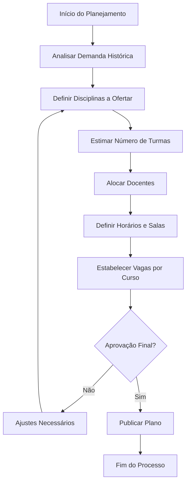
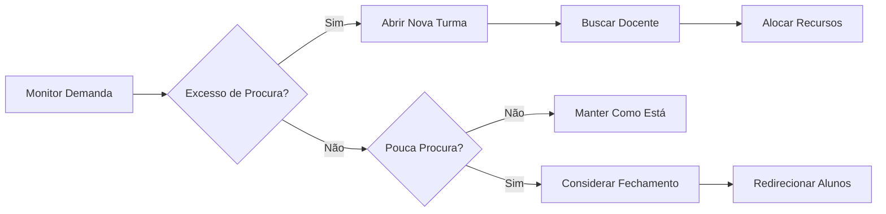
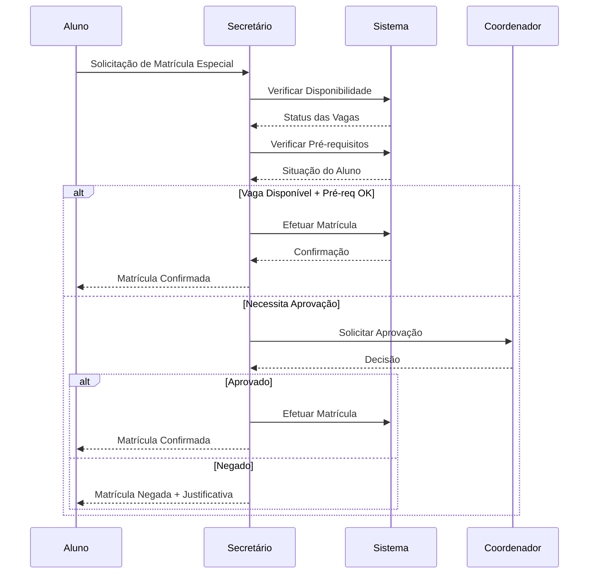
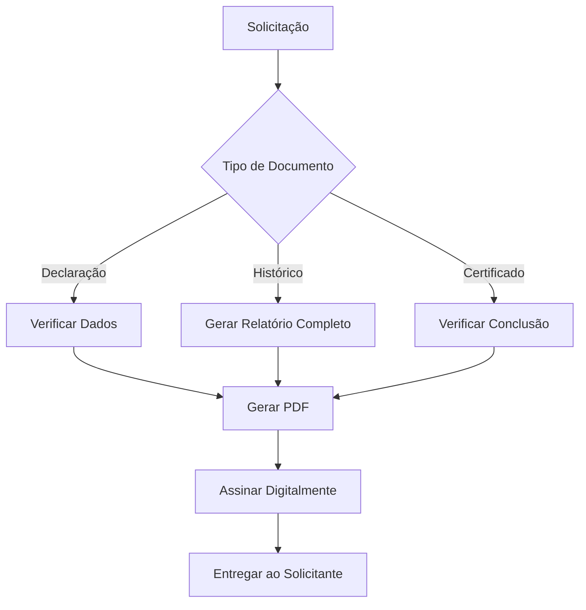
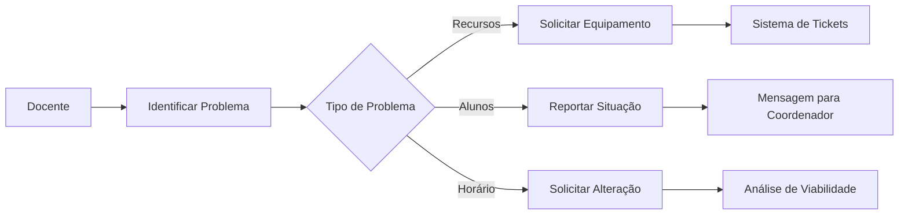
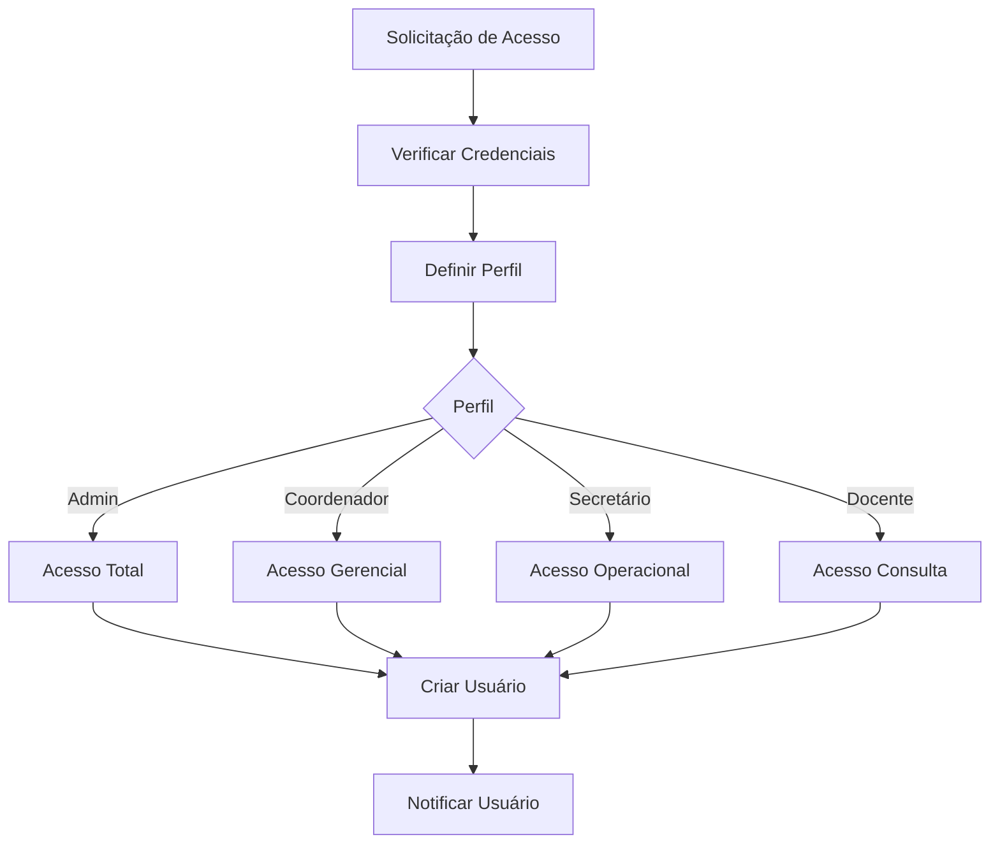
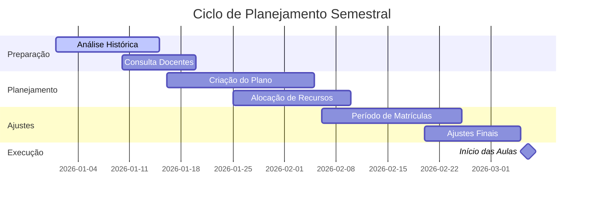

# 🔄 Fluxos de Trabalho do Sistema

## 📋 Sumário

- [📋 Sumário](#-sumário)
- [🎯 Visão Geral](#-visão-geral)
- [👑 Fluxo do Coordenador](#-fluxo-do-coordenador)
- [📝 Fluxo do Secretário](#-fluxo-do-secretário)
- [👨‍🏫 Fluxo do Docente](#-fluxo-do-docente)
- [⚙️ Fluxo do Administrador](#-fluxo-do-administrador)
- [📊 Processos Integrados](#-processos-integrados)

---

## 🎯 Visão Geral

Este documento descreve os principais fluxos de trabalho do Sistema Plano Departamental, organizados por perfil de usuário e processos do ciclo acadêmico.

### 🎭 Perfis de Usuário

| Perfil | Responsabilidades Principais |
|--------|------------------------------|
| **Coordenador** | Planejamento semestral, gestão de turmas, alocação de recursos |
| **Secretário** | Operações de matrícula, relatórios, atendimento |
| **Docente** | Consulta de turmas, acompanhamento de disciplinas |
| **Administrador** | Configuração do sistema, gestão de usuários |

---

## 👑 Fluxo do Coordenador

### 📅 Planejamento Semestral



#### 1️⃣ Preparação do Semestre

**Atividades:**
- Acessar relatórios de demanda dos últimos 3 semestres
- Consultar disponibilidade de docentes
- Verificar recursos disponíveis (salas, laboratórios)

**Telas do Sistema:**
- Dashboard → Estatísticas Históricas
- Relatórios → Demanda por Disciplina
- Docentes → Disponibilidade de Carga Horária

#### 2️⃣ Criação do Plano Departamental

**Passo a Passo:**

1. **Criar Novo Plano**
   ```
   Menu: Planos → Novo Plano
   Preencher: Ano/Semestre, Nome, Observações
   Salvar como Rascunho
   ```

2. **Definir Disciplinas**
   ```
   Plano Ativo → Disciplinas
   Selecionar disciplinas do catálogo
   Definir número de turmas por disciplina
   ```

3. **Criar Turmas**
   ```
   Para cada disciplina:
   - Definir letra da turma (A, B, C...)
   - Selecionar docente principal
   - Definir docente auxiliar (se necessário)
   - Estabelecer turno
   - Definir período recomendado
   ```

4. **Alocar Recursos**
   ```
   Para cada turma:
   - Atribuir sala
   - Definir horário
   - Verificar conflitos
   ```

5. **Estabelecer Vagas**
   ```
   Para cada turma:
   - Definir capacidade máxima
   - Distribuir vagas entre cursos
   - Considerar histórico de demanda
   ```

#### 3️⃣ Monitoramento e Ajustes

**Durante o Período de Matrículas:**



**Ações Disponíveis:**
- Abrir turmas extras
- Fechar turmas com baixa demanda
- Remanejamento de docentes
- Ajuste de vagas entre cursos

### 📊 Relatórios Gerenciais

**Relatórios Essenciais:**

1. **Ocupação de Turmas**
   - Taxa de preenchimento por disciplina
   - Comparação com semestres anteriores
   - Identificação de gargalos

2. **Carga Horária Docente**
   - Distribuição de carga entre docentes
   - Identificação de sobrecarga ou ociosidade
   - Planejamento de contratações

3. **Utilização de Recursos**
   - Ocupação de salas por turno
   - Uso de laboratórios
   - Otimização de espaços

---

## 📝 Fluxo do Secretário

### 👥 Gestão de Matrículas



#### 1️⃣ Operações de Matrícula

**Matrícula Regular:**
```
1. Acessar: Matrículas → Período Atual
2. Buscar aluno por matrícula ou nome
3. Verificar situação acadêmica
4. Processar pedidos de matrícula
5. Confirmar ou rejeitar com justificativa
```

**Matrícula Adicional:**
```
1. Período: Matrículas → Adicional
2. Verificar vagas remanescentes
3. Aplicar critérios de prioridade
4. Processar lista de espera
```

**Casos Especiais:**
- Alunos com dependência
- Matrícula em disciplinas de outros departamentos
- Quebra de pré-requisitos (com aprovação)
- Trancamentos parciais ou totais

#### 2️⃣ Atendimento ao Público

**Consultas Frequentes:**

| Solicitação | Ação no Sistema |
|-------------|-----------------|
| **Situação de Matrícula** | Consultar → Alunos → Situação Acadêmica |
| **Disponibilidade de Vagas** | Turmas → Vagas Disponíveis |
| **Histórico Escolar** | Relatórios → Histórico Individual |
| **Declarações** | Documentos → Gerar Declaração |
| **Trancamentos** | Matrículas → Processar Trancamento |

#### 3️⃣ Relatórios Operacionais

**Relatórios Diários:**
- Lista de matrículas processadas
- Vagas preenchidas por turma
- Pendências para aprovação

**Relatórios Semanais:**
- Estatísticas de atendimento
- Problemas recorrentes
- Sugestões de melhoria

### 📋 Gestão de Documentos



---

## 👨‍🏫 Fluxo do Docente

### 📚 Consulta de Turmas

#### 1️⃣ Visualização de Horários

```
Acesso: Login → Dashboard Docente
Visualizar:
- Turmas atribuídas no semestre atual
- Horários de cada disciplina
- Salas de aula designadas
- Número de alunos matriculados
```

#### 2️⃣ Acompanhamento de Disciplinas

**Informações Disponíveis:**
- Lista de alunos matriculados
- Histórico de frequência (se integrado)
- Notas parciais (se integrado)
- Recursos necessários

#### 3️⃣ Comunicação com Coordenação



### 📊 Relatórios para Docentes

1. **Lista de Presença**
   - Geração automática por turma
   - Formatação para impressão
   - Atualização automática de matrículas

2. **Diário de Classe**
   - Template para anotações
   - Controle de conteúdo ministrado
   - Acompanhamento de cronograma

---

## ⚙️ Fluxo do Administrador

### 🔧 Configuração do Sistema

#### 1️⃣ Gerenciamento de Usuários



**Operações:**
```
Usuários → Novo Usuário
Preencher: Nome, Email, Perfil
Gerar senha temporária
Enviar credenciais por email
```

#### 2️⃣ Manutenção de Dados

**Cadastros Básicos:**

| Entidade | Responsabilidade |
|----------|------------------|
| **Cursos** | Criar/editar cursos do departamento |
| **Disciplinas** | Manter catálogo de disciplinas |
| **Docentes** | Cadastro e atualização de informações |
| **Salas** | Manter registro de espaços físicos |
| **Horários** | Configurar grade de horários |

#### 3️⃣ Backup e Segurança

**Rotina de Backup:**
```
Diário: Backup incremental (23:00)
Semanal: Backup completo (domingo, 02:00)
Mensal: Backup arquival (1º domingo)
```

**Monitoramento:**
- Logs de acesso
- Tentativas de login falhadas
- Operações críticas
- Performance do sistema

### 📊 Relatórios Administrativos

1. **Uso do Sistema**
   - Número de acessos por usuário
   - Operações mais utilizadas
   - Horários de maior uso

2. **Integridade de Dados**
   - Consistência entre tabelas
   - Registros órfãos
   - Dados duplicados

3. **Performance**
   - Tempo de resposta das consultas
   - Uso de recursos do servidor
   - Gargalos identificados

---

## 📊 Processos Integrados

### 🔄 Ciclo Completo de Planejamento



### 📈 Métricas de Sucesso

**Indicadores de Planejamento:**

| Métrica | Meta | Descrição |
|---------|------|-----------|
| **Taxa de Ocupação** | > 85% | Porcentagem de vagas preenchidas |
| **Satisfação Docente** | > 4.0/5.0 | Avaliação da distribuição de carga |
| **Eficiência de Recursos** | > 90% | Uso otimizado de salas e horários |
| **Tempo de Resposta** | < 24h | Resolução de problemas durante matrículas |

**Indicadores de Qualidade:**

| Processo | Métrica | Meta |
|----------|---------|------|
| **Matrículas** | Tempo médio de processamento | < 5 min |
| **Relatórios** | Tempo de geração | < 30 seg |
| **Consultas** | Disponibilidade do sistema | > 99.5% |
| **Suporte** | Resolução no primeiro contato | > 80% |

---

<div align="center">

### 🎯 Próximos Passos

Após dominar estes fluxos, consulte:

- [**Regras de Negócio**](../regras-de-negocio/) - Entenda as regras detalhadas
- [**Glossário**](../../glossario/) - Termos técnicos e acadêmicos
- [**Arquitetura**](../../documentacao-tecnica/arquitetura/) - Aspectos técnicos

---

**📝 Documento vivo - Atualizado com base no feedback dos usuários**

</div>