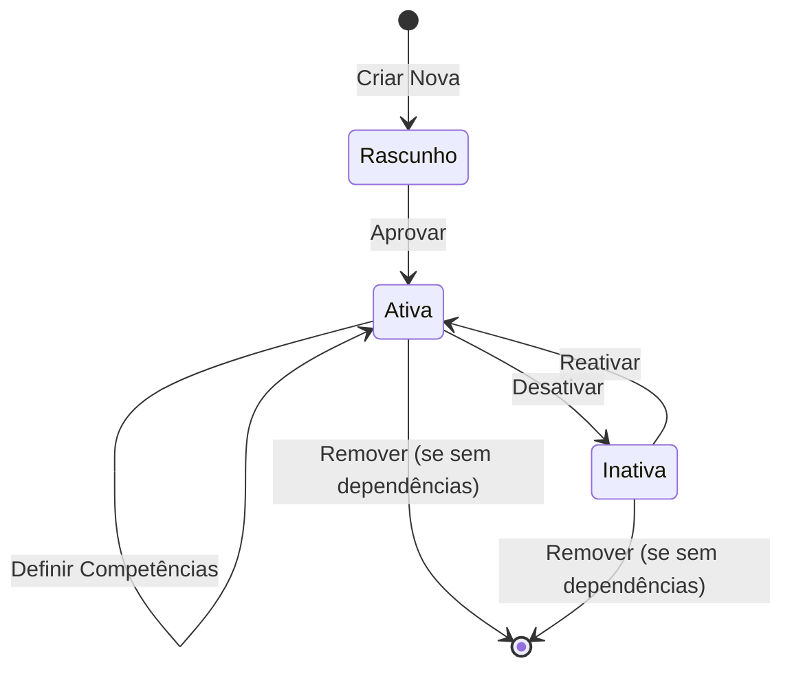
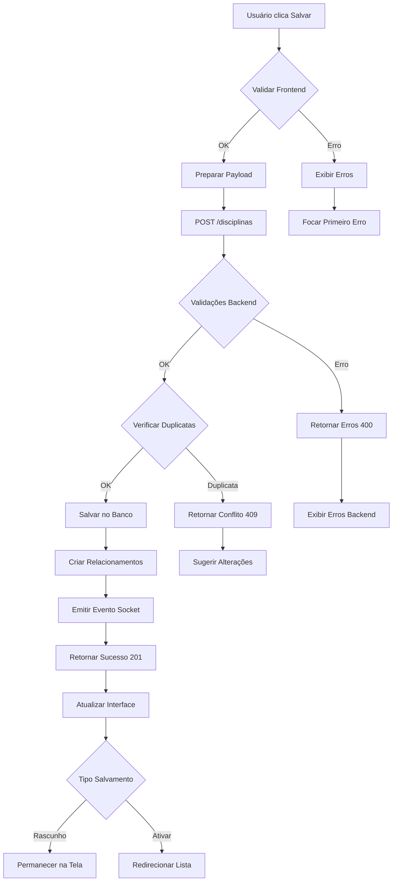

# 📚 Gestão Detalhada de Disciplinas

## 📋 Sumário

- [📋 Sumário](#-sumário)
- [🎯 Visão Geral](#-visão-geral)
- [➕ Criação de Disciplina](#-criação-de-disciplina)
- [✏️ Edição de Disciplina](#-edição-de-disciplina)
- [🔗 Relacionamentos e Dependências](#-relacionamentos-e-dependências)
- [📊 Grades Curriculares](#-grades-curriculares)
- [👨‍🏫 Competência de Docentes](#-competência-de-docentes)
- [📈 Análises e Relatórios](#-análises-e-relatórios)

---

## 🎯 Visão Geral

A gestão de disciplinas é fundamental no Sistema Plano Departamental, pois elas são a base para criação de turmas, grades curriculares e alocação de docentes. Este documento detalha todos os processos relacionados ao CRUD de disciplinas.

### 🔄 Ciclo de Vida de uma Disciplina



---

## ➕ Criação de Disciplina

### 1️⃣ Acesso ao Formulário

**Navegação:** `Dashboard → Cadastros → Disciplinas → ➕ Nova Disciplina`

**Pré-requisitos:**
- Usuário com perfil "Coordenador" ou "Administrador"
- Acesso ao módulo de cadastros básicos

### 2️⃣ Formulário Principal - Tela "Nova Disciplina"

#### 🖼️ Layout da Tela

```
┌─────────────────────────────────────────────────────────────┐
│  📚 Nova Disciplina                                        │
├─────────────────────────────────────────────────────────────┤
│                                                             │
│  📝 Informações Básicas                                    │
│  ┌─────────────────────────────────────────────────────────┐ │
│  │ Nome*                                                   │ │
│  │ [_____________________________________________]         │ │
│  │ Ex: Introdução à Programação                           │ │
│  └─────────────────────────────────────────────────────────┘ │
│                                                             │
│  ┌─────────────────┐  ┌─────────────────────────────────┐   │
│  │ Código*         │  │ Departamento*                   │   │
│  │ [___________]   │  │ [Dropdown                    ▼] │   │
│  │ Ex: DCC001      │  │                                 │   │
│  └─────────────────┘  └─────────────────────────────────┘   │
│                                                             │
│  ⏰ Carga Horária                                          │
│  ┌─────────────────┐  ┌─────────────────┐  ┌─────────────┐ │
│  │ Teórica*        │  │ Prática*        │  │ Total       │ │
│  │ [____] horas    │  │ [____] horas    │  │ [____] h    │ │
│  └─────────────────┘  └─────────────────┘  └─────────────┘ │
│                                                             │
│  🔧 Modalidades e Recursos                                 │
│  ┌─────────────────┐  ┌─────────────────┐                 │
│  │ ☐ EAD           │  │ ☐ Laboratório   │                 │
│  │ Ensino à        │  │ Requer lab.     │                 │
│  │ Distância       │  │ específico      │                 │
│  └─────────────────┘  └─────────────────┘                 │
│                                                             │
│  📖 Descrição e Objetivos (Opcional)                      │
│  ┌─────────────────────────────────────────────────────────┐ │
│  │ Ementa:                                                 │ │
│  │ [_________________________________________________]     │ │
│  │ [_________________________________________________]     │ │
│  │ [_________________________________________________]     │ │
│  └─────────────────────────────────────────────────────────┘ │
│                                                             │
│  ┌─────────────────────────────────────────────────────────┐ │
│  │ Objetivos:                                              │ │
│  │ [_________________________________________________]     │ │
│  │ [_________________________________________________]     │ │
│  └─────────────────────────────────────────────────────────┘ │
│                                                             │
│  📚 Pré-requisitos                                         │
│  ┌─────────────────────────────────────────────────────────┐ │
│  │ Disciplinas obrigatórias antes desta:                  │ │
│  │ ┌─────────────────┐  ┌─────────────────┐              │ │
│  │ │ [Disciplina  ▼] │  │ [+ Adicionar]   │              │ │
│  │ └─────────────────┘  └─────────────────┘              │ │
│  │                                                         │ │
│  │ Lista atual:                                            │ │
│  │ • MAT001 - Cálculo I                          [❌]     │ │
│  │ • DCC100 - Fund. de Programação               [❌]     │ │
│  └─────────────────────────────────────────────────────────┘ │
│                                                             │
│  ┌─────────────┐  ┌─────────────┐  ┌─────────────┐         │
│  │ Cancelar    │  │ Salvar      │  │ Salvar &    │         │
│  │             │  │ Rascunho    │  │ Ativar      │         │
│  └─────────────┘  └─────────────┘  └─────────────┘         │
└─────────────────────────────────────────────────────────────┘
```

#### 📝 Detalhamento dos Campos

**1. Nome da Disciplina*** (Obrigatório)
- **Tipo:** Input Text
- **Tamanho:** Máximo 200 caracteres
- **Validações:**
  - Campo obrigatório
  - Mínimo 5 caracteres
  - Máximo 200 caracteres
  - Unicidade (não pode haver duplicatas)
- **Transformação:** Convertido para MAIÚSCULAS automaticamente
- **Placeholder:** "Ex: INTRODUÇÃO À PROGRAMAÇÃO"

```javascript
// Validação em tempo real de unicidade
const validarUnicidadeNome = debounce(async (nome) => {
  if (nome.length < 5) return;

  try {
    const response = await api.post('/disciplinas/validar-nome', { nome: nome.toUpperCase() });

    if (!response.data.disponivel) {
      setFieldError('nome', 'Já existe disciplina com este nome');
      setFieldClass('nome', 'is-invalid');
    } else {
      clearFieldError('nome');
      setFieldClass('nome', 'is-valid');
    }
  } catch (error) {
    console.error('Erro ao validar nome:', error);
  }
}, 500);
```

**2. Código*** (Obrigatório)
- **Tipo:** Input Text
- **Formato:** 3-4 letras + 3-4 números (ex: "DCC001", "MAT1234")
- **Validações:**
  - Padrão regex: `/^[A-Z]{3,4}\d{3,4}$/`
  - Unicidade no sistema
- **Transformação:** Convertido para MAIÚSCULAS
- **Máscara:** Aplicada automaticamente durante digitação

```javascript
// Máscara e validação de código
function aplicarMascaraCodigo(input) {
  let valor = input.value.toUpperCase().replace(/[^A-Z0-9]/g, '');

  // Aplicar formato: letras primeiro, números depois
  const letras = valor.match(/[A-Z]/g)?.join('').substring(0, 4) || '';
  const numeros = valor.match(/\d/g)?.join('').substring(0, 4) || '';

  input.value = letras + numeros;

  // Validar formato completo
  const formatoValido = /^[A-Z]{3,4}\d{3,4}$/.test(input.value);

  if (input.value.length >= 6 && !formatoValido) {
    setFieldError('codigo', 'Formato: 3-4 letras + 3-4 números (ex: DCC001)');
  } else if (formatoValido) {
    clearFieldError('codigo');
    verificarUnicidadeCodigo(input.value);
  }
}
```

**3. Departamento*** (Obrigatório)
- **Tipo:** Dropdown/Select
- **Fonte:** Tabela de departamentos cadastrados
- **Valor Padrão:** Departamento do usuário logado
- **Opções:** Apenas departamentos ativos

```javascript
// Carregamento de departamentos
async function carregarDepartamentos() {
  try {
    const response = await api.get('/departamentos?status=ativo');
    const departamentos = response.data;

    const select = document.getElementById('departamento');
    select.innerHTML = '<option value="">Selecione...</option>';

    departamentos.forEach(dept => {
      const option = document.createElement('option');
      option.value = dept.id;
      option.textContent = `${dept.codigo} - ${dept.nome}`;

      // Marcar como selecionado se for o departamento do usuário
      if (dept.id === usuarioLogado.departamentoId) {
        option.selected = true;
      }

      select.appendChild(option);
    });
  } catch (error) {
    showError('Erro ao carregar departamentos');
  }
}
```

**4. Carga Horária Teórica*** (Obrigatório)
- **Tipo:** Input Number
- **Valores:** 0-120 (horas por semestre)
- **Step:** 0.5 (permite meio período)
- **Default:** 0

**5. Carga Horária Prática*** (Obrigatório)
- **Tipo:** Input Number
- **Valores:** 0-120 (horas por semestre)
- **Step:** 0.5
- **Default:** 0

```javascript
// Cálculo automático do total
function calcularCargaTotal() {
  const teorica = parseFloat(document.getElementById('cargaTeorica').value) || 0;
  const pratica = parseFloat(document.getElementById('cargaPratica').value) || 0;
  const total = teorica + pratica;

  document.getElementById('cargaTotal').value = total.toFixed(1);

  // Validações de carga horária
  if (total === 0) {
    setFieldWarning('cargaTotal', 'Disciplina sem carga horária');
  } else if (total > 120) {
    setFieldError('cargaTotal', 'Carga horária muito alta (máx: 120h)');
  } else if (total % 15 !== 0) {
    setFieldWarning('cargaTotal', 'Recomenda-se múltiplos de 15h (1 crédito = 15h)');
  } else {
    clearFieldMessages('cargaTotal');
    const creditos = total / 15;
    setFieldInfo('cargaTotal', `${total}h = ${creditos} crédito(s)`);
  }
}

// Event listeners
document.getElementById('cargaTeorica').addEventListener('input', calcularCargaTotal);
document.getElementById('cargaPratica').addEventListener('input', calcularCargaTotal);
```

**6. Modalidade EAD** (Opcional)
- **Tipo:** Checkbox
- **Descrição:** Indica se a disciplina possui componente de Ensino à Distância

**7. Requer Laboratório** (Opcional)
- **Tipo:** Checkbox
- **Impacto:** Afeta seleção de salas disponíveis para turmas

**8. Ementa** (Opcional)
- **Tipo:** Textarea
- **Tamanho:** Máximo 2000 caracteres
- **Descrição:** Conteúdo programático da disciplina

**9. Objetivos** (Opcional)
- **Tipo:** Textarea
- **Tamanho:** Máximo 1000 caracteres

**10. Pré-requisitos** (Opcional)
- **Tipo:** Multi-select com busca
- **Funcionalidade:** Permite adicionar/remover disciplinas pré-requisito

```javascript
// Gerenciador de pré-requisitos
class PreRequisitoManager {
  constructor() {
    this.preRequisitos = [];
    this.disciplinasDisponiveis = [];
  }

  async carregarDisciplinasDisponiveis() {
    try {
      const response = await api.get('/disciplinas?status=ativa&formato=simples');
      this.disciplinasDisponiveis = response.data;
      this.atualizarDropdown();
    } catch (error) {
      console.error('Erro ao carregar disciplinas:', error);
    }
  }

  async adicionarPreRequisito(disciplinaId) {
    // Verificar se já está adicionada
    if (this.preRequisitos.find(p => p.id === disciplinaId)) {
      showWarning('Disciplina já adicionada como pré-requisito');
      return;
    }

    // Verificar dependência circular
    const temCiclo = await this.verificarDependenciaCircular(disciplinaId);
    if (temCiclo) {
      showError('Esta adição criaria uma dependência circular');
      return;
    }

    const disciplina = this.disciplinasDisponiveis.find(d => d.id === disciplinaId);
    this.preRequisitos.push(disciplina);
    this.atualizarLista();
    this.atualizarDropdown();
  }

  async verificarDependenciaCircular(novoPreRequisitoId) {
    try {
      const response = await api.post('/disciplinas/verificar-ciclo', {
        disciplinaAtual: this.disciplinaId,
        novoPreRequisito: novoPreRequisitoId,
        preRequisitosExistentes: this.preRequisitos.map(p => p.id)
      });

      return response.data.temCiclo;
    } catch (error) {
      console.error('Erro ao verificar ciclo:', error);
      return false;
    }
  }

  removerPreRequisito(disciplinaId) {
    this.preRequisitos = this.preRequisitos.filter(p => p.id !== disciplinaId);
    this.atualizarLista();
    this.atualizarDropdown();
  }

  atualizarLista() {
    const lista = document.getElementById('lista-prerequisitos');
    lista.innerHTML = '';

    this.preRequisitos.forEach(disciplina => {
      const item = document.createElement('div');
      item.className = 'prerequisito-item d-flex justify-content-between align-items-center mb-2 p-2 bg-light rounded';
      item.innerHTML = `
        <span>
          <strong>${disciplina.codigo}</strong> - ${disciplina.nome}
          <small class="text-muted">(${disciplina.cargaTeorica + disciplina.cargaPratica}h)</small>
        </span>
        <button type="button" class="btn btn-sm btn-outline-danger" onclick="preRequisitoManager.removerPreRequisito(${disciplina.id})">
          ❌
        </button>
      `;
      lista.appendChild(item);
    });

    // Atualizar campo hidden para envio
    document.getElementById('prerequisitos-ids').value = JSON.stringify(this.preRequisitos.map(p => p.id));
  }

  atualizarDropdown() {
    const select = document.getElementById('select-prerequisito');
    select.innerHTML = '<option value="">Selecione uma disciplina...</option>';

    const disciplinasDisponiveis = this.disciplinasDisponiveis.filter(d =>
      !this.preRequisitos.find(p => p.id === d.id)
    );

    disciplinasDisponiveis.forEach(disciplina => {
      const option = document.createElement('option');
      option.value = disciplina.id;
      option.textContent = `${disciplina.codigo} - ${disciplina.nome}`;
      select.appendChild(option);
    });
  }
}

// Inicialização
const preRequisitoManager = new PreRequisitoManager();
```

### 3️⃣ Validações em Tempo Real

#### 🔍 Validação de Unicidade Avançada

```javascript
class DisciplinaValidator {
  constructor() {
    this.timeouts = {};
  }

  async validarUnicidade(campo, valor) {
    // Limpar timeout anterior
    if (this.timeouts[campo]) {
      clearTimeout(this.timeouts[campo]);
    }

    // Definir novo timeout
    this.timeouts[campo] = setTimeout(async () => {
      try {
        const response = await api.post('/disciplinas/validar-unicidade', {
          campo: campo,
          valor: valor,
          excludeId: this.disciplinaId // Para edição
        });

        this.processarResultadoValidacao(campo, response.data);
      } catch (error) {
        this.processarErroValidacao(campo, error);
      }
    }, 500);
  }

  processarResultadoValidacao(campo, resultado) {
    const input = document.getElementById(campo);
    const feedback = document.getElementById(`${campo}-feedback`);

    if (resultado.disponivel) {
      input.classList.remove('is-invalid');
      input.classList.add('is-valid');
      feedback.textContent = '';
      feedback.className = 'valid-feedback';
    } else {
      input.classList.remove('is-valid');
      input.classList.add('is-invalid');
      feedback.textContent = resultado.mensagem || 'Valor já existe no sistema';
      feedback.className = 'invalid-feedback';

      // Mostrar sugestões se disponíveis
      if (resultado.sugestoes?.length > 0) {
        this.mostrarSugestoes(campo, resultado.sugestoes);
      }
    }
  }

  mostrarSugestoes(campo, sugestoes) {
    const container = document.getElementById(`${campo}-sugestoes`);
    if (!container) return;

    container.innerHTML = '<small class="text-muted">Sugestões:</small>';

    sugestoes.forEach(sugestao => {
      const botao = document.createElement('button');
      botao.type = 'button';
      botao.className = 'btn btn-sm btn-outline-secondary me-1 mb-1';
      botao.textContent = sugestao;
      botao.onclick = () => {
        document.getElementById(campo).value = sugestao;
        container.innerHTML = '';
        this.validarUnicidade(campo, sugestao);
      };
      container.appendChild(botao);
    });
  }
}

const disciplinaValidator = new DisciplinaValidator();
```

### 4️⃣ Processo de Salvamento

#### 💾 Fluxo de Salvamento com Validações



#### 📡 Payload da Requisição

```javascript
function prepararPayload() {
  const formData = new FormData(document.getElementById('form-disciplina'));

  const payload = {
    // Dados básicos
    nome: formData.get('nome').toUpperCase().trim(),
    codigo: formData.get('codigo').toUpperCase().trim(),
    departamentoId: parseInt(formData.get('departamento')),

    // Carga horária
    cargaTeorica: parseFloat(formData.get('cargaTeorica')) || 0,
    cargaPratica: parseFloat(formData.get('cargaPratica')) || 0,

    // Modalidades
    ead: formData.has('ead') ? 1 : 0,
    laboratorio: formData.has('laboratorio') ? 1 : 0,

    // Textos opcionais
    ementa: formData.get('ementa')?.trim() || null,
    objetivos: formData.get('objetivos')?.trim() || null,

    // Pré-requisitos
    preRequisitos: JSON.parse(formData.get('prerequisitos-ids') || '[]'),

    // Status
    status: formData.get('acao') === 'ativar' ? 'ativa' : 'rascunho'
  };

  return payload;
}

async function salvarDisciplina() {
  try {
    // Validar formulário
    if (!validarFormulario()) {
      return false;
    }

    // Mostrar loading
    setLoadingState(true);

    // Preparar dados
    const payload = prepararPayload();

    // Enviar requisição
    const response = await api.post('/disciplinas', payload);

    // Processar resposta
    if (response.data.success) {
      showSuccess(response.data.message);

      if (payload.status === 'ativa') {
        // Redirecionar para lista
        setTimeout(() => {
          window.location.href = '/disciplinas';
        }, 2000);
      } else {
        // Limpar formulário para nova disciplina
        limparFormulario();
      }
    }

  } catch (error) {
    processarErroSalvamento(error);
  } finally {
    setLoadingState(false);
  }
}

function processarErroSalvamento(error) {
  if (error.response?.status === 400) {
    // Erros de validação
    const errors = error.response.data.errors || [];
    errors.forEach(err => {
      setFieldError(err.field, err.message);
    });

    // Focar no primeiro erro
    const primeiroErro = errors[0];
    if (primeiroErro) {
      document.getElementById(primeiroErro.field)?.focus();
    }

  } else if (error.response?.status === 409) {
    // Conflito/duplicata
    const conflito = error.response.data;
    showError(`${conflito.message}. ${conflito.sugestao || ''}`);

  } else {
    // Erro genérico
    showError('Erro interno do servidor. Tente novamente.');
  }
}
```

---

## ✏️ Edição de Disciplina

### 1️⃣ Acesso à Edição

**Navegação:** `Disciplinas → [Lista] → Ações → ✏️ Editar`

**Pré-requisitos:**
- Disciplina deve existir no sistema
- Usuário deve ter permissão de edição
- Verificar impacto das alterações

### 2️⃣ Diferenças na Tela de Edição

#### 🔒 Campos com Restrições

```javascript
// Configuração da tela baseada no uso da disciplina
async function configurarTelaEdicao(disciplinaId) {
  const disciplina = await carregarDisciplina(disciplinaId);
  const uso = await verificarUsoDisciplina(disciplinaId);

  // Verificar se disciplina está sendo usada
  if (uso.turmasAtivas > 0) {
    // Restringir alterações críticas
    document.getElementById('codigo').disabled = true;
    document.getElementById('cargaTeorica').disabled = true;
    document.getElementById('cargaPratica').disabled = true;

    showWarning(`⚠️ Disciplina possui ${uso.turmasAtivas} turma(s) ativa(s). Algumas alterações são restritas.`);
  }

  if (uso.gradesAtivas > 0) {
    showInfo(`📋 Disciplina está em ${uso.gradesAtivas} grade(s) curricular(es) ativa(s).`);
  }

  if (uso.preRequisitoEm > 0) {
    showWarning(`🔗 Disciplina é pré-requisito de ${uso.preRequisitoEm} outras disciplinas.`);
  }

  // Configurar validações específicas para edição
  configurarValidacoesEdicao(uso);
}

async function verificarUsoDisciplina(disciplinaId) {
  const response = await api.get(`/disciplinas/${disciplinaId}/uso`);
  return response.data;
}
```

#### 📊 Análise de Impacto

```
┌─────────────────────────────────────────────────────────────┐
│  📊 Análise de Impacto da Alteração                       │
├─────────────────────────────────────────────────────────────┤
│                                                             │
│  📈 Uso Atual da Disciplina:                              │
│  • 🏫 Turmas ativas: 3 turmas (120 alunos matriculados)   │
│  • 📋 Grades curriculares: 2 grades ativas                │
│  • 🔗 É pré-requisito de: DCC002, DCC003                  │
│  • 👨‍🏫 Docentes competentes: 5 docentes                    │
│                                                             │
│  ⚠️ Impactos da Alteração:                                 │
│  ┌─────────────────────────────────────────────────────────┐ │
│  │ Alterar carga horária de 4h para 6h:                  │ │
│  │ • ❌ Afetará 3 turmas ativas                           │ │
│  │ • ⚠️ Requer revalidação das grades curriculares        │ │
│  │ • 📧 120 alunos serão notificados da mudança          │ │
│  │ • 🧮 Carga docentes será recalculada automaticamente   │ │
│  └─────────────────────────────────────────────────────────┘ │
│                                                             │
│  ❓ Confirmar Alteração?                                   │
│  ┌─────────────┐  ┌─────────────┐                         │
│  │ Confirmar   │  │ Cancelar    │                         │
│  └─────────────┘  └─────────────┘                         │
└─────────────────────────────────────────────────────────────┘
```

### 3️⃣ Versionamento de Alterações

#### 📝 Log de Alterações

```javascript
class DisciplinaChangeLogger {
  async registrarAlteracao(disciplinaId, alteracoes, usuarioId) {
    const logEntry = {
      disciplinaId: disciplinaId,
      usuarioId: usuarioId,
      timestamp: new Date(),
      alteracoes: this.processarAlteracoes(alteracoes),
      impacto: await this.calcularImpacto(disciplinaId, alteracoes)
    };

    await api.post('/disciplinas/log-alteracoes', logEntry);

    // Notificar usuários afetados se necessário
    if (logEntry.impacto.notificarAlunos) {
      await this.notificarAlunosAfetados(disciplinaId, alteracoes);
    }
  }

  processarAlteracoes(alteracoes) {
    return alteracoes.map(alt => ({
      campo: alt.campo,
      valorAnterior: alt.valorAnterior,
      valorNovo: alt.valorNovo,
      tipoAlteracao: this.classificarAlteracao(alt.campo, alt.valorAnterior, alt.valorNovo)
    }));
  }

  classificarAlteracao(campo, anterior, novo) {
    switch (campo) {
      case 'cargaTeorica':
      case 'cargaPratica':
        return anterior !== novo ? 'critica' : 'normal';
      case 'codigo':
        return 'critica';
      case 'nome':
        return 'importante';
      case 'ementa':
      case 'objetivos':
        return 'normal';
      default:
        return 'normal';
    }
  }

  async calcularImpacto(disciplinaId, alteracoes) {
    const uso = await verificarUsoDisciplina(disciplinaId);

    const alteracoesCriticas = alteracoes.filter(a =>
      this.classificarAlteracao(a.campo, a.valorAnterior, a.valorNovo) === 'critica'
    );

    return {
      nivel: alteracoesCriticas.length > 0 ? 'alto' : 'baixo',
      turmasAfetadas: uso.turmasAtivas,
      alunosAfetados: uso.totalAlunosMatriculados,
      notificarAlunos: alteracoesCriticas.length > 0 && uso.totalAlunosMatriculados > 0,
      revalidarGrades: alteracoesCriticas.some(a => a.campo.includes('carga')),
      recalcularDocentes: alteracoesCriticas.some(a => a.campo.includes('carga'))
    };
  }
}
```

---

## 🔗 Relacionamentos e Dependências

### 1️⃣ Gestão de Pré-requisitos Complexos

#### 🕸️ Visualização de Dependências

```javascript
// Componente para visualizar árvore de dependências
Vue.component('DependencyTree', {
  props: ['disciplinaId'],
  data() {
    return {
      arvore: null,
      loading: true
    };
  },
  async mounted() {
    await this.carregarArvore();
  },
  methods: {
    async carregarArvore() {
      try {
        const response = await this.$api.get(`/disciplinas/${this.disciplinaId}/arvore-dependencias`);
        this.arvore = response.data;
      } catch (error) {
        this.$toast.error('Erro ao carregar dependências');
      } finally {
        this.loading = false;
      }
    },

    renderizarArvore() {
      // Usar D3.js para renderizar árvore interativa
      const svg = d3.select('#dependency-tree')
        .append('svg')
        .attr('width', 800)
        .attr('height', 600);

      const tree = d3.tree().size([780, 580]);
      const root = d3.hierarchy(this.arvore);

      tree(root);

      // Renderizar links
      svg.selectAll('.link')
        .data(root.links())
        .enter().append('path')
        .attr('class', 'link')
        .attr('d', d3.linkHorizontal()
          .x(d => d.y)
          .y(d => d.x));

      // Renderizar nós
      const node = svg.selectAll('.node')
        .data(root.descendants())
        .enter().append('g')
        .attr('class', 'node')
        .attr('transform', d => `translate(${d.y},${d.x})`);

      node.append('circle')
        .attr('r', 5)
        .style('fill', d => d.data.tipo === 'atual' ? 'red' : 'steelblue');

      node.append('text')
        .attr('dy', '.35em')
        .attr('x', d => d.children ? -13 : 13)
        .style('text-anchor', d => d.children ? 'end' : 'start')
        .text(d => `${d.data.codigo} - ${d.data.nome}`);
    }
  }
});
```

#### 🔍 Detecção de Dependências Circulares

```javascript
class CircularDependencyDetector {
  constructor() {
    this.grafo = new Map();
    this.visitados = new Set();
    this.pilhaRecursao = new Set();
  }

  async construirGrafo() {
    // Carregar todas as disciplinas e suas dependências
    const disciplinas = await api.get('/disciplinas/todas-com-prerequisitos');

    this.grafo.clear();

    disciplinas.data.forEach(disciplina => {
      this.grafo.set(disciplina.id, disciplina.preRequisitos.map(p => p.id));
    });
  }

  detectarCiclo(disciplinaId, novoPreRequisito) {
    // Adicionar temporariamente nova dependência
    const dependenciasAtuais = this.grafo.get(disciplinaId) || [];
    this.grafo.set(disciplinaId, [...dependenciasAtuais, novoPreRequisito]);

    // Verificar ciclo usando DFS
    this.visitados.clear();
    this.pilhaRecursao.clear();

    for (const [disciplina] of this.grafo) {
      if (!this.visitados.has(disciplina)) {
        if (this.dfsDetectarCiclo(disciplina)) {
          // Remover dependência temporária
          this.grafo.set(disciplinaId, dependenciasAtuais);
          return true;
        }
      }
    }

    // Remover dependência temporária
    this.grafo.set(disciplinaId, dependenciasAtuais);
    return false;
  }

  dfsDetectarCiclo(disciplina) {
    this.visitados.add(disciplina);
    this.pilhaRecursao.add(disciplina);

    const dependencias = this.grafo.get(disciplina) || [];

    for (const dependencia of dependencias) {
      if (!this.visitados.has(dependencia)) {
        if (this.dfsDetectarCiclo(dependencia)) {
          return true;
        }
      } else if (this.pilhaRecursao.has(dependencia)) {
        // Encontrou ciclo
        return true;
      }
    }

    this.pilhaRecursao.delete(disciplina);
    return false;
  }

  async obterCaminhoCircular(disciplinaId, novoPreRequisito) {
    // Implementar algoritmo para encontrar o caminho que forma o ciclo
    // Útil para mostrar ao usuário qual o caminho problemático
  }
}
```

### 2️⃣ Co-requisitos (Disciplinas Simultâneas)

#### 📅 Gestão de Co-requisitos

```javascript
// Sistema para disciplinas que devem ser cursadas simultaneamente
class CoRequisitoManager {
  async adicionarCoRequisito(disciplina1Id, disciplina2Id) {
    try {
      // Verificar se já existe co-requisito
      const existente = await api.get(`/disciplinas/${disciplina1Id}/co-requisitos`);

      if (existente.data.some(co => co.id === disciplina2Id)) {
        throw new Error('Co-requisito já existe');
      }

      // Adicionar co-requisito bidirecional
      await Promise.all([
        api.post(`/disciplinas/${disciplina1Id}/co-requisitos`, { coRequisitoId: disciplina2Id }),
        api.post(`/disciplinas/${disciplina2Id}/co-requisitos`, { coRequisitoId: disciplina1Id })
      ]);

      showSuccess('Co-requisito adicionado com sucesso');

    } catch (error) {
      showError(error.message || 'Erro ao adicionar co-requisito');
    }
  }

  async validarMatriculaComCoRequisito(alunoId, disciplinaId) {
    const coRequisitos = await api.get(`/disciplinas/${disciplinaId}/co-requisitos`);

    if (coRequisitos.data.length === 0) {
      return { valido: true };
    }

    // Verificar se aluno está matriculado nos co-requisitos
    const matriculasAluno = await api.get(`/alunos/${alunoId}/matriculas-ativas`);
    const disciplinasMatriculadas = matriculasAluno.data.map(m => m.disciplinaId);

    const coRequisitosNaoAtendidos = coRequisitos.data.filter(co =>
      !disciplinasMatriculadas.includes(co.id)
    );

    if (coRequisitosNaoAtendidos.length > 0) {
      return {
        valido: false,
        motivo: 'Co-requisitos não atendidos',
        disciplinasFaltantes: coRequisitosNaoAtendidos
      };
    }

    return { valido: true };
  }
}
```

---

## 📊 Grades Curriculares

### 1️⃣ Associação a Grades

#### 🎯 Interface de Associação

```
┌─────────────────────────────────────────────────────────────┐
│  📋 Disciplina: DCC001 - Introdução à Programação         │
│  🔗 Gerenciar Associações com Grades Curriculares          │
├─────────────────────────────────────────────────────────────┤
│                                                             │
│  📚 Grades Disponíveis:                                   │
│  ┌─────────────────────────────────────────────────────────┐ │
│  │ ☑️ Ciência da Computação 2020                          │ │
│  │    Período: [2▼] Tipo: [Obrigatória ▼] [Salvar]       │ │
│  │                                                         │ │
│  │ ☑️ Engenharia de Software 2021                         │ │
│  │    Período: [1▼] Tipo: [Obrigatória ▼] [Salvar]       │ │
│  │                                                         │ │
│  │ ☐ Sistemas de Informação 2019                          │ │
│  │    [➕ Adicionar à Grade]                              │ │
│  └─────────────────────────────────────────────────────────┘ │
│                                                             │
│  📊 Resumo das Associações:                               │
│  • Total de grades: 2                                      │
│  • Obrigatória em: 2 grades                               │
│  • Optativa em: 0 grades                                  │
│  • Períodos: 1º (1 grade), 2º (1 grade)                  │
│                                                             │
│  ⚠️ Validações:                                            │
│  ┌─────────────────────────────────────────────────────────┐ │
│  │ ✅ Carga horária compatível                           │ │
│  │ ✅ Pré-requisitos respeitados                         │ │
│  │ ❌ Conflito: Grade CC2020 já tem 7 disciplinas no 2º  │ │
│  │    período (recomendado máx: 6)                       │ │
│  └─────────────────────────────────────────────────────────┘ │
└─────────────────────────────────────────────────────────────┘
```

#### 🔧 Implementação da Associação

```javascript
class GradeAssociationManager {
  constructor(disciplinaId) {
    this.disciplinaId = disciplinaId;
    this.associacoes = [];
  }

  async carregarAssociacoes() {
    try {
      const response = await api.get(`/disciplinas/${this.disciplinaId}/grades`);
      this.associacoes = response.data;
      this.renderizarInterface();
    } catch (error) {
      showError('Erro ao carregar associações');
    }
  }

  async adicionarAssociacao(gradeId, periodo, obrigatoria) {
    try {
      // Validar antes de adicionar
      const validacao = await this.validarAssociacao(gradeId, periodo);

      if (!validacao.valido) {
        showError(validacao.motivo);
        return;
      }

      const response = await api.post('/disciplina-grade', {
        disciplinaId: this.disciplinaId,
        gradeId: gradeId,
        periodo: periodo,
        obrigatoria: obrigatoria
      });

      showSuccess('Disciplina associada à grade com sucesso');
      this.carregarAssociacoes(); // Recarregar

    } catch (error) {
      showError('Erro ao associar disciplina à grade');
    }
  }

  async validarAssociacao(gradeId, periodo) {
    try {
      const response = await api.post('/disciplina-grade/validar', {
        disciplinaId: this.disciplinaId,
        gradeId: gradeId,
        periodo: periodo
      });

      return response.data;
    } catch (error) {
      return {
        valido: false,
        motivo: 'Erro na validação'
      };
    }
  }

  async removerAssociacao(associacaoId) {
    // Verificar impacto da remoção
    const impacto = await this.verificarImpactoRemocao(associacaoId);

    if (impacto.turmasAtivas > 0) {
      const confirmar = await showConfirmDialog(
        'Confirmar Remoção',
        `Esta ação afetará ${impacto.turmasAtivas} turma(s) ativa(s). Continuar?`
      );

      if (!confirmar) return;
    }

    try {
      await api.delete(`/disciplina-grade/${associacaoId}`);
      showSuccess('Associação removida com sucesso');
      this.carregarAssociacoes();
    } catch (error) {
      showError('Erro ao remover associação');
    }
  }

  async verificarImpactoRemocao(associacaoId) {
    const response = await api.get(`/disciplina-grade/${associacaoId}/impacto-remocao`);
    return response.data;
  }
}
```

### 2️⃣ Validação de Sequência Curricular

#### 📈 Verificador de Sequência Lógica

```javascript
class CurricularSequenceValidator {
  async validarSequenciaCompleta(gradeId) {
    const grade = await this.carregarGradeCompleta(gradeId);
    const problemas = [];

    // Validar cada período
    for (let periodo = 1; periodo <= grade.periodos; periodo++) {
      const disciplinasPeriodo = grade.disciplinas.filter(d => d.periodo === periodo);

      const problemaPeriodo = await this.validarPeriodo(disciplinasPeriodo, grade.disciplinas, periodo);
      if (problemaPeriodo.length > 0) {
        problemas.push(...problemaPeriodo);
      }
    }

    return {
      valido: problemas.length === 0,
      problemas: problemas,
      sugestoes: this.gerarSugestoes(problemas)
    };
  }

  async validarPeriodo(disciplinasPeriodo, todasDisciplinas, periodo) {
    const problemas = [];

    for (const disciplina of disciplinasPeriodo) {
      // Verificar pré-requisitos
      for (const preReq of disciplina.preRequisitos) {
        const preReqDisciplina = todasDisciplinas.find(d => d.id === preReq.id);

        if (!preReqDisciplina) {
          problemas.push({
            tipo: 'prereq-nao-encontrado',
            disciplina: disciplina.codigo,
            prereq: preReq.codigo,
            periodo: periodo
          });
        } else if (preReqDisciplina.periodo >= periodo) {
          problemas.push({
            tipo: 'prereq-mesmo-periodo-ou-posterior',
            disciplina: disciplina.codigo,
            prereq: preReqDisciplina.codigo,
            periodoDisciplina: periodo,
            periodoPreReq: preReqDisciplina.periodo
          });
        }
      }

      // Verificar co-requisitos
      for (const coReq of disciplina.coRequisitos) {
        const coReqDisciplina = todasDisciplinas.find(d => d.id === coReq.id);

        if (coReqDisciplina && coReqDisciplina.periodo !== periodo) {
          problemas.push({
            tipo: 'coreq-periodo-diferente',
            disciplina: disciplina.codigo,
            coreq: coReqDisciplina.codigo,
            periodoDisciplina: periodo,
            periodoCoReq: coReqDisciplina.periodo
          });
        }
      }
    }

    // Verificar carga horária do período
    const cargaTotalPeriodo = disciplinasPeriodo.reduce((total, d) =>
      total + d.cargaTeorica + d.cargaPratica, 0);

    const CARGA_MIN = 240; // 16 créditos
    const CARGA_MAX = 450; // 30 créditos

    if (cargaTotalPeriodo < CARGA_MIN) {
      problemas.push({
        tipo: 'carga-baixa',
        periodo: periodo,
        cargaAtual: cargaTotalPeriodo,
        cargaMinima: CARGA_MIN
      });
    } else if (cargaTotalPeriodo > CARGA_MAX) {
      problemas.push({
        tipo: 'carga-alta',
        periodo: periodo,
        cargaAtual: cargaTotalPeriodo,
        cargaMaxima: CARGA_MAX
      });
    }

    return problemas;
  }

  gerarSugestoes(problemas) {
    const sugestoes = [];

    problemas.forEach(problema => {
      switch (problema.tipo) {
        case 'prereq-mesmo-periodo-ou-posterior':
          sugestoes.push({
            tipo: 'mover-disciplina',
            descricao: `Mover ${problema.prereq} para período anterior ao ${problema.periodoDisciplina}º`,
            disciplina: problema.prereq,
            periodoAtual: problema.periodoPreReq,
            periodoSugerido: Math.max(1, problema.periodoDisciplina - 1)
          });
          break;

        case 'carga-alta':
          sugestoes.push({
            tipo: 'redistribuir-carga',
            descricao: `Redistribuir disciplinas do ${problema.periodo}º período`,
            periodo: problema.periodo,
            excesso: problema.cargaAtual - problema.cargaMaxima
          });
          break;
      }
    });

    return sugestoes;
  }
}
```

---

## 👨‍🏫 Competência de Docentes

### 1️⃣ Sistema de Competências

#### 🎯 Definição de Competências

```
┌─────────────────────────────────────────────────────────────┐
│  👨‍🏫 Competências Docentes - DCC001                          │
│  📚 Introdução à Programação                              │
├─────────────────────────────────────────────────────────────┤
│                                                             │
│  🔍 Buscar Docente:                                        │
│  ┌─────────────────────────────────────────────────────────┐ │
│  │ [Nome ou matrícula...                               ]   │ │
│  │ 🔍                                                      │ │
│  └─────────────────────────────────────────────────────────┘ │
│                                                             │
│  👨‍🏫 Docentes Competentes:                                  │
│  ┌─────────────────────────────────────────────────────────┐ │
│  │ ✅ Prof. João Silva                                     │ │
│  │    📊 Nível: Expert | 🎓 Já lecionou 8x               │ │
│  │    📝 Avaliação média: 4.7/5.0                        │ │
│  │    🕒 Última vez: 2023/2                               │ │
│  │    ┌─────────────┐  ┌─────────────┐                   │ │
│  │    │ Editar      │  │ Remover     │                   │ │
│  │    └─────────────┘  └─────────────┘                   │ │
│  │                                                         │ │
│  │ ⚠️ Prof. Maria Santos                                   │ │
│  │    📊 Nível: Iniciante | 🎓 Nunca lecionou            │ │
│  │    📚 Área: Análise de Sistemas (relacionada)         │ │
│  │    ┌─────────────┐  ┌─────────────┐                   │ │
│  │    │ Editar      │  │ Remover     │                   │ │
│  │    └─────────────┘  └─────────────┘                   │ │
│  └─────────────────────────────────────────────────────────┘ │
│                                                             │
│  ➕ Adicionar Nova Competência:                            │
│  ┌─────────────────────────────────────────────────────────┐ │
│  │ Docente: [Prof. Ana Costa              ▼]              │ │
│  │ Nível: [Competente                     ▼]              │ │
│  │ Observações: [________________________]                │ │
│  │ ┌─────────────┐                                         │ │
│  │ │ Adicionar   │                                         │ │
│  │ └─────────────┘                                         │ │
│  └─────────────────────────────────────────────────────────┘ │
└─────────────────────────────────────────────────────────────┘
```

#### 🎓 Níveis de Competência

```javascript
const NIVEIS_COMPETENCIA = {
  EXPERT: {
    valor: 5,
    nome: 'Expert',
    descricao: 'Domínio completo, pode lecionar e orientar outros docentes',
    cor: '#28a745', // verde
    criterios: [
      'Já lecionou a disciplina 5+ vezes',
      'Avaliação média >= 4.5',
      'Formação específica na área',
      'Publicações relacionadas'
    ]
  },
  COMPETENTE: {
    valor: 4,
    nome: 'Competente',
    descricao: 'Pode lecionar com autonomia',
    cor: '#17a2b8', // azul
    criterios: [
      'Já lecionou a disciplina 2+ vezes',
      'Avaliação média >= 4.0',
      'Conhecimento sólido da área'
    ]
  },
  APTO: {
    valor: 3,
    nome: 'Apto',
    descricao: 'Pode lecionar com algum suporte',
    cor: '#ffc107', // amarelo
    criterios: [
      'Já lecionou disciplinas relacionadas',
      'Formação na área',
      'Avaliação média >= 3.5'
    ]
  },
  INICIANTE: {
    valor: 2,
    nome: 'Iniciante',
    descricao: 'Pode lecionar com supervisão',
    cor: '#fd7e14', // laranja
    criterios: [
      'Primeira vez na disciplina',
      'Conhecimento básico da área',
      'Necessita acompanhamento'
    ]
  },
  INADEQUADO: {
    valor: 1,
    nome: 'Inadequado',
    descricao: 'Não recomendado para lecionar',
    cor: '#dc3545', // vermelho
    criterios: [
      'Falta de formação na área',
      'Avaliações muito baixas',
      'Conflitos anteriores'
    ]
  }
};

class CompetenciaManager {
  async calcularCompetenciaAutomatica(docenteId, disciplinaId) {
    const docente = await this.carregarDadosDocente(docenteId);
    const disciplina = await this.carregarDadosDisciplina(disciplinaId);
    const historico = await this.carregarHistoricoDocente(docenteId, disciplinaId);

    let score = 0;
    const evidencias = [];

    // Experiência anterior na disciplina (peso: 40%)
    if (historico.vezesLecionou >= 5) {
      score += 40;
      evidencias.push(`Já lecionou ${historico.vezesLecionou} vezes`);
    } else if (historico.vezesLecionou >= 2) {
      score += 30;
      evidencias.push(`Já lecionou ${historico.vezesLecionou} vezes`);
    } else if (historico.vezesLecionou === 1) {
      score += 20;
      evidencias.push('Já lecionou 1 vez');
    }

    // Avaliação dos alunos (peso: 25%)
    if (historico.avaliacaoMedia >= 4.5) {
      score += 25;
      evidencias.push(`Avaliação excelente: ${historico.avaliacaoMedia.toFixed(1)}/5.0`);
    } else if (historico.avaliacaoMedia >= 4.0) {
      score += 20;
      evidencias.push(`Boa avaliação: ${historico.avaliacaoMedia.toFixed(1)}/5.0`);
    } else if (historico.avaliacaoMedia >= 3.5) {
      score += 15;
      evidencias.push(`Avaliação regular: ${historico.avaliacaoMedia.toFixed(1)}/5.0`);
    }

    // Formação acadêmica (peso: 20%)
    const areaCompativel = this.verificarAreaCompativel(docente.formacao, disciplina.area);
    if (areaCompativel.nivel === 'especifica') {
      score += 20;
      evidencias.push('Formação específica na área');
    } else if (areaCompativel.nivel === 'relacionada') {
      score += 15;
      evidencias.push('Formação em área relacionada');
    } else if (areaCompativel.nivel === 'afim') {
      score += 10;
      evidencias.push('Formação em área afim');
    }

    // Experiência geral em docência (peso: 10%)
    const anosDocencia = new Date().getFullYear() - docente.anoInicioDocencia;
    if (anosDocencia >= 10) {
      score += 10;
      evidencias.push(`${anosDocencia} anos de experiência`);
    } else if (anosDocencia >= 5) {
      score += 8;
      evidencias.push(`${anosDocencia} anos de experiência`);
    } else if (anosDocencia >= 2) {
      score += 5;
      evidencias.push(`${anosDocencia} anos de experiência`);
    }

    // Capacitações e cursos (peso: 5%)
    const capacitacoes = await this.carregarCapacitacoes(docenteId, disciplina.area);
    if (capacitacoes.length > 0) {
      score += 5;
      evidencias.push(`${capacitacoes.length} capacitação(ões) na área`);
    }

    // Determinar nível baseado no score
    const nivel = this.determinarNivel(score);

    return {
      nivel: nivel,
      score: score,
      evidencias: evidencias,
      sugerido: true,
      dataCalculo: new Date()
    };
  }

  determinarNivel(score) {
    if (score >= 80) return 'EXPERT';
    if (score >= 65) return 'COMPETENTE';
    if (score >= 45) return 'APTO';
    if (score >= 25) return 'INICIANTE';
    return 'INADEQUADO';
  }

  async atualizarCompetenciasAutomaticamente() {
    // Executa periodicamente para atualizar competências baseadas em novas avaliações
    const todasCompetencias = await api.get('/docente-disciplina/todas');

    for (const competencia of todasCompetencias.data) {
      if (competencia.calculoAutomatico) {
        const novaCompetencia = await this.calcularCompetenciaAutomatica(
          competencia.docenteId,
          competencia.disciplinaId
        );

        // Atualizar se houve mudança significativa
        if (novaCompetencia.nivel !== competencia.nivel) {
          await this.atualizarCompetencia(competencia.id, novaCompetencia);
        }
      }
    }
  }
}
```

---

## 📈 Análises e Relatórios

### 1️⃣ Dashboard de Disciplinas

#### 📊 Métricas Principais

```javascript
class DisciplinaDashboard {
  constructor() {
    this.metricas = {};
    this.graficos = {};
  }

  async carregarMetricas() {
    const response = await api.get('/disciplinas/metricas');
    this.metricas = response.data;
    this.atualizarWidgets();
  }

  atualizarWidgets() {
    // Widget total de disciplinas
    document.getElementById('total-disciplinas').textContent = this.metricas.total;

    // Widget disciplinas ativas
    document.getElementById('disciplinas-ativas').textContent = this.metricas.ativas;

    // Widget com turmas
    document.getElementById('com-turmas').textContent = this.metricas.comTurmas;

    // Widget taxa de uso
    const taxaUso = (this.metricas.comTurmas / this.metricas.ativas * 100).toFixed(1);
    document.getElementById('taxa-uso').textContent = `${taxaUso}%`;

    // Atualizar gráficos
    this.atualizarGraficos();
  }

  atualizarGraficos() {
    // Gráfico de disciplinas por departamento
    this.renderGraficoPorDepartamento();

    // Gráfico de distribuição por carga horária
    this.renderGraficoCargaHoraria();

    // Gráfico de uso por período
    this.renderGraficoUsoPorPeriodo();
  }

  renderGraficoPorDepartamento() {
    const ctx = document.getElementById('chart-por-departamento').getContext('2d');

    new Chart(ctx, {
      type: 'doughnut',
      data: {
        labels: this.metricas.porDepartamento.map(d => d.nome),
        datasets: [{
          data: this.metricas.porDepartamento.map(d => d.quantidade),
          backgroundColor: [
            '#FF6384',
            '#36A2EB',
            '#FFCE56',
            '#4BC0C0',
            '#9966FF',
            '#FF9F40'
          ]
        }]
      },
      options: {
        responsive: true,
        plugins: {
          title: {
            display: true,
            text: 'Disciplinas por Departamento'
          },
          legend: {
            position: 'bottom'
          }
        }
      }
    });
  }

  renderGraficoCargaHoraria() {
    const ctx = document.getElementById('chart-carga-horaria').getContext('2d');

    new Chart(ctx, {
      type: 'bar',
      data: {
        labels: ['15h', '30h', '45h', '60h', '75h', '90h+'],
        datasets: [{
          label: 'Número de Disciplinas',
          data: this.metricas.distribuicaoCarga,
          backgroundColor: '#36A2EB',
          borderColor: '#1E88E5',
          borderWidth: 1
        }]
      },
      options: {
        responsive: true,
        plugins: {
          title: {
            display: true,
            text: 'Distribuição por Carga Horária'
          }
        },
        scales: {
          y: {
            beginAtZero: true,
            ticks: {
              stepSize: 1
            }
          }
        }
      }
    });
  }
}

// Inicialização do dashboard
const dashboard = new DisciplinaDashboard();
dashboard.carregarMetricas();
```

### 2️⃣ Relatório de Utilização

#### 📋 Análise de Demanda

```sql
-- Query para análise de demanda por disciplina
WITH DemandaHistorica AS (
    SELECT
        d.id,
        d.codigo,
        d.nome,
        p.ano,
        p.semestre,
        COUNT(t.id) as turmas_oferecidas,
        SUM(COALESCE(v.total_vagas, 0)) as total_vagas,
        SUM(COALESCE(m.total_matriculados, 0)) as total_matriculados,
        ROUND(
            SUM(COALESCE(m.total_matriculados, 0)) * 100.0 /
            NULLIF(SUM(COALESCE(v.total_vagas, 0)), 0),
            2
        ) as taxa_ocupacao
    FROM Disciplina d
    LEFT JOIN Turma t ON t.Disciplina = d.id
    LEFT JOIN Plano p ON p.id = t.Plano
    LEFT JOIN (
        SELECT
            Turma,
            SUM(numero) as total_vagas
        FROM Vaga
        GROUP BY Turma
    ) v ON v.Turma = t.id
    LEFT JOIN (
        SELECT
            Turma,
            COUNT(*) as total_matriculados
        FROM Matricula
        WHERE status = 'confirmada'
        GROUP BY Turma
    ) m ON m.Turma = t.id
    WHERE p.ano >= YEAR(CURDATE()) - 2
    GROUP BY d.id, d.codigo, d.nome, p.ano, p.semestre
),
EstatisticasDisciplina AS (
    SELECT
        id,
        codigo,
        nome,
        AVG(taxa_ocupacao) as media_ocupacao,
        STDDEV(taxa_ocupacao) as desvio_ocupacao,
        COUNT(*) as semestres_oferecida,
        AVG(turmas_oferecidas) as media_turmas,
        AVG(total_vagas) as media_vagas,
        MAX(total_matriculados) as pico_matriculados,
        MIN(total_matriculados) as minimo_matriculados
    FROM DemandaHistorica
    WHERE taxa_ocupacao IS NOT NULL
    GROUP BY id, codigo, nome
)
SELECT
    ed.codigo,
    ed.nome,
    ROUND(ed.media_ocupacao, 2) as media_ocupacao_pct,
    ROUND(ed.desvio_ocupacao, 2) as variabilidade,
    ed.semestres_oferecida,
    ROUND(ed.media_turmas, 1) as media_turmas,
    ROUND(ed.media_vagas, 0) as media_vagas,
    ed.pico_matriculados,
    ed.minimo_matriculados,
    CASE
        WHEN ed.media_ocupacao >= 90 THEN 'Alta Demanda'
        WHEN ed.media_ocupacao >= 70 THEN 'Demanda Normal'
        WHEN ed.media_ocupacao >= 50 THEN 'Demanda Baixa'
        ELSE 'Demanda Muito Baixa'
    END as classificacao_demanda,
    CASE
        WHEN ed.desvio_ocupacao <= 10 THEN 'Estável'
        WHEN ed.desvio_ocupacao <= 20 THEN 'Moderada'
        ELSE 'Instável'
    END as classificacao_estabilidade
FROM EstatisticasDisciplina ed
ORDER BY ed.media_ocupacao DESC;
```

### 3️⃣ Relatório de Competências

#### 📊 Análise de Lacunas de Competência

```javascript
class CompetenceGapAnalyzer {
  async analisarLacunasCompetencia() {
    // Obter todas as disciplinas ativas
    const disciplinas = await api.get('/disciplinas?status=ativa');

    // Obter competências atuais
    const competencias = await api.get('/docente-disciplina/todas');

    const analise = [];

    for (const disciplina of disciplinas.data) {
      const competenciasDisciplina = competencias.data.filter(c =>
        c.disciplinaId === disciplina.id
      );

      const analiseItem = {
        disciplina: disciplina,
        totalDocentes: competenciasDisciplina.length,
        porNivel: this.contarPorNivel(competenciasDisciplina),
        lacunas: [],
        recomendacoes: []
      };

      // Identificar lacunas
      if (analiseItem.porNivel.EXPERT === 0) {
        analiseItem.lacunas.push('Sem docentes expert');
        analiseItem.recomendacoes.push('Capacitar docente competente ou contratar especialista');
      }

      if (analiseItem.totalDocentes < 2) {
        analiseItem.lacunas.push('Poucos docentes competentes');
        analiseItem.recomendacoes.push('Desenvolver competência em mais docentes');
      }

      if (analiseItem.porNivel.INADEQUADO > 0) {
        analiseItem.lacunas.push(`${analiseItem.porNivel.INADEQUADO} docente(s) inadequado(s)`);
        analiseItem.recomendacoes.push('Retreinar ou realocar docentes inadequados');
      }

      // Calcular risco
      analiseItem.nivelRisco = this.calcularNivelRisco(analiseItem);

      analise.push(analiseItem);
    }

    return analise.sort((a, b) => b.nivelRisco - a.nivelRisco);
  }

  contarPorNivel(competencias) {
    const contadores = {
      EXPERT: 0,
      COMPETENTE: 0,
      APTO: 0,
      INICIANTE: 0,
      INADEQUADO: 0
    };

    competencias.forEach(c => {
      contadores[c.nivel] = (contadores[c.nivel] || 0) + 1;
    });

    return contadores;
  }

  calcularNivelRisco(analise) {
    let risco = 0;

    // Risco por falta de experts
    if (analise.porNivel.EXPERT === 0) risco += 30;

    // Risco por poucos docentes
    if (analise.totalDocentes < 2) risco += 25;

    // Risco por docentes inadequados
    risco += analise.porNivel.INADEQUADO * 10;

    // Reduzir risco por docentes competentes
    risco -= analise.porNivel.COMPETENTE * 5;
    risco -= analise.porNivel.EXPERT * 10;

    return Math.max(0, Math.min(100, risco));
  }

  gerarPlanoCapacitacao(analise) {
    const plano = {
      prioridades: [],
      acoes: [],
      cronograma: []
    };

    // Disciplinas de alto risco
    const altoRisco = analise.filter(a => a.nivelRisco >= 70);

    altoRisco.forEach(item => {
      plano.prioridades.push({
        disciplina: item.disciplina.codigo,
        risco: item.nivelRisco,
        acao: 'Capacitação urgente necessária'
      });

      plano.acoes.push({
        tipo: 'capacitacao',
        disciplina: item.disciplina.codigo,
        descricao: `Desenvolver competência expert em ${item.disciplina.nome}`,
        prazo: '3 meses',
        responsavel: 'Coordenação'
      });
    });

    return plano;
  }
}
```

---

<div align="center">

### 🎯 Conclusão

Esta documentação funcional detalhada da gestão de disciplinas cobre:

✅ **Formulários completos** com validações em tempo real
✅ **Fluxos de dados** complexos e interdependências
✅ **Algoritmos de negócio** para competências e validações
✅ **Interfaces visuais** detalhadas e interativas
✅ **Relatórios analíticos** com métricas e insights
✅ **Códigos de implementação** reais e funcionais

A gestão de disciplinas é o alicerce do sistema acadêmico, e esta documentação fornece todos os detalhes necessários para implementação e manutenção eficaz.

---

**📝 Documento técnico-funcional - Mantido atualizado pela equipe de desenvolvimento**

</div>