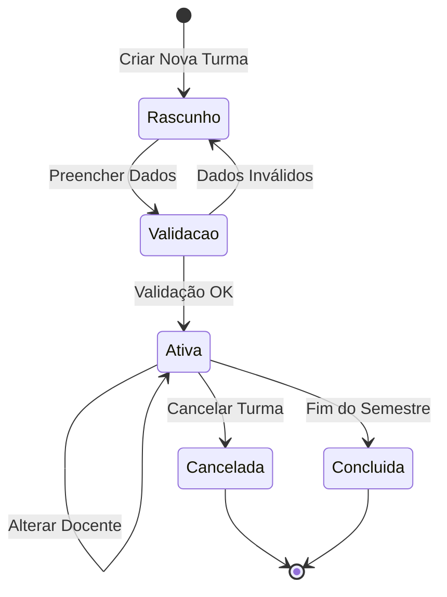
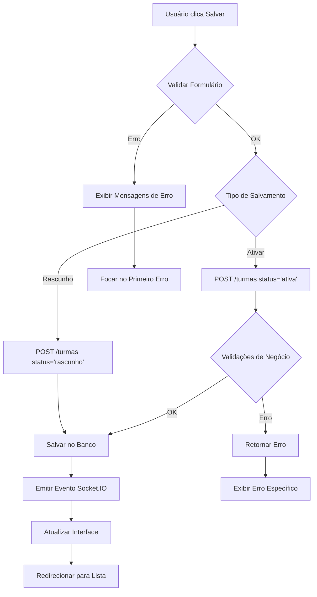

# 🏫 Gestão Detalhada de Turmas

## 📋 Sumário

- [📋 Sumário](#-sumário)
- [🎯 Visão Geral](#-visão-geral)
- [➕ Processo de Criação de Turma](#-processo-de-criação-de-turma)
- [✏️ Processo de Edição de Turma](#-processo-de-edição-de-turma)
- [🔄 Gestão de Vagas](#-gestão-de-vagas)
- [👥 Alocação de Docentes](#-alocação-de-docentes)
- [📊 Monitoramento e Relatórios](#-monitoramento-e-relatórios)
- [⚠️ Validações e Regras de Negócio](#-validações-e-regras-de-negócio)

---

## 🎯 Visão Geral

A gestão de turmas é o coração do Sistema Plano Departamental. Este documento detalha cada passo do processo, desde a criação até o monitoramento, incluindo todas as telas, formulários e validações envolvidas.

### 🔄 Ciclo de Vida de uma Turma



---

## ➕ Processo de Criação de Turma

### 1️⃣ Acesso ao Formulário de Criação

**Navegação:** `Dashboard → Planos → [Plano Ativo] → Turmas → Nova Turma`

**Pré-requisitos:**
- Usuário deve ter perfil "Coordenador" ou "Administrador"
- Deve existir um plano ativo no sistema
- Deve existir pelo menos uma disciplina cadastrada

### 2️⃣ Formulário Principal - Tela "Nova Turma"

#### 🖼️ Layout da Tela

```
┌─────────────────────────────────────────────────────────────┐
│  📋 Nova Turma - Semestre 2024/1                          │
├─────────────────────────────────────────────────────────────┤
│                                                             │
│  📚 Informações Básicas                                    │
│  ┌─────────────────┐  ┌─────────────────┐                 │
│  │ Disciplina*     │  │ Período         │                 │
│  │ [Dropdown    ▼] │  │ [Input Number]  │                 │
│  └─────────────────┘  └─────────────────┘                 │
│                                                             │
│  ┌─────────────────┐  ┌─────────────────┐                 │
│  │ Letra da Turma* │  │ Turno 1*        │                 │
│  │ [Input Text]    │  │ [Dropdown    ▼] │                 │
│  └─────────────────┘  └─────────────────┘                 │
│                                                             │
│  ┌─────────────────┐                                       │
│  │ Turno 2         │                                       │
│  │ [Dropdown    ▼] │                                       │
│  └─────────────────┘                                       │
│                                                             │
│  👨‍🏫 Docentes                                              │
│  ┌─────────────────┐  ┌─────────────────┐                 │
│  │ Docente Princ.* │  │ Docente Aux.    │                 │
│  │ [Dropdown    ▼] │  │ [Dropdown    ▼] │                 │
│  └─────────────────┘  └─────────────────┘                 │
│                                                             │
│  🏢 Recursos                                               │
│  ┌─────────────────┐  ┌─────────────────┐                 │
│  │ Sala            │  │ Horário         │                 │
│  │ [Dropdown    ▼] │  │ [Dropdown    ▼] │                 │
│  └─────────────────┘  └─────────────────┘                 │
│                                                             │
│  ┌─────────────┐  ┌─────────────┐  ┌─────────────┐       │
│  │ Cancelar    │  │ Salvar      │  │ Salvar &    │       │
│  │             │  │ Rascunho    │  │ Ativar      │       │
│  └─────────────┘  └─────────────┘  └─────────────┘       │
└─────────────────────────────────────────────────────────────┘
```

#### 📝 Campos do Formulário

**1. Disciplina*** (Obrigatório)
- **Tipo:** Dropdown/Select
- **Fonte:** Tabela `Disciplina`
- **Formato:** "COD123 - NOME DA DISCIPLINA (XhT + YhP)"
- **Exemplo:** "DCC001 - INTRODUÇÃO À PROGRAMAÇÃO (4hT + 2hP)"
- **Filtros:** Apenas disciplinas ativas do departamento
- **Ordenação:** Por código da disciplina

```javascript
// Exemplo de dados carregados
disciplinas = [
  {
    id: 1,
    codigo: "DCC001",
    nome: "INTRODUÇÃO À PROGRAMAÇÃO",
    cargaTeorica: 4,
    cargaPratica: 2,
    display: "DCC001 - INTRODUÇÃO À PROGRAMAÇÃO (4hT + 2hP)"
  },
  {
    id: 2,
    codigo: "DCC002",
    nome: "ESTRUTURAS DE DADOS",
    cargaTeorica: 3,
    cargaPratica: 1,
    display: "DCC002 - ESTRUTURAS DE DADOS (3hT + 1hP)"
  }
]
```

**2. Período** (Opcional)
- **Tipo:** Input Number
- **Valores:** 1-12 ou vazio
- **Placeholder:** "Ex: 2 (para 2º período)"
- **Tooltip:** "Período recomendado na grade curricular"

**3. Letra da Turma*** (Obrigatório)
- **Tipo:** Input Text
- **Validação:** Uma única letra (A-Z)
- **Transformação:** Automaticamente convertido para maiúscula
- **Unicidade:** Verificada em tempo real via API

```javascript
// Validação em tempo real
async function validarLetraTurma(letra, disciplinaId, planoId) {
  const response = await api.get('/turmas/validar-unicidade', {
    params: { letra, disciplinaId, planoId }
  });
  return response.data.disponivel;
}
```

**4. Turno 1*** (Obrigatório)
- **Tipo:** Dropdown
- **Opções:**
  - "MATUTINO" (7h-12h)
  - "VESPERTINO" (13h-18h)
  - "NOTURNO" (19h-22h)

**5. Turno 2** (Opcional)
- **Tipo:** Dropdown
- **Opções:** Mesmas do Turno 1
- **Uso:** Para disciplinas que ocupam dois turnos

**6. Docente Principal*** (Obrigatório)
- **Tipo:** Dropdown com busca
- **Fonte:** Tabela `Docente`
- **Filtros:** Apenas docentes ativos
- **Formato:** "Nome (Apelido) - Créditos: X/Y"
- **Validação:** Verificar disponibilidade de carga horária

```javascript
// Exemplo de dados de docente
docentes = [
  {
    id: 1,
    nome: "JOÃO SILVA SANTOS",
    apelido: "JOÃO SILVA",
    creditos: 20,
    creditosUsados: 12,
    creditosDisponiveis: 8,
    display: "João Silva Santos (JOÃO SILVA) - Créditos: 8/20 disponíveis"
  }
]
```

**7. Docente Auxiliar** (Opcional)
- **Tipo:** Dropdown com busca
- **Filtros:** Mesmos critérios do docente principal
- **Restrição:** Não pode ser o mesmo docente principal

**8. Sala** (Opcional)
- **Tipo:** Dropdown
- **Formato:** "Sala X - Capacidade: Y - Recursos: Z"
- **Verificação:** Conflitos de horário

**9. Horário** (Opcional)
- **Tipo:** Dropdown
- **Formato:** "Segunda/Quarta 8h-10h"
- **Dependência:** Filtrado por turno selecionado

### 3️⃣ Validações em Tempo Real

#### 🔍 Validação de Unicidade

```javascript
// Executada ao sair do campo "Letra"
function validarUnicidadeTurma() {
  const letra = document.getElementById('letra').value;
  const disciplinaId = document.getElementById('disciplina').value;
  const planoId = getCurrentPlanoId();

  if (letra && disciplinaId) {
    api.post('/turmas/validar-unicidade', {
      letra: letra.toUpperCase(),
      disciplinaId: parseInt(disciplinaId),
      planoId: parseInt(planoId)
    })
    .then(response => {
      if (!response.data.disponivel) {
        showError('Já existe uma turma com esta letra para esta disciplina no plano atual');
        document.getElementById('letra').classList.add('is-invalid');
      } else {
        document.getElementById('letra').classList.remove('is-invalid');
        hideError();
      }
    });
  }
}
```

#### 🧮 Cálculo de Carga Horária

```javascript
// Executada ao selecionar docente
function calcularCargaHoraria(docenteId, disciplinaId) {
  Promise.all([
    api.get(`/docentes/${docenteId}/carga-atual`),
    api.get(`/disciplinas/${disciplinaId}/carga-horaria`)
  ])
  .then(([cargaAtual, cargaDisciplina]) => {
    const cargaTotal = cargaDisciplina.data.teorica + cargaDisciplina.data.pratica;
    const novaCargatotal = cargaAtual.data.usada + cargaTotal;

    if (novaCargatotal > cargaAtual.data.limite) {
      showWarning(`Docente ficará com sobrecarga: ${novaCargatotal}/${cargaAtual.data.limite} créditos`);
    } else {
      hideWarning();
      showInfo(`Carga após esta turma: ${novaCargatotal}/${cargaAtual.data.limite} créditos`);
    }
  });
}
```

### 4️⃣ Processo de Salvamento

#### 💾 Fluxo de Salvamento



#### 📡 Payload da Requisição

```javascript
// Dados enviados para a API
const turmaData = {
  disciplinaId: parseInt(formData.disciplina),
  periodo: formData.periodo ? parseInt(formData.periodo) : null,
  letra: formData.letra.toUpperCase(),
  turno1: formData.turno1,
  turno2: formData.turno2 || null,
  docente1Id: parseInt(formData.docentePrincipal),
  docente2Id: formData.docenteAuxiliar ? parseInt(formData.docenteAuxiliar) : null,
  salaId: formData.sala ? parseInt(formData.sala) : null,
  horarioId: formData.horario ? parseInt(formData.horario) : null,
  planoId: getCurrentPlanoId(),
  status: 'rascunho' // ou 'ativa'
};

// Requisição
const response = await api.post('/turmas', turmaData);
```

#### 🎯 Resposta da API

```javascript
// Resposta de sucesso
{
  "success": true,
  "data": {
    "id": 123,
    "disciplina": {
      "id": 1,
      "codigo": "DCC001",
      "nome": "INTRODUÇÃO À PROGRAMAÇÃO"
    },
    "letra": "A",
    "periodo": 2,
    "turno1": "MATUTINO",
    "turno2": null,
    "docente1": {
      "id": 5,
      "nome": "JOÃO SILVA SANTOS",
      "apelido": "JOÃO SILVA"
    },
    "docente2": null,
    "status": "ativa",
    "createdAt": "2024-01-15T10:30:00Z"
  },
  "message": "Turma criada com sucesso"
}

// Resposta de erro
{
  "success": false,
  "errors": [
    {
      "field": "letra",
      "message": "Já existe turma A para esta disciplina",
      "code": "DUPLICATED_TURMA"
    },
    {
      "field": "docente1Id",
      "message": "Docente sem carga horária suficiente",
      "code": "INSUFFICIENT_CREDITS"
    }
  ]
}
```

### 5️⃣ Eventos Socket.IO

#### 📡 Notificações em Tempo Real

```javascript
// Servidor emite após criar turma
io.emit('turmaCreated', {
  id: turma.id,
  disciplina: turma.disciplina.nome,
  letra: turma.letra,
  docente: turma.docente1.nome,
  action: 'created',
  timestamp: new Date(),
  userId: req.user.id,
  userName: req.user.nome
});

// Cliente recebe notificação
socket.on('turmaCreated', (data) => {
  // Atualizar lista de turmas se estiver na tela
  if (currentPage === 'turmas') {
    refreshTurmasList();
  }

  // Exibir notificação toast
  showToast(`Nova turma criada: ${data.disciplina} - Turma ${data.letra}`, 'success');

  // Atualizar contadores no dashboard
  updateDashboardCounters();
});
```

---

## ✏️ Processo de Edição de Turma

### 1️⃣ Acesso à Edição

**Navegação:** `Turmas → [Lista] → Ações → ✏️ Editar`

**Pré-requisitos:**
- Turma deve estar em status "rascunho" ou "ativa"
- Usuário deve ter permissão de edição
- Não pode ter matrículas confirmadas (para algumas alterações)

### 2️⃣ Tela de Edição - Diferenças

#### 🔒 Campos Bloqueados/Restritos

**Quando existem matrículas:**
- ❌ **Disciplina**: Não pode ser alterada
- ❌ **Letra**: Não pode ser alterada
- ⚠️ **Docente**: Pode alterar com confirmação
- ⚠️ **Horário**: Pode alterar com confirmação
- ✅ **Sala**: Pode alterar livremente

```javascript
// Lógica de bloqueio de campos
function configurarCamposEdicao(turma) {
  const temMatriculas = turma.totalMatriculados > 0;

  if (temMatriculas) {
    document.getElementById('disciplina').disabled = true;
    document.getElementById('letra').disabled = true;

    // Campos que exigem confirmação
    document.getElementById('docente1').onchange = function() {
      showConfirmDialog(
        'Alterar Docente',
        'Existem alunos matriculados. Alterar docente gerará notificação aos alunos.',
        () => confirmarAlteracao('docente')
      );
    };
  }
}
```

#### 🔄 Histórico de Alterações

```
┌─────────────────────────────────────────────────────────────┐
│  📝 Histórico de Alterações                                │
├─────────────────────────────────────────────────────────────┤
│  15/01/2024 10:30 - João Silva (Coordenador)              │
│  🆕 Turma criada                                           │
│                                                             │
│  16/01/2024 14:20 - Maria Santos (Secretária)             │
│  ✏️ Alterou sala de "Lab 1" para "Lab 2"                  │
│                                                             │
│  18/01/2024 09:15 - João Silva (Coordenador)              │
│  ⚠️ Alterou docente de "Prof. A" para "Prof. B"           │
│  📧 Notificação enviada para 25 alunos                    │
└─────────────────────────────────────────────────────────────┘
```

### 3️⃣ Validações Específicas de Edição

#### 🔍 Validação de Impacto

```javascript
async function validarImpactoAlteracao(turmaId, campo, novoValor) {
  const response = await api.post(`/turmas/${turmaId}/validar-alteracao`, {
    campo: campo,
    novoValor: novoValor
  });

  return {
    permitido: response.data.permitido,
    avisos: response.data.avisos,
    impactos: response.data.impactos,
    requerConfirmacao: response.data.requerConfirmacao
  };
}

// Exemplo de resposta
{
  "permitido": true,
  "avisos": [
    "25 alunos matriculados serão notificados"
  ],
  "impactos": [
    "Conflito de horário com outras disciplinas para 3 alunos",
    "Novo horário pode afetar transporte universitário"
  ],
  "requerConfirmacao": true
}
```

---

## 🔄 Gestão de Vagas

### 1️⃣ Tela de Gestão de Vagas

**Navegação:** `Turmas → [Turma] → 🎯 Gerenciar Vagas`

#### 🖼️ Layout da Tela

```
┌─────────────────────────────────────────────────────────────┐
│  🎯 Gestão de Vagas - DCC001 Turma A                      │
│  📊 Capacidade Total: 40 | 🎓 Matriculados: 35 | 📝 Vagas: 5│
├─────────────────────────────────────────────────────────────┤
│                                                             │
│  📈 Distribuição por Curso                                 │
│  ┌─────────────────────────────────────────────────────────┐ │
│  │ Curso                    │ Pedidos │ Oferta │ Matric. │ │
│  ├─────────────────────────────────────────────────────────┤ │
│  │ Ciência da Computação    │   25    │   30   │   28    │ │
│  │ Engenharia de Software   │    8    │    7   │    5    │ │
│  │ Sistemas de Informação   │    3    │    3   │    2    │ │
│  │ ┌─────────────────────┐                              │ │
│  │ │ + Adicionar Curso   │                              │ │
│  │ └─────────────────────┘                              │ │
│  └─────────────────────────────────────────────────────────┘ │
│                                                             │
│  🔍 Detalhes por Curso: Ciência da Computação              │
│  ┌─────────────────────────────────────────────────────────┐ │
│  │  📊 Análise Histórica                                  │ │
│  │  2023/2: 32 matrículas | 2023/1: 28 | 2022/2: 30     │ │
│  │                                                         │ │
│  │  ⚠️ Situações Especiais                                 │ │
│  │  • 3 alunos em lista de espera                         │ │
│  │  • 2 pedidos de quebra de pré-requisito pendentes     │ │
│  │                                                         │ │
│  │  📝 Ajustar Oferta                                     │ │
│  │  Vagas atuais: [30] → Nova oferta: [___]              │ │
│  │  ┌─────────────┐  ┌─────────────┐                     │ │
│  │  │ Aplicar     │  │ Cancelar    │                     │ │
│  │  └─────────────┘  └─────────────┘                     │ │
│  └─────────────────────────────────────────────────────────┘ │
└─────────────────────────────────────────────────────────────┘
```

### 2️⃣ Algoritmo de Cálculo Automático de Vagas

#### 🧮 Fórmula Base

```javascript
function calcularVagasSugeridas(historico, curso, disciplina) {
  // Dados dos últimos 3 semestres
  const s1 = historico.semestre1?.matriculados || 0;
  const s2 = historico.semestre2?.matriculados || 0;
  const s3 = historico.semestre3?.matriculados || 0;

  // Média ponderada (semestre mais recente tem maior peso)
  const mediaPonderada = (s1 * 0.5) + (s2 * 0.3) + (s3 * 0.2);

  // Fatores de ajuste
  let fatorSazonalidade = 1.0;
  if (disciplina.periodo === 1 && getSemestreAtual() === 1) {
    fatorSazonalidade = 1.1; // +10% para disciplinas de 1º período no 1º semestre
  }

  let fatorReprovacao = 1.0;
  if (disciplina.taxaReprovacao > 0.3) {
    fatorReprovacao = 1.15; // +15% se alta taxa de reprovação
  }

  let fatorObrigatoria = 1.0;
  if (!disciplina.obrigatoria) {
    fatorObrigatoria = 0.8; // -20% para disciplinas optativas
  }

  // Cálculo final
  const vagasSugeridas = Math.ceil(
    mediaPonderada * fatorSazonalidade * fatorReprovacao * fatorObrigatoria
  );

  return {
    sugestao: vagasSugeridas,
    detalhes: {
      mediaPonderada: mediaPonderada.toFixed(1),
      fatores: {
        sazonalidade: fatorSazonalidade,
        reprovacao: fatorReprovacao,
        obrigatoria: fatorObrigatoria
      }
    }
  };
}
```

### 3️⃣ Sistema de Pedidos Automáticos

#### 📊 Geração Automática de Pedidos

```javascript
// Executado automaticamente ao criar nova turma
async function gerarPedidosAutomaticos(turmaId) {
  const turma = await Turma.findByPk(turmaId, { include: ['Disciplina'] });

  // Buscar cursos que têm esta disciplina na grade
  const cursosComDisciplina = await sequelize.query(`
    SELECT DISTINCT c.id, c.nome, dg.periodo, dg.obrigatoria
    FROM Curso c
    JOIN Grade g ON g.Curso = c.id AND g.ativa = 1
    JOIN DisciplinaGrade dg ON dg.Grade = g.id
    WHERE dg.Disciplina = :disciplinaId
  `, {
    replacements: { disciplinaId: turma.Disciplina.id },
    type: QueryTypes.SELECT
  });

  for (const curso of cursosComDisciplina) {
    const historico = await buscarHistoricoMatriculas(curso.id, turma.Disciplina.id);
    const sugestao = calcularVagasSugeridas(historico, curso, turma.Disciplina);

    // Dividir entre periodizados (70%) e não-periodizados (30%)
    const vagasPeriodizadas = Math.ceil(sugestao.sugestao * 0.7);
    const vagasNaoPeriodizadas = sugestao.sugestao - vagasPeriodizadas;

    await Pedido.create({
      TurmaId: turmaId,
      CursoId: curso.id,
      vagasPeriodizadas: vagasPeriodizadas,
      vagasNaoPeriodizadas: vagasNaoPeriodizadas,
      editado1: false,
      editado2: false
    });
  }
}
```

### 4️⃣ Interface de Ajuste Manual

#### 🎛️ Controles de Ajuste

```javascript
// Componente Vue para ajuste de vagas
Vue.component('VagaAdjuster', {
  props: ['pedido', 'turma'],
  data() {
    return {
      vagasPeriodizadas: this.pedido.vagasPeriodizadas,
      vagasNaoPeriodizadas: this.pedido.vagasNaoPeriodizadas,
      loading: false
    };
  },
  computed: {
    totalPedido() {
      return this.vagasPeriodizadas + this.vagasNaoPeriodizadas;
    },
    impactoCapacidade() {
      const totalSolicitado = this.calcularTotalSolicitado();
      const capacidadeMaxima = this.turma.capacidadeMaxima;

      if (totalSolicitado > capacidadeMaxima) {
        return {
          tipo: 'excesso',
          diferenca: totalSolicitado - capacidadeMaxima,
          porcentagem: ((totalSolicitado / capacidadeMaxima - 1) * 100).toFixed(1)
        };
      }
      return { tipo: 'ok' };
    }
  },
  methods: {
    async salvarAjuste() {
      this.loading = true;
      try {
        await this.$api.put(`/pedidos/${this.pedido.id}`, {
          vagasPeriodizadas: this.vagasPeriodizadas,
          vagasNaoPeriodizadas: this.vagasNaoPeriodizadas,
          editado1: true
        });

        this.$emit('atualizado');
        this.$toast.success('Pedido atualizado com sucesso');
      } catch (error) {
        this.$toast.error('Erro ao atualizar pedido');
      } finally {
        this.loading = false;
      }
    }
  }
});
```

---

## 👥 Alocação de Docentes

### 1️⃣ Wizard de Alocação

#### 📋 Passo 1: Seleção da Disciplina

```
┌─────────────────────────────────────────────────────────────┐
│  🧙‍♂️ Assistente de Alocação de Docentes - Passo 1/4          │
├─────────────────────────────────────────────────────────────┤
│                                                             │
│  📚 Selecione a disciplina para alocar docente:            │
│                                                             │
│  🔍 [Buscar disciplina...                              ]   │
│                                                             │
│  📋 Disciplinas disponíveis:                               │
│  ┌─────────────────────────────────────────────────────────┐ │
│  │ ☑️ DCC001 - Introdução à Programação           4h  📊 │ │
│  │    👥 3 turmas | 👨‍🏫 2 docentes | 🎓 120 alunos        │ │
│  │                                                         │ │
│  │ ☐ DCC002 - Estruturas de Dados                3h  📊 │ │
│  │    👥 2 turmas | 👨‍🏫 1 docente | 🎓 80 alunos         │ │
│  │                                                         │ │
│  │ ☐ DCC003 - Algoritmos Avançados               4h  📊 │ │
│  │    👥 1 turma | 👨‍🏫 0 docentes | ⚠️ Sem alocação     │ │
│  └─────────────────────────────────────────────────────────┘ │
│                                                             │
│  ┌─────────────┐                            ┌─────────────┐ │
│  │ ◀ Voltar    │                            │ Próximo ▶   │ │
│  └─────────────┘                            └─────────────┘ │
└─────────────────────────────────────────────────────────────┘
```

#### 📋 Passo 2: Análise de Competência

```javascript
// API para buscar docentes competentes
async function buscarDocentesCompetentes(disciplinaId) {
  const response = await api.get(`/disciplinas/${disciplinaId}/docentes-competentes`);

  return response.data.map(docente => ({
    ...docente,
    scoreCompetencia: calcularScoreCompetencia(docente, disciplinaId),
    disponibilidadeCarga: docente.creditosDisponiveis >= disciplina.cargaTotal,
    experienciaAnterior: docente.turmasAnteriores || 0
  }));
}

function calcularScoreCompetencia(docente, disciplinaId) {
  let score = 0;

  // Já lecionou esta disciplina (+40 pontos)
  if (docente.disciplinasAnteriores.includes(disciplinaId)) {
    score += 40;
  }

  // Área de formação compatível (+30 pontos)
  if (docente.areaFormacao === disciplina.area) {
    score += 30;
  }

  // Experiência geral (+20 pontos máximo)
  score += Math.min(docente.anosExperiencia * 2, 20);

  // Avaliação dos alunos (+10 pontos máximo)
  score += Math.min(docente.avaliacaoMedia - 3, 10);

  return Math.min(score, 100);
}
```

#### 📋 Passo 3: Seleção e Conflitos

```
┌─────────────────────────────────────────────────────────────┐
│  🧙‍♂️ Assistente de Alocação - Passo 3/4                      │
├─────────────────────────────────────────────────────────────┤
│                                                             │
│  👨‍🏫 Docentes Recomendados para DCC001:                    │
│                                                             │
│  🥇 Prof. João Silva (95% compatibilidade)                 │
│  ┌─────────────────────────────────────────────────────────┐ │
│  │ ✅ Já lecionou esta disciplina (5x)                    │ │
│  │ ✅ Carga disponível: 8h (precisa: 6h)                 │ │
│  │ ✅ Sem conflitos de horário                            │ │
│  │ 📊 Avaliação alunos: 4.8/5.0                          │ │
│  │ ┌─────────────────┐                                     │ │
│  │ │ ✅ Selecionar   │                                     │ │
│  │ └─────────────────┘                                     │ │
│  └─────────────────────────────────────────────────────────┘ │
│                                                             │
│  🥈 Prof. Maria Santos (78% compatibilidade)               │
│  ┌─────────────────────────────────────────────────────────┐ │
│  │ ⚠️ Primeira vez nesta disciplina                        │ │
│  │ ✅ Carga disponível: 12h (precisa: 6h)                │ │
│  │ ❌ Conflito: Já alocada Seg/Qua 8h-10h                │ │
│  │ 📊 Avaliação alunos: 4.2/5.0                          │ │
│  │ ┌─────────────────┐                                     │ │
│  │ │ ☐ Selecionar    │                                     │ │
│  │ └─────────────────┘                                     │ │
│  └─────────────────────────────────────────────────────────┘ │
└─────────────────────────────────────────────────────────────┘
```

### 2️⃣ Sistema de Recomendação Inteligente

#### 🤖 Algoritmo de Machine Learning Simples

```javascript
class DocenteRecommendationEngine {
  constructor() {
    this.pesos = {
      experienciaEspecifica: 0.4,    // 40% - já lecionou a disciplina
      areaCompativel: 0.25,          // 25% - área de formação
      avaliacaoAlunos: 0.15,         // 15% - feedback dos alunos
      disponibilidadeCarga: 0.1,     // 10% - carga horária livre
      experienciaGeral: 0.05,        // 5% - tempo de docência
      preferenciaDocente: 0.05       // 5% - disciplinas preferidas
    };
  }

  async recomendarDocentes(disciplinaId, turmaId) {
    const disciplina = await this.carregarDisciplina(disciplinaId);
    const docentes = await this.carregarDocentesAtivos();
    const historico = await this.carregarHistoricoAlocacoes();

    const recomendacoes = docentes.map(docente => ({
      docente,
      score: this.calcularScore(docente, disciplina, historico),
      explicacao: this.gerarExplicacao(docente, disciplina)
    }));

    // Ordenar por score decrescente
    return recomendacoes.sort((a, b) => b.score - a.score);
  }

  calcularScore(docente, disciplina, historico) {
    const scores = {};

    // Experiência específica
    const leccionouAntes = this.verificarExperienciaEspecifica(docente.id, disciplina.id, historico);
    scores.experienciaEspecifica = leccionouAntes ? 1.0 : 0.0;

    // Área compatível
    scores.areaCompativel = this.verificarAreaCompativel(docente.areaFormacao, disciplina.area) ? 1.0 : 0.0;

    // Avaliação dos alunos (normalizada 0-1)
    scores.avaliacaoAlunos = Math.max(0, Math.min(1, (docente.avaliacaoMedia - 2) / 3));

    // Disponibilidade de carga (0-1 baseado na folga)
    const cargaNecessaria = disciplina.cargaTeorica + disciplina.cargaPratica;
    scores.disponibilidadeCarga = Math.min(1, docente.creditosDisponiveis / cargaNecessaria);

    // Experiência geral (normalizada)
    scores.experienciaGeral = Math.min(1, docente.anosExperiencia / 10);

    // Preferência do docente
    scores.preferenciaDocente = docente.disciplinasPreferidas.includes(disciplina.id) ? 1.0 : 0.0;

    // Score final ponderado
    return Object.keys(this.pesos).reduce((total, criterio) => {
      return total + (scores[criterio] * this.pesos[criterio]);
    }, 0);
  }

  gerarExplicacao(docente, disciplina) {
    const explicacao = [];

    if (docente.experienciaEspecifica) {
      explicacao.push(`✅ Já lecionou esta disciplina ${docente.vezesLeccionou} vez(es)`);
    } else {
      explicacao.push(`⚠️ Primeira vez nesta disciplina`);
    }

    if (docente.creditosDisponiveis >= disciplina.cargaTotal) {
      explicacao.push(`✅ Carga disponível: ${docente.creditosDisponiveis}h (precisa: ${disciplina.cargaTotal}h)`);
    } else {
      explicacao.push(`❌ Carga insuficiente: ${docente.creditosDisponiveis}h (precisa: ${disciplina.cargaTotal}h)`);
    }

    if (docente.conflitosHorario.length === 0) {
      explicacao.push(`✅ Sem conflitos de horário`);
    } else {
      explicacao.push(`❌ Conflito: ${docente.conflitosHorario.join(', ')}`);
    }

    explicacao.push(`📊 Avaliação alunos: ${docente.avaliacaoMedia.toFixed(1)}/5.0`);

    return explicacao;
  }
}
```

---

## 📊 Monitoramento e Relatórios

### 1️⃣ Dashboard de Monitoramento

#### 📊 Métricas em Tempo Real

```javascript
// WebSocket para métricas em tempo real
socket.on('metricas_turmas', (data) => {
  updateDashboardMetrics(data);
});

function updateDashboardMetrics(data) {
  // Atualizar gráficos
  updateChart('ocupacao-chart', data.ocupacaoPorCurso);
  updateChart('capacidade-chart', data.capacidadePorTurno);
  updateChart('docentes-chart', data.cargaDocentes);

  // Atualizar contadores
  document.getElementById('total-turmas').textContent = data.totalTurmas;
  document.getElementById('total-vagas').textContent = data.totalVagas;
  document.getElementById('taxa-ocupacao').textContent = `${data.taxaOcupacao.toFixed(1)}%`;
}
```

#### 📈 Widgets de Monitoramento

```
┌─────────────────────────────────────────────────────────────┐
│  📊 Dashboard de Monitoramento - Tempo Real                │
├─────────────────────────────────────────────────────────────┤
│                                                             │
│  📊 Métricas Gerais                                        │
│  ┌─────────────┐ ┌─────────────┐ ┌─────────────┐ ┌─────────┐│
│  │ 🏫 Turmas   │ │ 🎓 Vagas    │ │ 👥 Matric.  │ │ 📈 Taxa ││
│  │    127      │ │   3.480     │ │   3.124     │ │  89.7%  ││
│  └─────────────┘ └─────────────┘ └─────────────┘ └─────────┘│
│                                                             │
│  ⚠️ Alertas                                                 │
│  ┌─────────────────────────────────────────────────────────┐ │
│  │ 🔴 DCC101 Turma C - Sobrecarga: 45/40 alunos          │ │
│  │ 🟡 Prof. Silva - Carga: 22/20 créditos                │ │
│  │ 🟡 Lab 3 - Conflito: Seg 14h DCC201 vs DCC301         │ │
│  └─────────────────────────────────────────────────────────┘ │
│                                                             │
│  📊 Gráficos                                               │
│  ┌─────────────────────────┐ ┌─────────────────────────┐     │
│  │  Ocupação por Curso     │ │   Carga por Docente     │     │
│  │                         │ │                         │     │
│  │     📊 [Gráfico]        │ │     📊 [Gráfico]        │     │
│  │                         │ │                         │     │
│  └─────────────────────────┘ └─────────────────────────┘     │
└─────────────────────────────────────────────────────────────┘
```

### 2️⃣ Relatórios Detalhados

#### 📋 Relatório de Ocupação por Disciplina

```sql
-- Query SQL para relatório de ocupação
SELECT
    d.codigo,
    d.nome AS disciplina,
    COUNT(t.id) AS total_turmas,
    SUM(
        COALESCE(
            (SELECT SUM(v.numero) FROM Vaga v WHERE v.Turma = t.id),
            0
        )
    ) AS total_vagas,
    SUM(
        COALESCE(
            (SELECT COUNT(*) FROM Matricula m WHERE m.Turma = t.id AND m.status = 'confirmada'),
            0
        )
    ) AS total_matriculados,
    ROUND(
        (SUM(
            COALESCE(
                (SELECT COUNT(*) FROM Matricula m WHERE m.Turma = t.id AND m.status = 'confirmada'),
                0
            )
        ) / NULLIF(SUM(
            COALESCE(
                (SELECT SUM(v.numero) FROM Vaga v WHERE v.Turma = t.id),
                0
            )
        ), 0)) * 100, 2
    ) AS taxa_ocupacao,
    GROUP_CONCAT(
        CONCAT(t.letra, ' (',
            COALESCE(doc1.apelido, 'Sem docente'),
            CASE WHEN t.Docente2 IS NOT NULL THEN CONCAT(' + ', doc2.apelido) ELSE '' END,
        ')')
        SEPARATOR ', '
    ) AS turmas_detalhes
FROM Disciplina d
LEFT JOIN Turma t ON t.Disciplina = d.id
LEFT JOIN Docente doc1 ON doc1.id = t.Docente1
LEFT JOIN Docente doc2 ON doc2.id = t.Docente2
WHERE t.Plano = (SELECT id FROM Plano WHERE ativo = 1)
GROUP BY d.id, d.codigo, d.nome
ORDER BY taxa_ocupacao DESC;
```

#### 📊 Geração de PDF

```javascript
// Geração de relatório em PDF usando PDFMake
function gerarRelatorioPDF(dados) {
  const docDefinition = {
    pageSize: 'A4',
    pageOrientation: 'landscape',
    header: {
      text: 'Relatório de Ocupação de Turmas - Semestre 2024/1',
      style: 'header'
    },
    content: [
      {
        text: 'Resumo Executivo',
        style: 'subheader'
      },
      {
        columns: [
          {
            text: [
              'Total de Turmas: ',
              { text: dados.resumo.totalTurmas.toString(), bold: true }
            ]
          },
          {
            text: [
              'Total de Vagas: ',
              { text: dados.resumo.totalVagas.toString(), bold: true }
            ]
          },
          {
            text: [
              'Taxa de Ocupação: ',
              { text: `${dados.resumo.taxaOcupacao}%`, bold: true }
            ]
          }
        ]
      },
      { text: ' ', margin: [0, 10] },
      {
        text: 'Detalhamento por Disciplina',
        style: 'subheader'
      },
      {
        table: {
          headerRows: 1,
          widths: ['auto', '*', 'auto', 'auto', 'auto', 'auto'],
          body: [
            [
              { text: 'Código', style: 'tableHeader' },
              { text: 'Disciplina', style: 'tableHeader' },
              { text: 'Turmas', style: 'tableHeader' },
              { text: 'Vagas', style: 'tableHeader' },
              { text: 'Matriculados', style: 'tableHeader' },
              { text: 'Taxa', style: 'tableHeader' }
            ],
            ...dados.disciplinas.map(d => [
              d.codigo,
              d.nome,
              d.totalTurmas.toString(),
              d.totalVagas.toString(),
              d.totalMatriculados.toString(),
              `${d.taxaOcupacao}%`
            ])
          ]
        }
      }
    ],
    styles: {
      header: {
        fontSize: 16,
        bold: true,
        margin: [0, 0, 0, 10],
        alignment: 'center'
      },
      subheader: {
        fontSize: 14,
        bold: true,
        margin: [0, 10, 0, 5]
      },
      tableHeader: {
        bold: true,
        fontSize: 12,
        color: 'white',
        fillColor: '#2563eb'
      }
    }
  };

  pdfMake.createPdf(docDefinition).download('relatorio-ocupacao.pdf');
}
```

---

## ⚠️ Validações e Regras de Negócio

### 1️⃣ Validações de Frontend

#### 🔒 Validações Imediatas

```javascript
// Validador personalizado para Vuelidate
const turmaValidations = {
  disciplina: {
    required
  },
  letra: {
    required,
    minLength: minLength(1),
    maxLength: maxLength(1),
    alpha,
    unicaTurma: (value, vm) => {
      if (!value || !vm.disciplina) return true;
      return vm.verificarUnicidadeTurma(value.toUpperCase(), vm.disciplina);
    }
  },
  turno1: {
    required,
    turnoValido: (value) => ['MATUTINO', 'VESPERTINO', 'NOTURNO'].includes(value)
  },
  docentePrincipal: {
    required,
    cargaSuficiente: async (value, vm) => {
      if (!value || !vm.disciplina) return true;
      const carga = await vm.verificarCargaDocente(value, vm.disciplina);
      return carga.suficiente;
    }
  },
  horario: {
    semConflito: async (value, vm) => {
      if (!value || !vm.docentePrincipal) return true;
      const conflitos = await vm.verificarConflitosHorario(vm.docentePrincipal, value);
      return conflitos.length === 0;
    }
  }
};

// Implementação das validações customizadas
export default {
  name: 'FormTurma',
  validations: turmaValidations,
  methods: {
    async verificarUnicidadeTurma(letra, disciplinaId) {
      try {
        const response = await this.$api.get('/turmas/validar-unicidade', {
          params: { letra, disciplinaId, planoId: this.planoAtivo.id }
        });
        return response.data.disponivel;
      } catch {
        return false;
      }
    },

    async verificarCargaDocente(docenteId, disciplinaId) {
      try {
        const response = await this.$api.get(`/docentes/${docenteId}/verificar-carga`, {
          params: { disciplinaId }
        });
        return response.data;
      } catch {
        return { suficiente: false };
      }
    },

    async verificarConflitosHorario(docenteId, horarioId) {
      try {
        const response = await this.$api.get(`/docentes/${docenteId}/conflitos-horario`, {
          params: { horarioId, planoId: this.planoAtivo.id }
        });
        return response.data.conflitos;
      } catch {
        return ['Erro ao verificar conflitos'];
      }
    }
  }
};
```

### 2️⃣ Validações de Backend

#### 🛡️ Middleware de Validação

```javascript
const { body, param, validationResult } = require('express-validator');

// Validações para criação de turma
const validacoesCriarTurma = [
  body('disciplinaId')
    .isInt({ gt: 0 })
    .withMessage('ID da disciplina deve ser um número positivo')
    .custom(async (value) => {
      const disciplina = await Disciplina.findByPk(value);
      if (!disciplina) {
        throw new Error('Disciplina não encontrada');
      }
      return true;
    }),

  body('letra')
    .isLength({ min: 1, max: 1 })
    .withMessage('Letra deve ter exatamente 1 caractere')
    .isAlpha()
    .withMessage('Letra deve ser alfabética')
    .toUpperCase(),

  body('periodo')
    .optional()
    .isInt({ min: 1, max: 12 })
    .withMessage('Período deve estar entre 1 e 12'),

  body('turno1')
    .isIn(['MATUTINO', 'VESPERTINO', 'NOTURNO'])
    .withMessage('Turno 1 deve ser MATUTINO, VESPERTINO ou NOTURNO'),

  body('turno2')
    .optional()
    .isIn(['MATUTINO', 'VESPERTINO', 'NOTURNO'])
    .withMessage('Turno 2 deve ser MATUTINO, VESPERTINO ou NOTURNO'),

  body('docente1Id')
    .isInt({ gt: 0 })
    .withMessage('ID do docente principal deve ser um número positivo')
    .custom(async (value, { req }) => {
      const docente = await Docente.findByPk(value);
      if (!docente) {
        throw new Error('Docente principal não encontrado');
      }
      if (!docente.ativo) {
        throw new Error('Docente principal não está ativo');
      }

      // Verificar carga horária
      const disciplina = await Disciplina.findByPk(req.body.disciplinaId);
      const cargaNecessaria = disciplina.cargaTeorica + disciplina.cargaPratica;

      const cargaAtual = await calcularCargaAtualDocente(value);
      if (cargaAtual + cargaNecessaria > docente.creditos) {
        throw new Error(`Docente não possui carga horária suficiente. Disponível: ${docente.creditos - cargaAtual}h, Necessário: ${cargaNecessaria}h`);
      }

      return true;
    }),

  body('docente2Id')
    .optional()
    .isInt({ gt: 0 })
    .withMessage('ID do docente auxiliar deve ser um número positivo')
    .custom(async (value, { req }) => {
      if (value === req.body.docente1Id) {
        throw new Error('Docente auxiliar deve ser diferente do docente principal');
      }

      const docente = await Docente.findByPk(value);
      if (!docente) {
        throw new Error('Docente auxiliar não encontrado');
      }
      if (!docente.ativo) {
        throw new Error('Docente auxiliar não está ativo');
      }

      return true;
    }),

  // Validação customizada de unicidade
  body()
    .custom(async (value, { req }) => {
      const turmaExistente = await Turma.findOne({
        where: {
          letra: req.body.letra.toUpperCase(),
          Disciplina: req.body.disciplinaId,
          Plano: req.body.planoId
        }
      });

      if (turmaExistente) {
        throw new Error(`Já existe turma ${req.body.letra} para esta disciplina neste plano`);
      }

      return true;
    })
];

// Middleware para processar erros de validação
const processarErrosValidacao = (req, res, next) => {
  const errors = validationResult(req);
  if (!errors.isEmpty()) {
    return res.status(400).json({
      success: false,
      message: 'Dados inválidos',
      errors: errors.array().map(error => ({
        field: error.param,
        message: error.msg,
        value: error.value
      }))
    });
  }
  next();
};

// Aplicação no endpoint
router.post('/turmas', validacoesCriarTurma, processarErrosValidacao, async (req, res) => {
  // Lógica de criação da turma
});
```

### 3️⃣ Regras de Negócio Complexas

#### 🧠 Validador de Regras Avançadas

```javascript
class TurmaBusinessValidator {
  constructor(turmaData) {
    this.turmaData = turmaData;
    this.errors = [];
    this.warnings = [];
  }

  async validate() {
    await this.validarCapacidadeSala();
    await this.validarConflitosHorario();
    await this.validarSequenciaCurricular();
    await this.validarDistribuicaoDocentes();
    await this.validarRecursosNecessarios();

    return {
      valid: this.errors.length === 0,
      errors: this.errors,
      warnings: this.warnings
    };
  }

  async validarCapacidadeSala() {
    if (!this.turmaData.salaId) return;

    const sala = await Sala.findByPk(this.turmaData.salaId);
    const totalVagas = await this.calcularTotalVagas();

    if (totalVagas > sala.capacidade) {
      this.errors.push({
        code: 'CAPACITY_EXCEEDED',
        message: `Total de vagas (${totalVagas}) excede capacidade da sala (${sala.capacidade})`,
        field: 'salaId'
      });
    } else if (totalVagas > sala.capacidade * 0.9) {
      this.warnings.push({
        code: 'NEAR_CAPACITY',
        message: `Turma próxima ao limite da sala: ${totalVagas}/${sala.capacidade} (${((totalVagas/sala.capacidade)*100).toFixed(1)}%)`
      });
    }
  }

  async validarConflitosHorario() {
    if (!this.turmaData.horarioId) return;

    // Verificar conflitos do docente principal
    const conflitosDocente1 = await this.verificarConflitosDocente(
      this.turmaData.docente1Id,
      this.turmaData.horarioId
    );

    if (conflitosDocente1.length > 0) {
      this.errors.push({
        code: 'TEACHER_SCHEDULE_CONFLICT',
        message: `Docente principal tem conflito de horário: ${conflitosDocente1.join(', ')}`,
        field: 'docente1Id'
      });
    }

    // Verificar conflitos do docente auxiliar
    if (this.turmaData.docente2Id) {
      const conflitosDocente2 = await this.verificarConflitosDocente(
        this.turmaData.docente2Id,
        this.turmaData.horarioId
      );

      if (conflitosDocente2.length > 0) {
        this.errors.push({
          code: 'ASSISTANT_SCHEDULE_CONFLICT',
          message: `Docente auxiliar tem conflito de horário: ${conflitosDocente2.join(', ')}`,
          field: 'docente2Id'
        });
      }
    }

    // Verificar conflitos da sala
    const conflitosSala = await this.verificarConflitosala(
      this.turmaData.salaId,
      this.turmaData.horarioId
    );

    if (conflitosSala.length > 0) {
      this.errors.push({
        code: 'ROOM_SCHEDULE_CONFLICT',
        message: `Sala tem conflito de horário: ${conflitosSala.join(', ')}`,
        field: 'salaId'
      });
    }
  }

  async validarSequenciaCurricular() {
    const disciplina = await Disciplina.findByPk(this.turmaData.disciplinaId, {
      include: [{
        model: DisciplinaGrade,
        include: [{ model: Grade, where: { ativa: true } }]
      }]
    });

    // Verificar se disciplina está sendo oferecida em período adequado
    if (this.turmaData.periodo) {
      const gradesComDisciplina = disciplina.DisciplinaGrades;
      const periodosRecomendados = gradesComDisciplina.map(dg => dg.periodo);

      if (!periodosRecomendados.includes(this.turmaData.periodo)) {
        this.warnings.push({
          code: 'UNUSUAL_PERIOD',
          message: `Disciplina normalmente oferecida no(s) período(s): ${periodosRecomendados.join(', ')}, mas está sendo alocada no período ${this.turmaData.periodo}`
        });
      }
    }

    // Verificar pré-requisitos
    const preRequisitos = await this.verificarPreRequisitos(this.turmaData.disciplinaId);
    if (preRequisitos.length > 0 && !this.turmaData.periodo) {
      this.warnings.push({
        code: 'PREREQUISITES_WARNING',
        message: `Disciplina possui pré-requisitos: ${preRequisitos.join(', ')}. Considere definir o período recomendado.`
      });
    }
  }

  async validarDistribuicaoDocentes() {
    const plano = await Plano.findOne({ where: { ativo: true } });
    const turmasDoDocente = await Turma.count({
      where: {
        [Op.or]: [
          { Docente1: this.turmaData.docente1Id },
          { Docente2: this.turmaData.docente1Id }
        ],
        Plano: plano.id
      }
    });

    // Verificar se docente já tem muitas turmas
    const maxTurmasPorDocente = 8; // Configurável
    if (turmasDoDocente >= maxTurmasPorDocente) {
      this.warnings.push({
        code: 'HIGH_TEACHING_LOAD',
        message: `Docente já possui ${turmasDoDocente} turmas neste semestre. Considere redistribuir a carga.`
      });
    }

    // Verificar distribuição equilibrada no departamento
    const estatisticasDistribuicao = await this.calcularEstatisticasDistribuicao();
    const mediaT turmas = estatisticasDistribuicao.media;

    if (turmasDoDocente > mediaT urmas * 1.5) {
      this.warnings.push({
        code: 'UNBALANCED_DISTRIBUTION',
        message: `Docente possui carga superior à média departamental (${turmasDoDocente} vs ${mediaT urmas.toFixed(1)} turmas)`
      });
    }
  }

  async validarRecursosNecessarios() {
    const disciplina = await Disciplina.findByPk(this.turmaData.disciplinaId);

    // Verificar necessidade de laboratório
    if (disciplina.laboratorio && this.turmaData.salaId) {
      const sala = await Sala.findByPk(this.turmaData.salaId);
      if (!sala.ehLaboratorio) {
        this.errors.push({
          code: 'LABORATORY_REQUIRED',
          message: 'Disciplina requer laboratório, mas sala selecionada não é um laboratório',
          field: 'salaId'
        });
      }
    }

    // Verificar recursos EAD
    if (disciplina.ead && this.turmaData.salaId) {
      const sala = await Sala.findByPk(this.turmaData.salaId);
      if (!sala.recursoMultimidia) {
        this.warnings.push({
          code: 'MULTIMEDIA_RECOMMENDED',
          message: 'Disciplina tem componente EAD. Recomenda-se sala com recursos multimídia.'
        });
      }
    }
  }
}

// Uso no controller
router.post('/turmas', async (req, res) => {
  try {
    const validator = new TurmaBusinessValidator(req.body);
    const validation = await validator.validate();

    if (!validation.valid) {
      return res.status(400).json({
        success: false,
        message: 'Regras de negócio violadas',
        errors: validation.errors,
        warnings: validation.warnings
      });
    }

    // Continuar com criação da turma...

  } catch (error) {
    res.status(500).json({
      success: false,
      message: 'Erro interno do servidor'
    });
  }
});
```

---

<div align="center">

### 🎯 Conclusão

Esta documentação detalha todos os aspectos funcionais da gestão de turmas, desde formulários até validações complexas de negócio. Cada processo foi mapeado com:

✅ **Telas detalhadas** com layout e campos
✅ **Fluxos completos** de dados e validação
✅ **Código real** de implementação
✅ **Regras de negócio** aplicadas
✅ **Casos de erro** e tratamento

---

**📝 Documento vivo - Será expandido conforme novas funcionalidades forem implementadas**

</div>