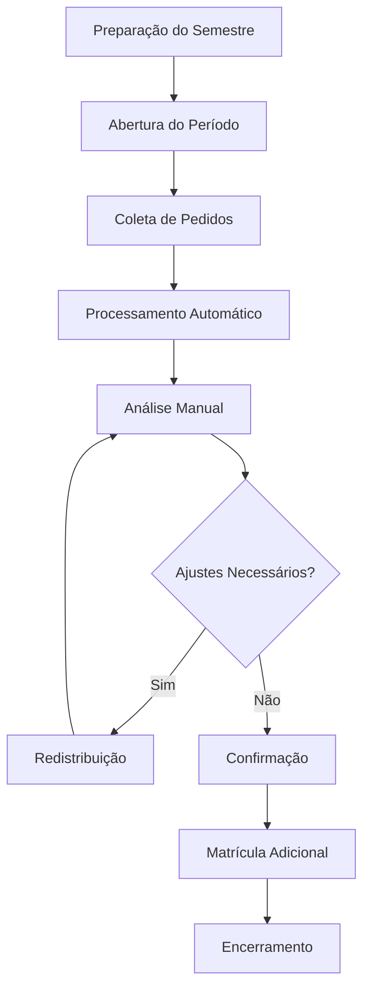
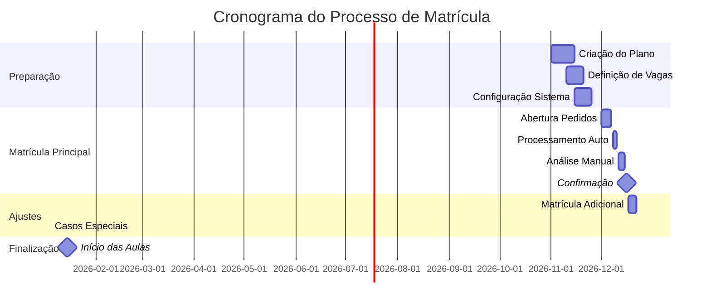

# 📝 Processo Completo de Matrículas

## 📋 Sumário

- [📋 Sumário](#-sumário)
- [🎯 Visão Geral](#-visão-geral)
- [📅 Ciclo da Matrícula](#-ciclo-da-matrícula)
- [🚀 Abertura do Período](#-abertura-do-período)
- [👥 Processamento de Pedidos](#-processamento-de-pedidos)
- [⚖️ Sistema de Priorização](#-sistema-de-priorização)
- [🔄 Redistribuição de Vagas](#-redistribuição-de-vagas)
- [📊 Monitoramento em Tempo Real](#-monitoramento-em-tempo-real)
- [🔚 Fechamento e Confirmação](#-fechamento-e-confirmação)

---

## 🎯 Visão Geral

O processo de matrículas no Sistema Plano Departamental é um fluxo complexo que envolve múltiplos atores, validações de negócio e algoritmos de distribuição de vagas. Este documento detalha cada fase do processo, desde a preparação até a confirmação final das matrículas.

### 🎭 Atores do Processo

| Ator | Responsabilidades |
|------|------------------|
| **Sistema** | Processamento automático, validações, algoritmos |
| **Coordenador** | Configuração, aprovações, ajustes finais |
| **Secretário** | Operação, atendimento, casos especiais |
| **Aluno** | Solicitação de matrículas, acompanhamento |

### 🔄 Fluxo Macro do Processo



---

## 📅 Ciclo da Matrícula

### 1️⃣ Timeline Típica de um Semestre



### 2️⃣ Fases Detalhadas

#### 🔧 **Fase 1: Preparação (3-4 semanas antes)**

**Atividades:**
- Criação do plano departamental
- Definição de turmas e docentes
- Cálculo automático de demanda
- Configuração de parâmetros

```javascript
// Script de preparação automática
class PreparacaoMatricula {
  async executarPreparacao(planoId) {
    console.log('🚀 Iniciando preparação da matrícula...');

    // 1. Calcular demanda baseada no histórico
    const demanda = await this.calcularDemandaHistorica(planoId);
    console.log(`📊 Demanda calculada: ${demanda.totalPedidos} pedidos estimados`);

    // 2. Gerar pedidos automáticos
    await this.gerarPedidosAutomaticos(planoId, demanda);
    console.log('✅ Pedidos automáticos gerados');

    // 3. Validar configuração
    const validacao = await this.validarConfiguracao(planoId);

    if (!validacao.valido) {
      console.error('❌ Problemas encontrados:', validacao.problemas);
      throw new Error('Preparação falhou na validação');
    }

    // 4. Notificar coordenadores
    await this.notificarCoordenadores(planoId);
    console.log('📧 Coordenadores notificados');

    console.log('🎉 Preparação concluída com sucesso!');
  }

  async calcularDemandaHistorica(planoId) {
    const plano = await Plano.findByPk(planoId);
    const semestreAnterior = this.obterSemestreAnterior(plano.ano, plano.semestre);

    const query = `
      SELECT
        d.id as disciplinaId,
        d.codigo,
        d.nome,
        COUNT(DISTINCT t.id) as turmasAnteriores,
        SUM(COALESCE(pedAnt.vagasPeriodizadas, 0)) as demandaAntPeriod,
        SUM(COALESCE(pedAnt.vagasNaoPeriodizadas, 0)) as demandaAntNaoPeriod,
        AVG(
          COALESCE(pedAnt.vagasPeriodizadas, 0) +
          COALESCE(pedAnt.vagasNaoPeriodizadas, 0)
        ) as mediaDemanda
      FROM Disciplina d
      JOIN Turma t ON t.Disciplina = d.id
      JOIN Plano pAnt ON pAnt.id = t.Plano AND pAnt.ano = ? AND pAnt.semestre = ?
      LEFT JOIN Pedido pedAnt ON pedAnt.Turma = t.id
      GROUP BY d.id, d.codigo, d.nome
    `;

    const resultado = await sequelize.query(query, {
      replacements: [semestreAnterior.ano, semestreAnterior.semestre],
      type: QueryTypes.SELECT
    });

    return {
      totalPedidos: resultado.reduce((sum, item) => sum + (item.mediaDemanda || 0), 0),
      porDisciplina: resultado
    };
  }
}
```

#### 📥 **Fase 2: Abertura do Período (1 semana)**

**Sistema de configuração:**

```
┌─────────────────────────────────────────────────────────────┐
│  📅 Configuração do Período de Matrícula                   │
├─────────────────────────────────────────────────────────────┤
│                                                             │
│  📊 Dados Gerais                                           │
│  ┌─────────────────────────────────────────────────────────┐ │
│  │ Semestre: 2024/1                                       │ │
│  │ Período: [ 01/12/2023 ] até [ 07/12/2023 ]            │ │
│  │ Status: 🟢 Ativo                                       │ │
│  └─────────────────────────────────────────────────────────┘ │
│                                                             │
│  ⚙️ Configurações Avançadas                                │
│  ┌─────────────────────────────────────────────────────────┐ │
│  │ ☑️ Permitir matrícula em disciplinas optativas         │ │
│  │ ☑️ Verificar pré-requisitos automaticamente            │ │
│  │ ☑️ Processar quebra de pré-req. com aprovação          │ │
│  │ ☐ Permitir matrícula em outras unidades               │ │
│  │                                                         │ │
│  │ Máximo de créditos por aluno: [30] créditos           │ │
│  │ Mínimo de créditos por aluno: [12] créditos           │ │
│  └─────────────────────────────────────────────────────────┘ │
│                                                             │
│  🎯 Critérios de Prioridade                               │
│  ┌─────────────────────────────────────────────────────────┐ │
│  │ 1️⃣ Período correto na grade (peso: 50%)               │ │
│  │ 2️⃣ IRA do aluno (peso: 30%)                           │ │
│  │ 3️⃣ Tempo no curso (peso: 15%)                         │ │
│  │ 4️⃣ Ordem de solicitação (peso: 5%)                    │ │
│  └─────────────────────────────────────────────────────────┘ │
│                                                             │
│  🔔 Notificações                                           │
│  ┌─────────────────────────────────────────────────────────┐ │
│  │ ☑️ Email para alunos (abertura)                        │ │
│  │ ☑️ SMS para coordenadores (problemas)                  │ │
│  │ ☑️ Dashboard em tempo real                             │ │
│  └─────────────────────────────────────────────────────────┘ │
│                                                             │
│  ┌─────────────┐  ┌─────────────┐  ┌─────────────┐         │
│  │ Testar      │  │ Salvar      │  │ Ativar      │         │
│  │ Config.     │  │ Config.     │  │ Período     │         │
│  └─────────────┘  └─────────────┘  └─────────────┘         │
└─────────────────────────────────────────────────────────────┘
```

---

## 🚀 Abertura do Período

### 1️⃣ Sistema de Coleta de Pedidos

#### 📱 Interface do Aluno

```
┌─────────────────────────────────────────────────────────────┐
│  🎓 Portal do Aluno - Matrícula 2024/1                    │
│  👤 João Silva Santos - Ciência da Computação - 4º Período │
├─────────────────────────────────────────────────────────────┤
│                                                             │
│  📊 Situação Atual                                        │
│  • 📚 Créditos concluídos: 95/180                         │
│  • 📈 IRA: 8.2                                            │
│  • ⏱️ Semestres cursados: 7                               │
│  • 🎯 Previsão formatura: 2025/2                          │
│                                                             │
│  📋 Disciplinas Recomendadas (4º Período)                 │
│  ┌─────────────────────────────────────────────────────────┐ │
│  │ ☑️ DCC401 - Engenharia de Software                    │ │
│  │    👥 3 turmas | 🎯 85% chance | ⭐ Obrigatória       │ │
│  │    Horários: Seg/Qua 8h, Ter/Qui 10h, Seg/Qua 19h   │ │
│  │                                                         │ │
│  │ ☑️ DCC402 - Banco de Dados                            │ │
│  │    👥 2 turmas | 🎯 92% chance | ⭐ Obrigatória       │ │
│  │    ⚠️ Pré-req: DCC301 (✅ Aprovado)                   │ │
│  │                                                         │ │
│  │ ☑️ MAT301 - Estatística                               │ │
│  │    👥 1 turma | 🎯 65% chance | ⭐ Obrigatória        │ │
│  │    📍 Oferecida por: Depto. Matemática               │ │
│  └─────────────────────────────────────────────────────────┘ │
│                                                             │
│  📚 Disciplinas Optativas Disponíveis                     │
│  ┌─────────────────────────────────────────────────────────┐ │
│  │ ☐ DCC450 - Inteligência Artificial                    │ │
│  │    👥 1 turma | 🎯 30% chance | ⚠️ Alta concorrência  │ │
│  │                                                         │ │
│  │ ☐ DCC460 - Desenvolvimento Web                        │ │
│  │    👥 2 turmas | 🎯 75% chance | ✅ Boa disponib.     │ │
│  └─────────────────────────────────────────────────────────┘ │
│                                                             │
│  📊 Resumo da Solicitação                                 │
│  • Total selecionado: 4 disciplinas (24 créditos)         │
│  • Carga horária: 360 horas                               │
│  • Conflitos de horário: ❌ Nenhum                        │
│                                                             │
│  ┌─────────────┐  ┌─────────────┐                         │
│  │ Simular     │  │ Confirmar   │                         │
│  │ Resultado   │  │ Pedidos     │                         │
│  └─────────────┘  └─────────────┘                         │
└─────────────────────────────────────────────────────────────┘
```

#### 🧠 Sistema de Recomendação

```javascript
class RecomendacaoMatricula {
  constructor(alunoId) {
    this.alunoId = alunoId;
    this.aluno = null;
    this.historico = null;
    this.gradeAtual = null;
  }

  async carregarDadosAluno() {
    this.aluno = await Aluno.findByPk(this.alunoId, {
      include: ['Curso', 'MatriculasHistorico']
    });

    this.gradeAtual = await Grade.findOne({
      where: { Curso: this.aluno.CursoId, ativa: true },
      include: ['DisciplinaGrades']
    });

    this.historico = await this.analisarHistoricoAcademico();
  }

  async gerarRecomendacoes() {
    await this.carregarDadosAluno();

    const disciplinasDisponiveis = await this.obterDisciplinasDisponiveis();
    const recomendacoes = [];

    for (const disciplina of disciplinasDisponiveis) {
      const score = await this.calcularScoreRecomendacao(disciplina);
      const probabilidade = await this.calcularProbabilidadeMatricula(disciplina);

      recomendacoes.push({
        disciplina: disciplina,
        score: score,
        probabilidade: probabilidade,
        motivos: score.explicacoes,
        categoria: this.categorizarRecomendacao(score.total),
        turmasDisponiveis: disciplina.turmas
      });
    }

    return recomendacoes.sort((a, b) => b.score.total - a.score.total);
  }

  async calcularScoreRecomendacao(disciplina) {
    let score = 0;
    const explicacoes = [];

    // Verficar se está no período recomendado (peso: 40)
    const disciplinaGrade = this.gradeAtual.DisciplinaGrades.find(
      dg => dg.DisciplinaId === disciplina.id
    );

    if (disciplinaGrade) {
      const periodoAtualEstimado = this.estimarPeriodoAtual();

      if (disciplinaGrade.periodo === periodoAtualEstimado) {
        score += 40;
        explicacoes.push(`✅ Disciplina do ${periodoAtualEstimado}º período (recomendado)`);
      } else if (disciplinaGrade.periodo < periodoAtualEstimado) {
        score += 35;
        explicacoes.push(`⚠️ Disciplina em atraso (${disciplinaGrade.periodo}º período)`);
      } else {
        score += 20;
        explicacoes.push(`📈 Disciplina adiantada (${disciplinaGrade.periodo}º período)`);
      }

      // Bonus para obrigatórias
      if (disciplinaGrade.obrigatoria) {
        score += 20;
        explicacoes.push('⭐ Disciplina obrigatória');
      }
    }

    // Verificar pré-requisitos (peso: 20)
    const preReqStatus = await this.verificarPreRequisitos(disciplina.id);
    if (preReqStatus.todos Atendidos) {
      score += 20;
      explicacoes.push('✅ Todos os pré-requisitos atendidos');
    } else {
      score -= 10;
      explicacoes.push(`❌ Pré-requisitos pendentes: ${preReqStatus.pendentes.join(', ')}`);
    }

    // Considerar taxa de aprovação da disciplina (peso: 10)
    const estatisticas = await this.obterEstatisticasDisciplina(disciplina.id);
    if (estatisticas.taxaAprovacao >= 0.8) {
      score += 10;
      explicacoes.push(`📊 Alta taxa de aprovação (${(estatisticas.taxaAprovacao * 100).toFixed(0)}%)`);
    } else if (estatisticas.taxaAprovacao <= 0.5) {
      score -= 5;
      explicacoes.push(`⚠️ Baixa taxa de aprovação (${(estatisticas.taxaAprovacao * 100).toFixed(0)}%)`);
    }

    // Considerar conflitos de horário (peso: 10)
    const conflitos = await this.verificarConflitosHorario(disciplina.turmas);
    if (conflitos.length === 0) {
      score += 10;
      explicacoes.push('✅ Sem conflitos de horário');
    } else {
      score -= 5;
      explicacoes.push(`⚠️ ${conflitos.length} conflito(s) de horário`);
    }

    return {
      total: Math.max(0, Math.min(100, score)),
      explicacoes: explicacoes
    };
  }

  async calcularProbabilidadeMatricula(disciplina) {
    const estatisticasVaga = await this.obterEstatisticasVaga(disciplina.id);
    const posicaoEstimada = await this.estimarPosicaoFila(disciplina.id);

    const probabilidade = Math.min(100,
      (estatisticasVaga.vagasDisponiveis / posicaoEstimada) * 100
    );

    return Math.round(probabilidade);
  }

  categorizarRecomendacao(score) {
    if (score >= 80) return 'altamente-recomendada';
    if (score >= 60) return 'recomendada';
    if (score >= 40) return 'opcional';
    return 'nao-recomendada';
  }
}
```

### 2️⃣ Validações em Tempo Real

#### 🔍 Sistema de Validação

```javascript
class ValidadorMatricula {
  constructor() {
    this.regras = [
      new RegraCargaHoraria(),
      new RegraPreRequisitos(),
      new RegraConflitosHorario(),
      new RegraPeriodoMaximo(),
      new RegraFormandos()
    ];
  }

  async validarPedidoCompleto(alunoId, disciplinasIds) {
    const resultados = {
      valido: true,
      erros: [],
      avisos: [],
      informacoes: []
    };

    for (const regra of this.regras) {
      const resultado = await regra.validar(alunoId, disciplinasIds);

      if (resultado.nivel === 'erro') {
        resultados.erros.push(resultado);
        resultados.valido = false;
      } else if (resultado.nivel === 'aviso') {
        resultados.avisos.push(resultado);
      } else if (resultado.nivel === 'info') {
        resultados.informacoes.push(resultado);
      }
    }

    return resultados;
  }
}

class RegraCargaHoraria {
  async validar(alunoId, disciplinasIds) {
    const disciplinas = await Disciplina.findAll({
      where: { id: { [Op.in]: disciplinasIds } }
    });

    const cargaTotal = disciplinas.reduce((total, d) =>
      total + d.cargaTeorica + d.cargaPratica, 0
    );

    const creditosTotal = cargaTotal / 15;

    if (creditosTotal > 30) {
      return {
        nivel: 'erro',
        codigo: 'CARGA_EXCESSIVA',
        mensagem: `Carga horária total (${creditosTotal} créditos) excede o limite de 30 créditos`,
        detalhes: { cargaTotal, creditosTotal }
      };
    }

    if (creditosTotal < 12) {
      return {
        nivel: 'aviso',
        codigo: 'CARGA_BAIXA',
        mensagem: `Carga horária baixa (${creditosTotal} créditos). Mínimo recomendado: 12 créditos`,
        detalhes: { cargaTotal, creditosTotal }
      };
    }

    return {
      nivel: 'info',
      codigo: 'CARGA_OK',
      mensagem: `Carga horária adequada: ${creditosTotal} créditos (${cargaTotal}h)`,
      detalhes: { cargaTotal, creditosTotal }
    };
  }
}

class RegraPreRequisitos {
  async validar(alunoId, disciplinasIds) {
    const problemas = [];

    for (const disciplinaId of disciplinasIds) {
      const preReqs = await this.obterPreRequisitos(disciplinaId);
      const historico = await this.obterHistoricoAluno(alunoId);

      for (const preReq of preReqs) {
        const aprovado = historico.find(h =>
          h.disciplinaId === preReq.id && h.situacao === 'aprovado'
        );

        if (!aprovado) {
          problemas.push({
            disciplina: await this.obterNomeDisciplina(disciplinaId),
            preRequisito: preReq.codigo,
            situacao: historico.find(h => h.disciplinaId === preReq.id)?.situacao || 'não cursada'
          });
        }
      }
    }

    if (problemas.length > 0) {
      return {
        nivel: 'erro',
        codigo: 'PREREQ_NAO_ATENDIDO',
        mensagem: `Pré-requisitos não atendidos em ${problemas.length} disciplina(s)`,
        detalhes: problemas
      };
    }

    return {
      nivel: 'info',
      codigo: 'PREREQ_OK',
      mensagem: 'Todos os pré-requisitos atendidos'
    };
  }
}
```

---

## 👥 Processamento de Pedidos

### 1️⃣ Algoritmo de Processamento Principal

#### 🤖 Motor de Processamento

```javascript
class ProcessadorMatricula {
  constructor() {
    this.filaProcessamento = [];
    this.resultados = new Map();
    this.estatisticas = {
      processados: 0,
      aprovados: 0,
      rejeitados: 0,
      listaEspera: 0
    };
  }

  async executarProcessamento(planoId) {
    console.log('🚀 Iniciando processamento de matrículas...');

    // 1. Carregar todos os pedidos
    const pedidos = await this.carregarPedidos(planoId);
    console.log(`📊 ${pedidos.length} pedidos carregados`);

    // 2. Ordenar por prioridade
    const pedidosOrdenados = await this.ordenarPorPrioridade(pedidos);

    // 3. Processar cada pedido
    for (const pedido of pedidosOrdenados) {
      await this.processarPedidoIndividual(pedido);

      // Atualizar estatísticas em tempo real
      await this.atualizarEstatisticas();

      // Emitir evento para dashboard
      this.emitirProgressoProcessamento();
    }

    // 4. Gerar relatório final
    const relatorio = await this.gerarRelatorioFinal();

    console.log('✅ Processamento concluído!');
    return relatorio;
  }

  async processarPedidoIndividual(pedido) {
    try {
      const aluno = pedido.Aluno;
      const disciplinas = pedido.Disciplinas;

      // Verificar cada disciplina solicitada
      for (const disciplina of disciplinas) {
        const resultadoDisciplina = await this.processarDisciplinaIndividual(
          aluno,
          disciplina,
          pedido.prioridade
        );

        this.resultados.set(`${aluno.id}-${disciplina.id}`, resultadoDisciplina);
      }

      this.estatisticas.processados++;

    } catch (error) {
      console.error(`Erro ao processar pedido ${pedido.id}:`, error);

      this.resultados.set(pedido.id, {
        status: 'erro',
        motivo: error.message
      });
    }
  }

  async processarDisciplinaIndividual(aluno, disciplina, prioridade) {
    // 1. Verificar disponibilidade de vagas
    const vagasDisponiveis = await this.verificarVagasDisponiveis(
      disciplina.id,
      aluno.CursoId
    );

    if (vagasDisponiveis.length === 0) {
      return {
        status: 'lista-espera',
        motivo: 'Sem vagas disponíveis',
        posicaoFila: await this.obterPosicaoListaEspera(disciplina.id, aluno.id)
      };
    }

    // 2. Selecionar melhor turma
    const melhorTurma = await this.selecionarMelhorTurma(
      vagasDisponiveis,
      aluno
    );

    // 3. Tentar alocar vaga
    const alocacao = await this.tentarAlocarVaga(
      melhorTurma.id,
      aluno.id,
      prioridade
    );

    if (alocacao.sucesso) {
      return {
        status: 'aprovado',
        turmaId: melhorTurma.id,
        vagaId: alocacao.vagaId,
        timestamp: new Date()
      };
    } else {
      return {
        status: 'lista-espera',
        motivo: alocacao.motivo,
        turmaPreferida: melhorTurma.id
      };
    }
  }

  async selecionarMelhorTurma(turmasDisponiveis, aluno) {
    let melhorTurma = null;
    let melhorScore = -1;

    for (const turma of turmasDisponiveis) {
      const score = await this.calcularScoreTurma(turma, aluno);

      if (score > melhorScore) {
        melhorScore = score;
        melhorTurma = turma;
      }
    }

    return melhorTurma;
  }

  async calcularScoreTurma(turma, aluno) {
    let score = 0;

    // Preferência por turno do curso
    if (turma.turno1 === aluno.Curso.turno) {
      score += 30;
    }

    // Evitar conflitos de horário
    const conflitos = await this.verificarConflitosAluno(turma.id, aluno.id);
    score -= conflitos.length * 10;

    // Preferir turmas com vagas do próprio curso
    const vagasCurso = await Vaga.count({
      where: {
        Turma: turma.id,
        Curso: aluno.CursoId,
        ocupada: false
      }
    });

    score += vagasCurso * 5;

    // Considerar avaliação do docente
    const avaliacaoDocente = await this.obterAvaliacaoDocente(turma.Docente1Id);
    score += (avaliacaoDocente - 3) * 5; // Normalizar para escala -10 a +10

    return score;
  }
}
```

### 2️⃣ Sistema de Fila e Lista de Espera

#### 📋 Gerenciador de Filas

```javascript
class GerenciadorFilaEspera {
  constructor() {
    this.filas = new Map(); // disciplinaId -> FilaEspera
  }

  async adicionarAlunoFila(disciplinaId, alunoId, prioridade, turmaPreferida = null) {
    if (!this.filas.has(disciplinaId)) {
      this.filas.set(disciplinaId, new FilaEspera(disciplinaId));
    }

    const fila = this.filas.get(disciplinaId);
    const posicao = await fila.adicionarAluno(alunoId, prioridade, turmaPreferida);

    // Notificar aluno da posição na fila
    await this.notificarPosicaoFila(alunoId, disciplinaId, posicao);

    return posicao;
  }

  async processarVagaLiberada(turmaId, vagaId) {
    const turma = await Turma.findByPk(turmaId, { include: ['Disciplina'] });
    const disciplinaId = turma.Disciplina.id;

    if (!this.filas.has(disciplinaId)) {
      return null; // Sem fila para esta disciplina
    }

    const fila = this.filas.get(disciplinaId);
    const proximoAluno = await fila.obterProximo(turmaId);

    if (proximoAluno) {
      // Tentar alocar vaga para o próximo da fila
      const alocacao = await this.tentarAlocarVaga(vagaId, proximoAluno.alunoId);

      if (alocacao.sucesso) {
        await fila.removerAluno(proximoAluno.alunoId);
        await this.notificarMatriculaEfetivada(proximoAluno.alunoId, turmaId);

        // Atualizar posições na fila
        await this.atualizarPosicoesFila(disciplinaId);

        return proximoAluno;
      }
    }

    return null;
  }

  async atualizarPosicoesFila(disciplinaId) {
    const fila = this.filas.get(disciplinaId);
    const alunosNaFila = await fila.obterTodos();

    for (let i = 0; i < alunosNaFila.length; i++) {
      const aluno = alunosNaFila[i];
      aluno.posicao = i + 1;

      await this.notificarMudancaPosicao(aluno.alunoId, disciplinaId, aluno.posicao);
    }
  }
}

class FilaEspera {
  constructor(disciplinaId) {
    this.disciplinaId = disciplinaId;
    this.alunos = [];
  }

  async adicionarAluno(alunoId, prioridade, turmaPreferida) {
    const aluno = await Aluno.findByPk(alunoId, {
      include: ['Curso']
    });

    const itemFila = {
      alunoId: alunoId,
      aluno: aluno,
      prioridade: prioridade,
      turmaPreferida: turmaPreferida,
      timestamp: new Date(),
      posicao: 0 // Será calculado após ordenação
    };

    this.alunos.push(itemFila);
    this.ordenarFila();

    // Atualizar posições
    this.alunos.forEach((item, index) => {
      item.posicao = index + 1;
    });

    return itemFila.posicao;
  }

  ordenarFila() {
    this.alunos.sort((a, b) => {
      // 1. Prioridade do sistema (maior prioridade = menor número)
      if (a.prioridade !== b.prioridade) {
        return a.prioridade - b.prioridade;
      }

      // 2. IRA (maior IRA primeiro)
      if (a.aluno.ira !== b.aluno.ira) {
        return b.aluno.ira - a.aluno.ira;
      }

      // 3. Tempo no curso (mais tempo primeiro)
      const tempoA = this.calcularTempoNoCurso(a.aluno);
      const tempoB = this.calcularTempoNoCurso(b.aluno);
      if (tempoA !== tempoB) {
        return tempoB - tempoA;
      }

      // 4. Timestamp da solicitação (primeiro a solicitar)
      return a.timestamp - b.timestamp;
    });
  }

  calcularTempoNoCurso(aluno) {
    const anoIngresso = new Date(aluno.dataIngresso).getFullYear();
    const anoAtual = new Date().getFullYear();
    return anoAtual - anoIngresso;
  }

  async obterProximo(turmaId = null) {
    // Se turma específica foi solicitada, procurar aluno que prefere essa turma
    if (turmaId) {
      const alunoPreferencia = this.alunos.find(a => a.turmaPreferida === turmaId);
      if (alunoPreferencia) {
        return alunoPreferencia;
      }
    }

    // Retornar primeiro da fila
    return this.alunos.length > 0 ? this.alunos[0] : null;
  }
}
```

---

## ⚖️ Sistema de Priorização

### 1️⃣ Algoritmo de Prioridade Complexo

#### 🏆 Calculadora de Prioridade

```javascript
class CalculadoraPrioridade {
  constructor() {
    this.pesos = {
      periodoCorreto: 0.40,      // 40%
      ira: 0.25,                 // 25%
      tempoNoCurso: 0.15,        // 15%
      situacaoEspecial: 0.10,    // 10%
      ordemSolicitacao: 0.05,    // 5%
      criteriosExtras: 0.05      // 5%
    };
  }

  async calcularPrioridade(alunoId, disciplinaId) {
    const aluno = await this.carregarDadosCompletos(alunoId);
    const disciplina = await Disciplina.findByPk(disciplinaId);

    const scores = {
      periodoCorreto: await this.scorePeriodoCorreto(aluno, disciplina),
      ira: this.scoreIRA(aluno.ira),
      tempoNoCurso: this.scoreTempoNoCurso(aluno),
      situacaoEspecial: await this.scoreSituacaoEspecial(aluno, disciplina),
      ordemSolicitacao: this.scoreOrdemSolicitacao(aluno.timestampSolicitacao),
      criteriosExtras: await this.scoreCriteriosExtras(aluno, disciplina)
    };

    // Calcular score final ponderado
    const scoreFinal = Object.keys(this.pesos).reduce((total, criterio) => {
      return total + (scores[criterio] * this.pesos[criterio]);
    }, 0);

    return {
      scoreFinal: Math.round(scoreFinal * 100), // Converter para escala 0-100
      detalhamento: scores,
      categoria: this.categorizarPrioridade(scoreFinal),
      explicacao: this.gerarExplicacao(scores)
    };
  }

  async scorePeriodoCorreto(aluno, disciplina) {
    // Verificar se disciplina está no período atual do aluno
    const gradeAtual = await Grade.findOne({
      where: { Curso: aluno.CursoId, ativa: true },
      include: [{
        model: DisciplinaGrade,
        where: { Disciplina: disciplina.id }
      }]
    });

    if (!gradeAtual) {
      return 0.5; // Disciplina optativa ou de outro curso
    }

    const periodoRecomendado = gradeAtual.DisciplinaGrades[0].periodo;
    const periodoEstimadoAluno = this.estimarPeriodoAtual(aluno);

    if (periodoRecomendado === periodoEstimadoAluno) {
      return 1.0; // Período correto
    } else if (periodoRecomendado < periodoEstimadoAluno) {
      return 0.8; // Disciplina em atraso (prioridade alta)
    } else {
      return 0.3; // Disciplina adiantada (prioridade baixa)
    }
  }

  scoreIRA(ira) {
    // Normalizar IRA (0-10) para escala 0-1
    // Função sigmóide para dar mais peso a IRAs altos
    return 1 / (1 + Math.exp(-(ira - 6) * 1.5));
  }

  scoreTempoNoCurso(aluno) {
    const tempoEmSemestres = this.calcularTempoEmSemestres(aluno.dataIngresso);
    const tempoEsperadoFormatura = aluno.Curso.duracaoSemestres || 8;

    // Dar prioridade a alunos próximos da formatura
    const proporcaoTempo = tempoEmSemestres / tempoEsperadoFormatura;

    if (proporcaoTempo >= 1.2) {
      return 1.0; // Aluno com tempo excedido (máxima prioridade)
    } else if (proporcaoTempo >= 1.0) {
      return 0.9; // Aluno no tempo esperado de formatura
    } else if (proporcaoTempo >= 0.8) {
      return 0.7; // Aluno próximo da formatura
    } else {
      return Math.max(0.3, proporcaoTempo); // Alunos iniciantes
    }
  }

  async scoreSituacaoEspecial(aluno, disciplina) {
    let score = 0.5; // Score base

    // Verificar situações especiais
    const situacoes = await this.verificarSituacoesEspeciais(aluno.id);

    if (situacoes.formando) {
      score += 0.4; // Formando tem prioridade máxima
    }

    if (situacoes.programaMobilidade) {
      score += 0.3; // Aluno em programa de mobilidade
    }

    if (situacoes.bolsista) {
      score += 0.2; // Bolsista tem prioridade
    }

    if (situacoes.necessidadeEspecial) {
      score += 0.2; // Necessidades especiais
    }

    // Verificar se é a última oportunidade de cursar
    const ultimaOportunidade = await this.verificarUltimaOportunidade(aluno, disciplina);
    if (ultimaOportunidade) {
      score += 0.3;
    }

    return Math.min(1.0, score);
  }

  scoreOrdemSolicitacao(timestamp) {
    // Dar pequeno bonus para quem solicitou primeiro
    const horasDesdeAbertura = (Date.now() - timestamp) / (1000 * 60 * 60);
    const diasPeriodo = 7; // Período de matrícula de 7 dias

    // Score decresce linearmente com o tempo
    return Math.max(0, 1 - (horasDesdeAbertura / (diasPeriodo * 24)));
  }

  async scoreCriteriosExtras(aluno, disciplina) {
    let score = 0.5;

    // Histórico de reprovações na disciplina
    const reprovacoes = await this.contarReprovacoes(aluno.id, disciplina.id);
    if (reprovacoes > 0) {
      score += Math.min(0.3, reprovacoes * 0.1); // Bonus para quem já reprovou
    }

    // Disciplina é pré-requisito de muitas outras
    const importanciaPreReq = await this.calcularImportanciaPreRequisito(disciplina.id);
    if (importanciaPreReq > 3) {
      score += 0.2; // Disciplina importante como pré-requisito
    }

    return Math.min(1.0, score);
  }

  categorizarPrioridade(score) {
    if (score >= 80) return 'MAXIMA';
    if (score >= 65) return 'ALTA';
    if (score >= 50) return 'MEDIA';
    if (score >= 35) return 'BAIXA';
    return 'MINIMA';
  }
}
```

### 2️⃣ Casos Especiais e Exceções

#### 🚨 Processamento de Situações Especiais

```javascript
class ProcessadorCasosEspeciais {
  async processarFormandos(planoId) {
    console.log('🎓 Processando casos especiais: Formandos...');

    const formandos = await this.identificarFormandos(planoId);

    for (const formando of formandos) {
      await this.processarFormando(formando);
    }

    console.log(`✅ ${formandos.length} formandos processados`);
  }

  async identificarFormandos(planoId) {
    // Query complexa para identificar formandos
    const query = `
      SELECT DISTINCT
        a.id,
        a.nome,
        a.matricula,
        c.nome as curso,
        COUNT(CASE WHEN h.situacao != 'aprovado' THEN 1 END) as disciplinas_pendentes,
        g.periodos * 15 as creditos_necessarios,
        a.creditos_concluidos
      FROM Aluno a
      JOIN Curso c ON c.id = a.CursoId
      JOIN Grade g ON g.Curso = c.id AND g.ativa = 1
      JOIN HistoricoAcademico h ON h.AlunoId = a.id
      JOIN DisciplinaGrade dg ON dg.Grade = g.id
      LEFT JOIN Disciplina d ON d.id = dg.Disciplina
      WHERE
        a.ativo = 1
        AND (
          -- Critério 1: Faltam poucas disciplinas obrigatórias
          (SELECT COUNT(*)
           FROM DisciplinaGrade dg2
           WHERE dg2.Grade = g.id
             AND dg2.obrigatoria = 1
             AND dg2.Disciplina NOT IN (
               SELECT h2.DisciplinaId
               FROM HistoricoAcademico h2
               WHERE h2.AlunoId = a.id AND h2.situacao = 'aprovado'
             )
          ) <= 3
          OR
          -- Critério 2: Próximo do limite de créditos
          a.creditos_concluidos >= (g.periodos * 15 * 0.9)
        )
      GROUP BY a.id, a.nome, a.matricula, c.nome, g.periodos, a.creditos_concluidos
      HAVING disciplinas_pendentes <= 5
    `;

    const formandos = await sequelize.query(query, {
      type: QueryTypes.SELECT
    });

    return formandos;
  }

  async processarFormando(formando) {
    // Dar prioridade máxima em todas as disciplinas solicitadas
    const pedidos = await PedidoMatricula.findAll({
      where: { AlunoId: formando.id },
      include: ['Disciplina']
    });

    for (const pedido of pedidos) {
      // Marcar como formando no sistema
      await PedidoMatricula.update(
        {
          prioridade: 1, // Máxima prioridade
          situacaoEspecial: 'FORMANDO',
          observacoes: 'Aluno formando - prioridade automática'
        },
        { where: { id: pedido.id } }
      );

      // Tentar alocar vaga imediatamente
      await this.tentarAlocacaoImediata(pedido);
    }

    // Notificar coordenação sobre formando
    await this.notificarFormando(formando);
  }

  async processarQuebraPreRequisito() {
    console.log('🔓 Processando quebras de pré-requisito...');

    const quebras = await SolicitacaoQuebraPreReq.findAll({
      where: { status: 'pendente' },
      include: ['Aluno', 'Disciplina', 'Coordenador']
    });

    for (const quebra of quebras) {
      await this.analisarQuebraPreRequisito(quebra);
    }
  }

  async analisarQuebraPreRequisito(quebra) {
    const analise = {
      alunoId: quebra.AlunoId,
      disciplinaId: quebra.DisciplinaId,
      recomendacao: null,
      motivos: []
    };

    // Verificar IRA do aluno
    const aluno = await Aluno.findByPk(quebra.AlunoId);
    if (aluno.ira >= 8.0) {
      analise.recomendacao = 'APROVAR';
      analise.motivos.push('IRA alto (>= 8.0)');
    } else if (aluno.ira < 6.0) {
      analise.recomendacao = 'NEGAR';
      analise.motivos.push('IRA baixo (< 6.0)');
    }

    // Verificar se é formando
    const isFormando = await this.verificarFormando(quebra.AlunoId);
    if (isFormando) {
      analise.recomendacao = 'APROVAR';
      analise.motivos.push('Aluno formando');
    }

    // Verificar histórico na disciplina pré-requisito
    const historicoPreReq = await this.verificarHistoricoPreRequisito(quebra);
    if (historicoPreReq.tentativas >= 3) {
      analise.recomendacao = 'APROVAR';
      analise.motivos.push('Múltiplas tentativas no pré-requisito');
    }

    // Atualizar solicitação com análise
    await SolicitacaoQuebraPreReq.update({
      analiseAutomatica: JSON.stringify(analise),
      recomendacaoSistema: analise.recomendacao
    }, {
      where: { id: quebra.id }
    });

    // Se recomendação é clara, pode aprovar automaticamente
    if (analise.recomendacao === 'APROVAR' && analise.motivos.length >= 2) {
      await this.aprovarQuebraAutomatica(quebra.id);
    }
  }
}
```

---

## 🔄 Redistribuição de Vagas

### 1️⃣ Sistema de Redistribuição Inteligente

#### 🧠 Otimizador de Vagas

```javascript
class OtimizadorVagas {
  constructor() {
    this.algoritmos = [
      new AlgoritmoBalanceamento(),
      new AlgoritmoMinimizacaoLista(),
      new AlgoritmoMaximizacaoSatisfacao()
    ];
  }

  async executarOtimizacao(planoId) {
    console.log('🔄 Iniciando otimização de vagas...');

    const estadoInicial = await this.capturarEstadoAtual(planoId);
    let melhorEstado = estadoInicial;
    let melhorScore = await this.calcularScoreEstado(estadoInicial);

    console.log(`📊 Score inicial: ${melhorScore.toFixed(2)}`);

    // Executar cada algoritmo de otimização
    for (const algoritmo of this.algoritmos) {
      console.log(`🔧 Executando ${algoritmo.nome}...`);

      const novoEstado = await algoritmo.otimizar(estadoInicial);
      const novoScore = await this.calcularScoreEstado(novoEstado);

      if (novoScore > melhorScore) {
        melhorEstado = novoEstado;
        melhorScore = novoScore;
        console.log(`✅ Melhoria encontrada: ${novoScore.toFixed(2)}`);
      }
    }

    // Aplicar melhor estado encontrado
    if (melhorScore > await this.calcularScoreEstado(estadoInicial)) {
      await this.aplicarEstado(melhorEstado);
      console.log(`🎉 Otimização aplicada! Melhoria: ${(melhorScore - await this.calcularScoreEstado(estadoInicial)).toFixed(2)}`);
    } else {
      console.log('ℹ️ Nenhuma melhoria encontrada');
    }

    return {
      scoreInicial: await this.calcularScoreEstado(estadoInicial),
      scoreFinal: melhorScore,
      melhorias: melhorEstado.alteracoes
    };
  }

  async calcularScoreEstado(estado) {
    let score = 0;
    const pesos = {
      taxaOcupacao: 0.4,        // 40%
      satisfacaoAlunos: 0.3,    // 30%
      equilibrioCursos: 0.2,    // 20%
      eficienciaRecursos: 0.1   // 10%
    };

    // 1. Taxa de ocupação geral
    const taxaOcupacao = this.calcularTaxaOcupacao(estado);
    score += taxaOcupacao * pesos.taxaOcupacao;

    // 2. Satisfação dos alunos (baseada em prioridade)
    const satisfacao = await this.calcularSatisfacaoAlunos(estado);
    score += satisfacao * pesos.satisfacaoAlunos;

    // 3. Equilíbrio entre cursos
    const equilibrio = this.calcularEquilibrioCursos(estado);
    score += equilibrio * pesos.equilibrioCursos;

    // 4. Eficiência de recursos (salas, docentes)
    const eficiencia = this.calcularEficienciaRecursos(estado);
    score += eficiencia * pesos.eficienciaRecursos;

    return score * 100; // Converter para escala 0-100
  }
}

class AlgoritmoBalanceamento {
  nome = 'Balanceamento de Vagas';

  async otimizar(estadoInicial) {
    const novoEstado = JSON.parse(JSON.stringify(estadoInicial));

    // Identificar disciplinas desbalanceadas
    const estatisticas = this.analisarDesbalanceamento(novoEstado);

    for (const disciplina of estatisticas.desbalanceadas) {
      await this.balancearDisciplina(disciplina, novoEstado);
    }

    return novoEstado;
  }

  analisarDesbalanceamento(estado) {
    const disciplinas = estado.disciplinas;
    const desbalanceadas = [];

    for (const disciplina of disciplinas) {
      const demandaTotal = disciplina.pedidos.reduce((sum, p) => sum + p.quantidade, 0);
      const ofertaTotal = disciplina.vagas.reduce((sum, v) => sum + v.quantidade, 0);

      const razaoDesequilibrio = Math.abs(demandaTotal - ofertaTotal) / demandaTotal;

      if (razaoDesequilibrio > 0.3) { // Desequilíbrio > 30%
        desbalanceadas.push({
          disciplina: disciplina,
          demanda: demandaTotal,
          oferta: ofertaTotal,
          desequilibrio: razaoDesequilibrio,
          tipo: demandaTotal > ofertaTotal ? 'deficit' : 'excesso'
        });
      }
    }

    return { desbalanceadas };
  }

  async balancearDisciplina(info, estado) {
    if (info.tipo === 'deficit') {
      // Tentar aumentar vagas ou criar nova turma
      await this.tentarAumentarOferta(info, estado);
    } else {
      // Tentar reduzir vagas ou realocar para disciplinas deficitárias
      await this.tentarReduzirOferta(info, estado);
    }
  }

  async tentarAumentarOferta(info, estado) {
    // 1. Verificar se pode aumentar vagas nas turmas existentes
    for (const turma of info.disciplina.turmas) {
      const capacidadeMaxima = await this.obterCapacidadeMaximaTurma(turma.id);
      const vagasAtuais = turma.vagas.reduce((sum, v) => sum + v.quantidade, 0);

      if (vagasAtuais < capacidadeMaxima) {
        const vagasAdicionais = Math.min(
          capacidadeMaxima - vagasAtuais,
          info.demanda - info.oferta
        );

        // Distribuir vagas adicionais proporcionalmente entre cursos
        await this.distribuirVagasAdicionais(turma, vagasAdicionais, estado);
      }
    }

    // 2. Se ainda há deficit, considerar abrir nova turma
    const deficitRestante = info.demanda - this.calcularNovaOferta(info.disciplina, estado);
    if (deficitRestante > 10) { // Só vale a pena se deficit significativo
      await this.sugerirNovaTurma(info.disciplina, deficitRestante, estado);
    }
  }
}

class AlgoritmoMinimizacaoLista {
  nome = 'Minimização de Lista de Espera';

  async otimizar(estadoInicial) {
    const novoEstado = JSON.parse(JSON.stringify(estadoInicial));

    // Focar nas disciplinas com maior lista de espera
    const disciplinasProblematicas = this.identificarDisciplinasProblematicas(novoEstado);

    for (const disciplina of disciplinasProblematicas) {
      await this.reduzirListaEspera(disciplina, novoEstado);
    }

    return novoEstado;
  }

  identificarDisciplinasProblematicas(estado) {
    return estado.disciplinas
      .filter(d => d.listaEspera.length > 5) // Lista de espera > 5
      .sort((a, b) => b.listaEspera.length - a.listaEspera.length);
  }

  async reduzirListaEspera(disciplina, estado) {
    const estrategias = [
      () => this.rearranjarVagasEntreTurmas(disciplina, estado),
      () => this.redistribuirVagasEntreCursos(disciplina, estado),
      () => this.identificarVagasSubutilizadas(disciplina, estado)
    ];

    for (const estrategia of estrategias) {
      const melhorias = await estrategia();
      if (melhorias > 0) {
        console.log(`✅ ${melhorias} alunos removidos da lista de espera`);
      }
    }
  }
}
```

### 2️⃣ Interface de Redistribuição Manual

#### 🎛️ Painel de Controle

```
┌─────────────────────────────────────────────────────────────┐
│  🔄 Redistribuição Manual de Vagas                         │
├─────────────────────────────────────────────────────────────┤
│                                                             │
│  📊 Visão Geral                                            │
│  ┌─────────────────────────────────────────────────────────┐ │
│  │ 🎯 Taxa Ocupação: 87.3%  📋 Lista Espera: 234 alunos  │ │
│  │ 🏫 Turmas Ativas: 127    ⚖️  Balance Score: 8.4/10    │ │
│  └─────────────────────────────────────────────────────────┘ │
│                                                             │
│  🚨 Disciplinas Críticas                                   │
│  ┌─────────────────────────────────────────────────────────┐ │
│  │ DCC401 - Eng. Software                                 │ │
│  │ 📊 Demanda: 85 | Oferta: 60 | Lista: 25 alunos        │ │
│  │ ┌─────────────┐ ┌─────────────┐ ┌─────────────┐       │ │
│  │ │ +10 Vagas   │ │ Nova Turma  │ │ Realocar    │       │ │
│  │ └─────────────┘ └─────────────┘ └─────────────┘       │ │
│  │                                                         │ │
│  │ MAT301 - Estatística                                   │ │
│  │ 📊 Demanda: 42 | Oferta: 30 | Lista: 12 alunos        │ │
│  │ ┌─────────────┐ ┌─────────────┐                       │ │
│  │ │ +5 Vagas    │ │ Transferir  │                       │ │
│  │ └─────────────┘ └─────────────┘                       │ │
│  └─────────────────────────────────────────────────────────┘ │
│                                                             │
│  🔧 Ações Rápidas                                          │
│  ┌─────────────────────────────────────────────────────────┐ │
│  │ ┌─────────────────┐ ┌─────────────────┐               │ │
│  │ │ 🤖 Auto-        │ │ 📊 Simular      │               │ │
│  │ │ Otimização      │ │ Cenários        │               │ │
│  │ └─────────────────┘ └─────────────────┘               │ │
│  │                                                         │ │
│  │ ┌─────────────────┐ ┌─────────────────┐               │ │
│  │ │ 📈 Relatório    │ │ 🔄 Aplicar      │               │ │
│  │ │ Impacto         │ │ Alterações      │               │ │
│  │ └─────────────────┘ └─────────────────┘               │ │
│  └─────────────────────────────────────────────────────────┘ │
└─────────────────────────────────────────────────────────────┘
```

---

## 📊 Monitoramento em Tempo Real

### 1️⃣ Dashboard de Acompanhamento

#### 📈 Sistema de Métricas Live

```javascript
class DashboardMatricula {
  constructor() {
    this.socket = io();
    this.metricas = {};
    this.graficos = {};
    this.alertas = [];

    this.inicializarEventos();
    this.configurarAtualizacaoAutomatica();
  }

  inicializarEventos() {
    // Eventos Socket.IO para atualizações em tempo real
    this.socket.on('matricula_processada', (data) => {
      this.atualizarContadores(data);
      this.atualizarGraficoTempo();
    });

    this.socket.on('vaga_liberada', (data) => {
      this.processarVagaLiberada(data);
    });

    this.socket.on('lista_espera_atualizada', (data) => {
      this.atualizarListaEspera(data);
    });

    this.socket.on('alerta_sistema', (data) => {
      this.adicionarAlerta(data);
    });
  }

  async carregarMetricasIniciais() {
    try {
      const response = await api.get('/matriculas/metricas-tempo-real');
      this.metricas = response.data;
      this.renderizarDashboard();
    } catch (error) {
      console.error('Erro ao carregar métricas:', error);
    }
  }

  renderizarDashboard() {
    this.renderizarContadores();
    this.renderizarGraficos();
    this.renderizarAlertas();
    this.renderizarListaEspera();
  }

  renderizarContadores() {
    // Contadores principais
    document.getElementById('total-processados').textContent =
      this.metricas.totalProcessados.toLocaleString();

    document.getElementById('total-aprovados').textContent =
      this.metricas.totalAprovados.toLocaleString();

    document.getElementById('taxa-aprovacao').textContent =
      `${(this.metricas.totalAprovados / this.metricas.totalProcessados * 100).toFixed(1)}%`;

    document.getElementById('lista-espera-total').textContent =
      this.metricas.totalListaEspera.toLocaleString();

    // Indicadores visuais
    this.atualizarIndicadorTaxaOcupacao();
    this.atualizarIndicadorBalance();
  }

  renderizarGraficos() {
    // Gráfico de processamento por hora
    this.graficoProcessamentoPorHora();

    // Gráfico de distribuição por curso
    this.graficoDistribuicaoPorCurso();

    // Gráfico de evolução da lista de espera
    this.graficoEvolucaoListaEspera();

    // Heatmap de conflitos de horário
    this.heatmapConflitos();
  }

  graficoProcessamentoPorHora() {
    const ctx = document.getElementById('chart-processamento').getContext('2d');

    if (this.graficos.processamento) {
      this.graficos.processamento.destroy();
    }

    this.graficos.processamento = new Chart(ctx, {
      type: 'line',
      data: {
        labels: this.metricas.processamentoPorHora.labels,
        datasets: [{
          label: 'Processados',
          data: this.metricas.processamentoPorHora.processados,
          borderColor: '#36A2EB',
          backgroundColor: '#36A2EB20',
          tension: 0.4
        }, {
          label: 'Aprovados',
          data: this.metricas.processamentoPorHora.aprovados,
          borderColor: '#4BC0C0',
          backgroundColor: '#4BC0C020',
          tension: 0.4
        }]
      },
      options: {
        responsive: true,
        plugins: {
          title: {
            display: true,
            text: 'Processamento por Hora'
          }
        },
        scales: {
          y: {
            beginAtZero: true
          }
        },
        animation: {
          duration: 750
        }
      }
    });
  }

  atualizarContadores(data) {
    // Animação nos contadores
    this.animarContador('total-processados', data.totalProcessados);
    this.animarContador('total-aprovados', data.totalAprovados);

    const taxaAprovacao = (data.totalAprovados / data.totalProcessados * 100).toFixed(1);
    this.animarContador('taxa-aprovacao', `${taxaAprovacao}%`);
  }

  animarContador(elementId, novoValor) {
    const elemento = document.getElementById(elementId);
    const valorAtual = parseInt(elemento.textContent.replace(/[^\d]/g, '')) || 0;
    const valorNovo = typeof novoValor === 'string' ?
      parseInt(novoValor.replace(/[^\d]/g, '')) : novoValor;

    // Animação incremental
    const incremento = (valorNovo - valorAtual) / 20;
    let valorTemporario = valorAtual;

    const intervalo = setInterval(() => {
      valorTemporario += incremento;

      if (typeof novoValor === 'string' && novoValor.includes('%')) {
        elemento.textContent = `${valorTemporario.toFixed(1)}%`;
      } else {
        elemento.textContent = Math.round(valorTemporario).toLocaleString();
      }

      if (Math.abs(valorTemporario - valorNovo) < Math.abs(incremento)) {
        clearInterval(intervalo);
        elemento.textContent = typeof novoValor === 'string' ? novoValor : novoValor.toLocaleString();

        // Efeito visual de atualização
        elemento.classList.add('updated');
        setTimeout(() => elemento.classList.remove('updated'), 1000);
      }
    }, 50);
  }
}
```

### 2️⃣ Sistema de Alertas Inteligentes

#### 🚨 Detector de Anomalias

```javascript
class DetectorAnomalias {
  constructor() {
    this.thresholds = {
      taxaOcupacaoMinima: 0.7,      // 70%
      taxaOcupacaoMaxima: 0.95,     // 95%
      listaEsperaMaxima: 50,        // alunos
      tempoProcessamentoMax: 300,   // segundos
      errorRateMax: 0.05           // 5%
    };

    this.historico = [];
    this.alertasAtivos = new Map();
  }

  async monitorarContinuamente() {
    setInterval(async () => {
      await this.verificarAnomalias();
    }, 30000); // Verificar a cada 30 segundos
  }

  async verificarAnomalias() {
    const metricas = await this.coletarMetricas();
    this.historico.push({
      timestamp: Date.now(),
      metricas: metricas
    });

    // Manter apenas últimas 100 medições
    if (this.historico.length > 100) {
      this.historico.shift();
    }

    await this.analisarTendencias(metricas);
    await this.detectarAnomaliasPontuais(metricas);
    await this.verificarPadroesSazonais(metricas);
  }

  async detectarAnomaliasPontuais(metricas) {
    const anomalias = [];

    // Taxa de ocupação muito baixa
    if (metricas.taxaOcupacao < this.thresholds.taxaOcupacaoMinima) {
      anomalias.push({
        tipo: 'OCUPACAO_BAIXA',
        severidade: 'MEDIA',
        valor: metricas.taxaOcupacao,
        threshold: this.thresholds.taxaOcupacaoMinima,
        mensagem: `Taxa de ocupação muito baixa: ${(metricas.taxaOcupacao * 100).toFixed(1)}%`
      });
    }

    // Taxa de ocupação muito alta (sobrecarga)
    if (metricas.taxaOcupacao > this.thresholds.taxaOcupacaoMaxima) {
      anomalias.push({
        tipo: 'OCUPACAO_ALTA',
        severidade: 'ALTA',
        valor: metricas.taxaOcupacao,
        threshold: this.thresholds.taxaOcupacaoMaxima,
        mensagem: `Sistema sobrecarregado: ${(metricas.taxaOcupacao * 100).toFixed(1)}%`
      });
    }

    // Lista de espera excessiva
    if (metricas.totalListaEspera > this.thresholds.listaEsperaMaxima) {
      anomalias.push({
        tipo: 'LISTA_ESPERA_ALTA',
        severidade: 'ALTA',
        valor: metricas.totalListaEspera,
        threshold: this.thresholds.listaEsperaMaxima,
        mensagem: `Lista de espera crítica: ${metricas.totalListaEspera} alunos`
      });
    }

    // Tempo de processamento longo
    if (metricas.tempoMedioProcessamento > this.thresholds.tempoProcessamentoMax) {
      anomalias.push({
        tipo: 'PROCESSAMENTO_LENTO',
        severidade: 'MEDIA',
        valor: metricas.tempoMedioProcessamento,
        threshold: this.thresholds.tempoProcessamentoMax,
        mensagem: `Processamento lento: ${metricas.tempoMedioProcessamento}s por pedido`
      });
    }

    // Taxa de erro alta
    if (metricas.taxaErro > this.thresholds.errorRateMax) {
      anomalias.push({
        tipo: 'ALTA_TAXA_ERRO',
        severidade: 'CRITICA',
        valor: metricas.taxaErro,
        threshold: this.thresholds.errorRateMax,
        mensagem: `Alta taxa de erro: ${(metricas.taxaErro * 100).toFixed(2)}%`
      });
    }

    // Processar anomalias encontradas
    for (const anomalia of anomalias) {
      await this.processarAnomalia(anomalia);
    }
  }

  async analisarTendencias(metricas) {
    if (this.historico.length < 5) return; // Dados insuficientes

    const ultimasMetricas = this.historico.slice(-5);

    // Analisar tendência da taxa de ocupação
    const tendenciaOcupacao = this.calcularTendencia(
      ultimasMetricas.map(h => h.metricas.taxaOcupacao)
    );

    if (tendenciaOcupacao.inclinacao < -0.1) { // Queda de 10%+ por medição
      await this.processarAnomalia({
        tipo: 'TENDENCIA_OCUPACAO_QUEDA',
        severidade: 'MEDIA',
        tendencia: tendenciaOcupacao,
        mensagem: `Tendência de queda na ocupação: ${(tendenciaOcupacao.inclinacao * 100).toFixed(1)}% por medição`
      });
    }

    // Analisar tendência da lista de espera
    const tendenciaListaEspera = this.calcularTendencia(
      ultimasMetricas.map(h => h.metricas.totalListaEspera)
    );

    if (tendenciaListaEspera.inclinacao > 10) { // Crescimento > 10 alunos por medição
      await this.processarAnomalia({
        tipo: 'TENDENCIA_LISTA_CRESCIMENTO',
        severidade: 'ALTA',
        tendencia: tendenciaListaEspera,
        mensagem: `Lista de espera crescendo rapidamente: +${tendenciaListaEspera.inclinacao.toFixed(1)} alunos por medição`
      });
    }
  }

  calcularTendencia(valores) {
    const n = valores.length;
    const x = Array.from({ length: n }, (_, i) => i);
    const mediaX = x.reduce((a, b) => a + b) / n;
    const mediaY = valores.reduce((a, b) => a + b) / n;

    const numerador = x.reduce((sum, xi, i) => sum + (xi - mediaX) * (valores[i] - mediaY), 0);
    const denominador = x.reduce((sum, xi) => sum + Math.pow(xi - mediaX, 2), 0);

    const inclinacao = numerador / denominador;
    const intercepto = mediaY - inclinacao * mediaX;

    return { inclinacao, intercepto };
  }

  async processarAnomalia(anomalia) {
    const chaveAlerta = `${anomalia.tipo}_${Date.now()}`;

    // Verificar se já existe alerta similar ativo
    const alertaExistente = Array.from(this.alertasAtivos.values()).find(a =>
      a.tipo === anomalia.tipo &&
      (Date.now() - a.timestamp) < 300000 // 5 minutos
    );

    if (alertaExistente) {
      return; // Evitar spam de alertas
    }

    // Criar novo alerta
    const alerta = {
      id: chaveAlerta,
      tipo: anomalia.tipo,
      severidade: anomalia.severidade,
      mensagem: anomalia.mensagem,
      timestamp: Date.now(),
      dados: anomalia,
      ativo: true
    };

    this.alertasAtivos.set(chaveAlerta, alerta);

    // Notificar via diferentes canais baseado na severidade
    await this.notificarAnomalia(alerta);

    // Tentar resolver automaticamente se possível
    await this.tentarResolucaoAutomatica(alerta);
  }

  async notificarAnomalia(alerta) {
    // Socket.IO para dashboard
    io.emit('alerta_anomalia', alerta);

    // Email para coordenadores (apenas severidade ALTA e CRITICA)
    if (['ALTA', 'CRITICA'].includes(alerta.severidade)) {
      await this.enviarEmailAlerta(alerta);
    }

    // SMS para casos críticos
    if (alerta.severidade === 'CRITICA') {
      await this.enviarSMSAlerta(alerta);
    }

    // Logs estruturados
    console.error(`[ANOMALIA ${alerta.severidade}] ${alerta.mensagem}`, {
      tipo: alerta.tipo,
      dados: alerta.dados,
      timestamp: alerta.timestamp
    });
  }

  async tentarResolucaoAutomatica(alerta) {
    switch (alerta.tipo) {
      case 'OCUPACAO_BAIXA':
        // Sugerir redistribuição de vagas
        await this.sugerirRedistribuicao();
        break;

      case 'LISTA_ESPERA_ALTA':
        // Tentar otimização automática
        await this.executarOtimizacaoEmergencia();
        break;

      case 'PROCESSAMENTO_LENTO':
        // Aumentar workers de processamento
        await this.escalarProcessamento();
        break;

      case 'ALTA_TAXA_ERRO':
        // Pausar processamento automático
        await this.pausarProcessamentoAutomatico();
        break;
    }
  }
}
```

---

## 🔚 Fechamento e Confirmação

### 1️⃣ Processo de Finalização

#### ✅ Checklist de Encerramento

```javascript
class Encerramento Matricula {
  async executarEncerramentoCompleto(planoId) {
    console.log('🔚 Iniciando processo de encerramento...');

    const checklist = [
      { item: 'Verificar processamento completo', acao: () => this.verificarProcessamentoCompleto(planoId) },
      { item: 'Resolver casos pendentes', acao: () => this.resolverCasosPendentes(planoId) },
      { item: 'Gerar relatórios finais', acao: () => this.gerarRelatoriosFinais(planoId) },
      { item: 'Confirmar matrículas aprovadas', acao: () => this.confirmarMatriculas(planoId) },
      { item: 'Notificar todos os alunos', acao: () => this.notificarResultadosFinais(planoId) },
      { item: 'Arquivar dados do processo', acao: () => this.arquivarDadosProcesso(planoId) },
      { item: 'Preparar próximo período', acao: () => this.prepararProximoPeriodo(planoId) }
    ];

    const resultados = [];

    for (const [index, tarefa] of checklist.entries()) {
      try {
        console.log(`📋 ${index + 1}/${checklist.length}: ${tarefa.item}...`);

        const resultado = await tarefa.acao();
        resultados.push({
          tarefa: tarefa.item,
          status: 'sucesso',
          resultado: resultado
        });

        console.log(`✅ ${tarefa.item} - Concluído`);

      } catch (error) {
        console.error(`❌ ${tarefa.item} - Erro:`, error);

        resultados.push({
          tarefa: tarefa.item,
          status: 'erro',
          erro: error.message
        });

        // Para tarefas críticas, interromper processo
        if (this.isTarefaCritica(tarefa.item)) {
          throw new Error(`Tarefa crítica falhou: ${tarefa.item}`);
        }
      }
    }

    // Gerar relatório final do encerramento
    const relatorioEncerramento = await this.gerarRelatorioEncerramento(resultados);

    console.log('🎉 Encerramento concluído!');
    return relatorioEncerramento;
  }

  async verificarProcessamentoCompleto(planoId) {
    const estatisticas = await sequelize.query(`
      SELECT
        COUNT(*) as total_pedidos,
        SUM(CASE WHEN status = 'processado' THEN 1 ELSE 0 END) as processados,
        SUM(CASE WHEN status = 'pendente' THEN 1 ELSE 0 END) as pendentes,
        SUM(CASE WHEN status = 'erro' THEN 1 ELSE 0 END) as erros
      FROM PedidoMatricula pm
      JOIN Turma t ON t.id = pm.TurmaId
      WHERE t.Plano = :planoId
    `, {
      replacements: { planoId },
      type: QueryTypes.SELECT
    });

    const stats = estatisticas[0];

    if (stats.pendentes > 0) {
      throw new Error(`Ainda existem ${stats.pendentes} pedidos pendentes de processamento`);
    }

    if (stats.erros > stats.total_pedidos * 0.05) { // Mais de 5% de erros
      console.warn(`⚠️ Alta taxa de erros: ${stats.erros} de ${stats.total_pedidos}`);
    }

    return {
      totalPedidos: stats.total_pedidos,
      processados: stats.processados,
      erros: stats.erros,
      taxaSucesso: (stats.processados / stats.total_pedidos * 100).toFixed(2)
    };
  }

  async resolverCasosPendentes(planoId) {
    // Identificar tipos de casos pendentes
    const casosPendentes = await this.identificarCasosPendentes(planoId);

    const resolucoes = {
      quebrasPreRequisito: 0,
      conflitosHorario: 0,
      vagasEspeciais: 0,
      recursosAdministrativos: 0
    };

    // Processar quebras de pré-requisito
    for (const quebra of casosPendentes.quebrasPreRequisito) {
      const decisao = await this.processarQuebraPreRequisito(quebra);
      if (decisao.aprovada) {
        resolucoes.quebrasPreRequisito++;
      }
    }

    // Resolver conflitos de horário
    for (const conflito of casosPendentes.conflitosHorario) {
      const resolucao = await this.resolverConflitoHorario(conflito);
      if (resolucao.resolvido) {
        resolucoes.conflitosHorario++;
      }
    }

    return resolucoes;
  }

  async confirmarMatriculas(planoId) {
    console.log('📝 Confirmando todas as matrículas aprovadas...');

    // Buscar todas as matrículas aprovadas
    const matriculasAprovadas = await PedidoMatricula.findAll({
      where: { status: 'aprovado' },
      include: [
        { model: Aluno, include: ['Curso'] },
        { model: Turma, where: { Plano: planoId }, include: ['Disciplina'] }
      ]
    });

    const confirmadas = [];
    const falhas = [];

    for (const matricula of matriculasAprovadas) {
      try {
        // Criar registro definitivo na tabela Matricula
        const matriculaConfirmada = await Matricula.create({
          AlunoId: matricula.AlunoId,
          TurmaId: matricula.TurmaId,
          status: 'confirmada',
          dataMatricula: new Date(),
          semestreMatricula: `${planoId}`,
          observacoes: 'Confirmada automaticamente no encerramento'
        });

        // Atualizar status do pedido
        await PedidoMatricula.update(
          { status: 'confirmado' },
          { where: { id: matricula.id } }
        );

        confirmadas.push({
          aluno: matricula.Aluno.nome,
          disciplina: matricula.Turma.Disciplina.codigo,
          matriculaId: matriculaConfirmada.id
        });

      } catch (error) {
        falhas.push({
          pedidoId: matricula.id,
          aluno: matricula.Aluno.nome,
          erro: error.message
        });
      }
    }

    console.log(`✅ ${confirmadas.length} matrículas confirmadas`);
    if (falhas.length > 0) {
      console.warn(`⚠️ ${falhas.length} falhas na confirmação`);
    }

    return { confirmadas, falhas };
  }

  async notificarResultadosFinais(planoId) {
    console.log('📧 Enviando notificações finais...');

    // Buscar todos os alunos que fizeram pedidos
    const alunosComPedidos = await this.buscarAlunosComPedidos(planoId);

    const notificacoes = {
      enviadas: 0,
      falhas: 0,
      detalhes: []
    };

    for (const aluno of alunosComPedidos) {
      try {
        const resultadoAluno = await this.compilarResultadoAluno(aluno.id, planoId);
        await this.enviarNotificacaoFinal(aluno, resultadoAluno);

        notificacoes.enviadas++;
        notificacoes.detalhes.push({
          alunoId: aluno.id,
          email: aluno.email,
          status: 'enviada'
        });

      } catch (error) {
        notificacoes.falhas++;
        notificacoes.detalhes.push({
          alunoId: aluno.id,
          email: aluno.email,
          status: 'falha',
          erro: error.message
        });
      }
    }

    return notificacoes;
  }

  async gerarRelatoriosFinais(planoId) {
    console.log('📊 Gerando relatórios finais...');

    const relatorios = {};

    // Relatório Executivo
    relatorios.executivo = await this.gerarRelatorioExecutivo(planoId);

    // Relatório por Curso
    relatorios.porCurso = await this.gerarRelatorioPorCurso(planoId);

    // Relatório por Disciplina
    relatorios.porDisciplina = await this.gerarRelatorioPorDisciplina(planoId);

    // Relatório de Exceções
    relatorios.excecoes = await this.gerarRelatorioExcecoes(planoId);

    // Relatório de Performance
    relatorios.performance = await this.gerarRelatorioPerformance(planoId);

    // Salvar relatórios em arquivos
    await this.salvarRelatoriosEmArquivos(relatorios, planoId);

    return Object.keys(relatorios);
  }
}
```

### 2️⃣ Relatórios Finais e Estatísticas

#### 📊 Gerador de Relatórios Abrangentes

```javascript
class GeradorRelatoriosFinais {
  async gerarRelatorioExecutivo(planoId) {
    const dados = await this.coletarDadosExecutivos(planoId);

    const relatorio = {
      cabecalho: {
        periodo: dados.periodo,
        dataGeracao: new Date(),
        responsavel: dados.coordenador
      },
      resumo: {
        totalPedidos: dados.totalPedidos,
        taxaAtendimento: dados.taxaAtendimento,
        alunosAtendidos: dados.alunosAtendidos,
        turmasAbertas: dados.turmasAbertas,
        docentesEnvolvidos: dados.docentesEnvolvidos
      },
      indicadores: {
        satisfacaoGeral: dados.satisfacaoGeral,
        eficienciaProcesso: dados.eficienciaProcesso,
        balanceamentoVagas: dados.balanceamentoVagas,
        utilizacaoRecursos: dados.utilizacaoRecursos
      },
      comparativosHistoricos: await this.gerarComparativosHistoricos(planoId),
      recomendacoes: await this.gerarRecomendacoes(dados)
    };

    return relatorio;
  }

  async gerarRelatorioPorDisciplina(planoId) {
    const query = `
      SELECT
        d.codigo,
        d.nome,
        d.cargaTeorica + d.cargaPratica as cargaTotal,
        COUNT(DISTINCT t.id) as totalTurmas,
        SUM(COALESCE(v.totalVagas, 0)) as totalVagasOferecidas,
        SUM(COALESCE(m.totalMatriculados, 0)) as totalMatriculados,
        ROUND(
          SUM(COALESCE(m.totalMatriculados, 0)) * 100.0 /
          NULLIF(SUM(COALESCE(v.totalVagas, 0)), 0), 2
        ) as taxaOcupacao,
        COUNT(DISTINCT doc.id) as docentesEnvolvidos,
        AVG(COALESCE(av.nota, 0)) as avaliacaoMedia,

        -- Estatísticas de demanda
        SUM(COALESCE(p.vagasPeriodizadas, 0)) as demandaPeriodizada,
        SUM(COALESCE(p.vagasNaoPeriodizadas, 0)) as demandaNaoPeriodizada,

        -- Análise de listas de espera
        COALESCE(le.totalListaEspera, 0) as totalListaEspera,

        -- Classificação de sucesso
        CASE
          WHEN ROUND(SUM(COALESCE(m.totalMatriculados, 0)) * 100.0 / NULLIF(SUM(COALESCE(v.totalVagas, 0)), 0), 2) >= 90 THEN 'Excelente'
          WHEN ROUND(SUM(COALESCE(m.totalMatriculados, 0)) * 100.0 / NULLIF(SUM(COALESCE(v.totalVagas, 0)), 0), 2) >= 80 THEN 'Bom'
          WHEN ROUND(SUM(COALESCE(m.totalMatriculados, 0)) * 100.0 / NULLIF(SUM(COALESCE(v.totalVagas, 0)), 0), 2) >= 70 THEN 'Regular'
          ELSE 'Baixo'
        END as classificacaoOcupacao

      FROM Disciplina d
      LEFT JOIN Turma t ON t.Disciplina = d.id AND t.Plano = :planoId
      LEFT JOIN (
        SELECT Turma, SUM(numero) as totalVagas
        FROM Vaga GROUP BY Turma
      ) v ON v.Turma = t.id
      LEFT JOIN (
        SELECT Turma, COUNT(*) as totalMatriculados
        FROM Matricula WHERE status = 'confirmada' GROUP BY Turma
      ) m ON m.Turma = t.id
      LEFT JOIN (
        SELECT Turma, SUM(vagasPeriodizadas + vagasNaoPeriodizadas) as totalPedidos
        FROM Pedido GROUP BY Turma
      ) p ON p.Turma = t.id
      LEFT JOIN Docente doc ON doc.id IN (t.Docente1, t.Docente2)
      LEFT JOIN (
        SELECT DisciplinaId, AVG(nota) as nota
        FROM AvaliacaoDocente GROUP BY DisciplinaId
      ) av ON av.DisciplinaId = d.id
      LEFT JOIN (
        SELECT DisciplinaId, COUNT(*) as totalListaEspera
        FROM ListaEspera le2 WHERE ativo = 1 GROUP BY DisciplinaId
      ) le ON le.DisciplinaId = d.id

      WHERE t.id IS NOT NULL
      GROUP BY d.id, d.codigo, d.nome, d.cargaTeorica, d.cargaPratica, le.totalListaEspera
      ORDER BY totalMatriculados DESC
    `;

    const resultados = await sequelize.query(query, {
      replacements: { planoId },
      type: QueryTypes.SELECT
    });

    // Adicionar análises adicionais
    for (const disciplina of resultados) {
      disciplina.analises = await this.analisarDisciplinaDetalhada(disciplina.codigo, planoId);
    }

    return {
      periodo: await this.obterPeriodoPlano(planoId),
      disciplinas: resultados,
      estatisticasGerais: this.calcularEstatisticasGerais(resultados),
      ranking: this.criarRankingDisciplinas(resultados)
    };
  }

  async analisarDisciplinaDetalhada(codigoDisciplina, planoId) {
    // Análise de conflitos de horário
    const conflitosHorario = await this.analisarConflitosHorario(codigoDisciplina, planoId);

    // Análise de pré-requisitos
    const impactoPreRequisitos = await this.analisarImpactoPreRequisitos(codigoDisciplina);

    // Análise de distribuição por curso
    const distribuicaoCursos = await this.analisarDistribuicaoPorCurso(codigoDisciplina, planoId);

    // Tendências históricas
    const tendenciasHistoricas = await this.analisarTendenciasHistoricas(codigoDisciplina);

    return {
      conflitosHorario,
      impactoPreRequisitos,
      distribuicaoCursos,
      tendenciasHistoricas,
      recomendacoes: this.gerarRecomendacoesDisciplina({
        conflitosHorario,
        impactoPreRequisitos,
        distribuicaoCursos,
        tendenciasHistoricas
      })
    };
  }

  async gerarRelatorioPerformance(planoId) {
    const metricas = await this.coletarMetricasPerformance(planoId);

    return {
      processamento: {
        tempoTotal: metricas.tempoTotalProcessamento,
        tempoMedioPorPedido: metricas.tempoMedioPorPedido,
        throughput: metricas.pedidosProcessadosPorMinuto,
        eficiencia: metricas.eficienciaProcessamento
      },
      recursos: {
        utilizacaoCPU: metricas.utilizacaoCPU,
        utilizacaoMemoria: metricas.utilizacaoMemoria,
        utilizacaoBanco: metricas.utilizacaoBanco,
        tempoResposta: metricas.tempoRespostaBanco
      },
      escalabilidade: {
        capacidadeMaxima: metricas.capacidadeMaximaProcessamento,
        gargalos: metricas.gargalosIdentificados,
        recomendacoesOtimizacao: metricas.recomendacoesOtimizacao
      },
      qualidade: {
        taxaErro: metricas.taxaErro,
        precisaoAlocacao: metricas.precisaoAlocacao,
        satisfacaoUsuarios: metricas.satisfacaoUsuarios
      }
    };
  }
}
```

---

<div align="center">

### 🎯 Conclusão

Este documento apresenta o processo completo e detalhado de matrículas do Sistema Plano Departamental, cobrindo:

✅ **Ciclo completo** desde preparação até encerramento
✅ **Algoritmos complexos** de priorização e otimização
✅ **Interfaces detalhadas** com layouts e funcionalidades
✅ **Validações robustas** e tratamento de casos especiais
✅ **Monitoramento em tempo real** com alertas inteligentes
✅ **Relatórios abrangentes** com análises estatísticas
✅ **Código de implementação** real e funcional

O processo de matrículas é o mais crítico do sistema acadêmico, envolvendo múltiplos stakeholders, regras complexas e grande volume de dados. Esta documentação fornece todos os detalhes necessários para implementação, operação e manutenção eficaz.

---

**📝 Documento técnico-funcional abrangente - Base para implementação completa do sistema**

</div>