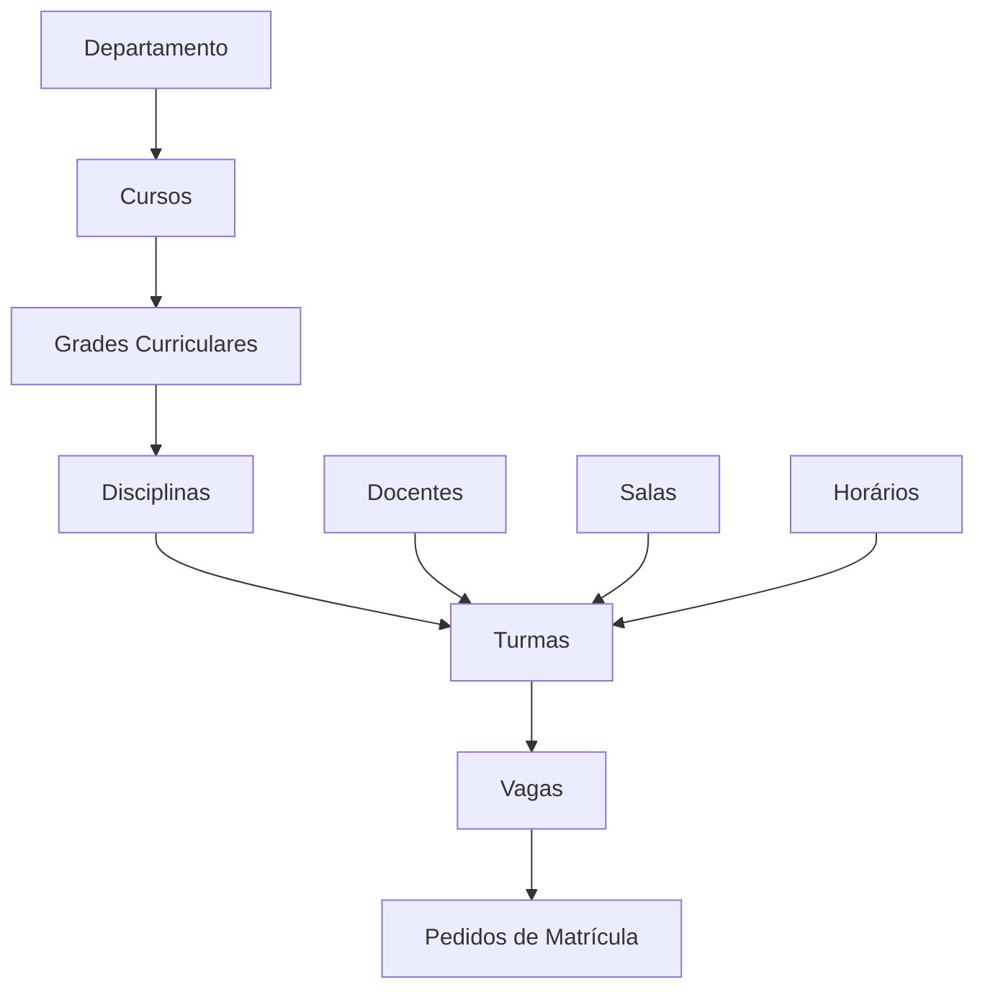
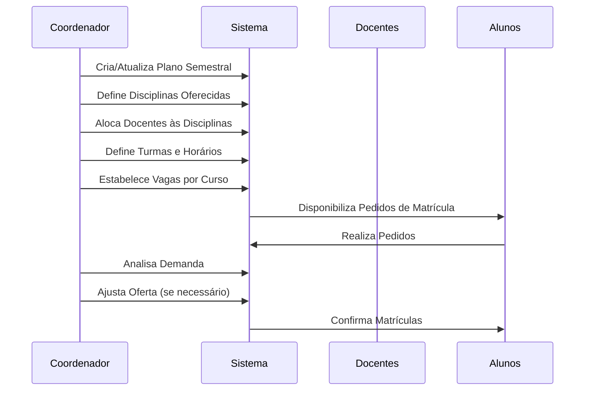
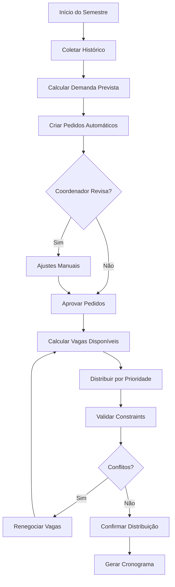
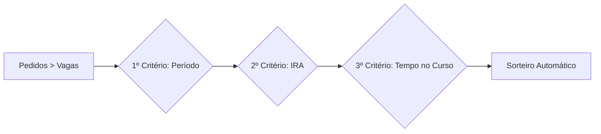

# 📊 Regras de Negócio - Sistema Plano Departamental

## 📋 Sumário

- [📋 Sumário](#-sumário)
- [🎯 Visão Geral](#-visão-geral)
- [🏛️ Domínio Acadêmico](#-domínio-acadêmico)
- [📚 Entidades Principais](#-entidades-principais)
  - [🎓 Curso](#-curso)
  - [📖 Disciplina](#-disciplina)
  - [👨‍🏫 Docente](#-docente)
  - [🏫 Turma](#-turma)
  - [📝 Pedido de Matrícula](#-pedido-de-matrícula)
  - [🎯 Vaga](#-vaga)
  - [📋 Grade Curricular](#-grade-curricular)
  - [📊 Plano Departamental](#-plano-departamental)
- [🔄 Regras de Relacionamento](#-regras-de-relacionamento)
- [✅ Regras de Validação](#-regras-de-validação)
- [🔒 Regras de Acesso](#-regras-de-acesso)
- [📈 Regras de Negócio Complexas](#-regras-de-negócio-complexas)

---

## 🎯 Visão Geral

O Sistema Plano Departamental é projetado para gerenciar todo o ciclo de vida do planejamento acadêmico de um departamento universitário, desde a criação de cursos até a alocação de vagas e controle de matrículas.

### 🎨 Características do Domínio

- **Período Acadêmico**: Sistema trabalha com semestres
- **Hierarquia**: Departamento → Cursos → Disciplinas → Turmas
- **Matrícula**: Baseada em pedidos e disponibilidade de vagas
- **Planejamento**: Antecipado por semestre letivo

---

## 🏛️ Domínio Acadêmico

### 🗂️ Estrutura Organizacional



### 📊 Fluxo de Planejamento



---

## 📚 Entidades Principais

### 🎓 Curso

**Definição**: Representa um curso de graduação ou pós-graduação oferecido pelo departamento.

#### 📋 Estrutura de Dados

```javascript
Curso {
  id: Integer (PK, Auto-increment)
  nome: String (Obrigatório, Único após normalização)
  codigo: String (Obrigatório, Único)
  turno: String (Obrigatório)
  semestreInicial: Integer (Opcional, padrão: 0)
  alunosEntrada: Integer (Entrada 1º semestre)
  alunosEntrada2: Integer (Entrada 2º semestre)
  posicao: Integer (Ordenação)
}
```

#### 🔧 Regras de Negócio

1. **RN-C001 - Unicidade de Nome**:
   - O nome do curso deve ser único no sistema
   - Normalização: conversão para MAIÚSCULAS antes da validação

2. **RN-C002 - Unicidade de Código**:
   - O código do curso deve ser único
   - Formato: geralmente 3-4 caracteres (ex: "COMP", "MAT")
   - Normalização: conversão para MAIÚSCULAS

3. **RN-C003 - Turno Obrigatório**:
   - Todo curso deve ter um turno definido
   - Valores típicos: "MATUTINO", "VESPERTINO", "NOTURNO", "INTEGRAL"

4. **RN-C004 - Entrada de Alunos**:
   - `alunosEntrada`: número de vagas para entrada no 1º semestre
   - `alunosEntrada2`: número de vagas para entrada no 2º semestre
   - Valores podem ser 0 (sem entrada neste semestre)

5. **RN-C005 - Relacionamentos Protegidos**:
   - Curso com grades curriculares não pode ser excluído (`RESTRICT`)
   - Curso com turmas ativas não pode ser excluído (`RESTRICT`)

#### 🔄 Relacionamentos

- **1:N** com Grade Curricular (um curso possui várias grades)
- **N:M** com Turma através de Vaga (cursos podem ter vagas em turmas)
- **N:M** com Turma através de Pedido (alunos de cursos fazem pedidos em turmas)

### 📖 Disciplina

**Definição**: Representa uma disciplina que pode ser oferecida pelo departamento.

#### 📋 Estrutura de Dados

```javascript
Disciplina {
  id: Integer (PK, Auto-increment)
  nome: String (Obrigatório)
  codigo: String (Obrigatório)
  cargaTeorica: Float (Obrigatório)
  cargaPratica: Float (Obrigatório)
  ead: Integer (Boolean - 0/1)
  laboratorio: Integer (Boolean - 0/1)
  departamento: Integer (Padrão: 1)
}
```

#### 🔧 Regras de Negócio

1. **RN-D001 - Normalização**:
   - Nome e código convertidos para MAIÚSCULAS
   - Padronização para evitar duplicatas

2. **RN-D002 - Carga Horária**:
   - `cargaTeorica` + `cargaPratica` = carga horária total
   - Ambos valores são obrigatórios (podem ser 0.0)
   - Formato decimal para permitir frações de hora

3. **RN-D003 - Modalidades**:
   - `ead`: indica se a disciplina possui componente EAD
   - `laboratorio`: indica se requer laboratório
   - Valores: 0 (não) ou 1 (sim)

4. **RN-D004 - Departamento**:
   - Toda disciplina pertence a um departamento
   - Valor padrão: 1 (departamento principal)

5. **RN-D005 - Proteção de Exclusão**:
   - Disciplina com turmas não pode ser excluída (`RESTRICT`)
   - Disciplina em grade curricular não pode ser excluída (`RESTRICT`)

#### 🔄 Relacionamentos

- **1:N** com Turma (disciplina pode ter várias turmas)
- **N:M** com Grade através de DisciplinaGrade
- **N:M** with Docente através de DocenteDisciplina (competência)

### 👨‍🏫 Docente

**Definição**: Representa um professor que pode lecionar disciplinas.

#### 📋 Estrutura de Dados

```javascript
Docente {
  id: Integer (PK, Auto-increment)
  nome: String (Obrigatório)
  apelido: String (Obrigatório)
  nomesiga: String (Nome no sistema SIGA)
  creditos: Integer (Carga horária disponível)
  ativo: Boolean (Padrão: true)
}
```

#### 🔧 Regras de Negócio

1. **RN-DOC001 - Normalização**:
   - `nome` e `apelido` convertidos para MAIÚSCULAS
   - Padronização para relatórios e consultas

2. **RN-DOC002 - Sistema SIGA**:
   - `nomesiga`: nome usado no sistema oficial da universidade
   - Usado para integração e relatórios oficiais

3. **RN-DOC003 - Carga Horária**:
   - `creditos`: representa a carga horária total disponível
   - Usado para controle de alocação em turmas
   - Valor em créditos (1 crédito = 15 horas/semestre)

4. **RN-DOC004 - Status Ativo**:
   - Docentes inativos não podem ser alocados a novas turmas
   - Mantidos no sistema para histórico

5. **RN-DOC005 - Alocação em Turmas**:
   - Um docente pode estar em até 2 posições por turma (Docente1, Docente2)
   - Permite co-docência ou divisão de responsabilidades

#### 🔄 Relacionamentos

- **1:N** com Turma (docente principal - Docente1)
- **1:N** com Turma (docente auxiliar - Docente2)
- **1:N** com CargaPos (carga horária pós-graduação)
- **N:M** com Disciplina através de DocenteDisciplina (competência)

### 🏫 Turma

**Definição**: Representa uma oferta específica de disciplina em um período letivo.

#### 📋 Estrutura de Dados

```javascript
Turma {
  id: Integer (PK, Auto-increment)
  periodo: Integer (Período/semestre da disciplina na grade)
  letra: String (Identificador da turma - A, B, C...)
  turno1: String (Turno principal)
  turno2: String (Turno secundário - opcional)

  // Foreign Keys
  Disciplina: Integer (FK -> Disciplina.id)
  Docente1: Integer (FK -> Docente.id - principal)
  Docente2: Integer (FK -> Docente.id - auxiliar)
  Plano: Integer (FK -> Plano.id)
  Sala: Integer (FK -> Sala.id)
  Horario: Integer (FK -> Horario.id)
}
```

#### 🔧 Regras de Negócio

1. **RN-T001 - Unicidade**:
   - Índice único: `[letra, periodo, Disciplina, Plano]`
   - Não pode haver duas turmas iguais no mesmo plano

2. **RN-T002 - Identificação**:
   - `letra`: identificador visual da turma (A, B, C, D...)
   - Normalizado para MAIÚSCULAS
   - Usado em relatórios e cronogramas

3. **RN-T003 - Período**:
   - `periodo`: indica em qual período da grade a disciplina é oferecida
   - Valores típicos: 1, 2, 3... (semestres do curso)
   - Pode ser NULL para disciplinas optativas

4. **RN-T004 - Turnos**:
   - `turno1`: turno principal da turma
   - `turno2`: turno secundário (para disciplinas que ocupam 2 turnos)
   - Valores: "MATUTINO", "VESPERTINO", "NOTURNO"

5. **RN-T005 - Docentes**:
   - `Docente1`: professor principal (obrigatório)
   - `Docente2`: professor auxiliar (opcional)
   - Permite co-docência e divisão de responsabilidades

6. **RN-T006 - Dependências**:
   - Toda turma deve estar associada a uma disciplina
   - Toda turma deve estar associada a um plano departamental
   - Sala e horário são opcionais (podem ser definidos posteriormente)

#### 🔄 Relacionamentos

- **N:1** com Disciplina (muitas turmas para uma disciplina)
- **N:1** com Docente (professor principal)
- **N:1** com Docente (professor auxiliar)
- **N:1** com Plano (plano departamental)
- **N:M** com Curso através de Vaga (turmas oferecidas para cursos)
- **N:M** com Curso através de Pedido (pedidos de matrícula)

### 📝 Pedido de Matrícula

**Definição**: Representa a demanda de um curso específico por vagas em uma turma.

#### 📋 Estrutura de Dados

```javascript
Pedido {
  id: Integer (PK, Auto-increment)
  vagasPeriodizadas: Integer (Vagas para alunos no período correto)
  vagasNaoPeriodizadas: Integer (Vagas para alunos fora do período)
  editado1: Boolean (Indica se foi editado pelo coordenador)
  editado2: Boolean (Indica segunda edição)

  // Foreign Keys (através de associação N:M)
  Turma: Integer (FK -> Turma.id)
  Curso: Integer (FK -> Curso.id)
}
```

#### 🔧 Regras de Negócio

1. **RN-P001 - Tipos de Vagas**:
   - `vagasPeriodizadas`: alunos cursando no período "normal"
   - `vagasNaoPeriodizadas`: alunos em recuperação, adiantados, etc.
   - Ambos valores obrigatórios (podem ser 0)

2. **RN-P002 - Controle de Edições**:
   - `editado1`/`editado2`: rastreiam modificações manuais
   - Usado para auditoria e controle de alterações
   - Sistema vs. edições manuais do coordenador

3. **RN-P003 - Relacionamento Obrigatório**:
   - Todo pedido deve especificar uma turma e um curso
   - Representa demanda específica: "Curso X quer Y vagas na Turma Z"

4. **RN-P004 - Ciclo de Vida**:
   - Criado automaticamente com base em matrículas anteriores
   - Pode ser ajustado manualmente pelo coordenador
   - Usado para dimensionar oferta de vagas

5. **RN-P005 - Exclusão em Cascata**:
   - Se turma é excluída, pedidos são removidos automaticamente
   - Se curso é excluído, pedidos são removidos automaticamente

#### 🔄 Relacionamentos

- **N:M** entre Turma e Curso (tabela de junção)
- Permite que um curso faça pedidos em múltiplas turmas
- Permite que uma turma receba pedidos de múltiplos cursos

### 🎯 Vaga

**Definição**: Representa a oferta de vagas de uma turma para um curso específico.

#### 📋 Estrutura de Dados

```javascript
Vaga {
  id: Integer (PK, Auto-increment)
  numero: Integer (Quantidade de vagas oferecidas)

  // Foreign Keys (através de associação N:M)
  Turma: Integer (FK -> Turma.id)
  Curso: Integer (FK -> Curso.id)
}
```

#### 🔧 Regras de Negócio

1. **RN-V001 - Quantidade Obrigatória**:
   - `numero`: deve ser um valor inteiro não negativo
   - Representa exatamente quantos alunos podem se matricular

2. **RN-V002 - Balanceamento Oferta/Demanda**:
   - Vagas são criadas com base nos pedidos
   - Coordenador pode ajustar conforme capacidade da turma

3. **RN-V003 - Relacionamento Único**:
   - Uma vaga representa oferta específica: "Turma X oferece Y vagas para Curso Z"
   - Combinação Turma+Curso deve ser única (via constraint)

4. **RN-V004 - Proteção de Dados**:
   - Se turma é excluída, vagas são removidas (`RESTRICT`)
   - Se curso é excluído, vagas são removidas (`RESTRICT`)

#### 🔄 Relacionamentos

- **N:M** entre Turma e Curso (tabela de junção)
- Complementar à tabela Pedido (oferta vs. demanda)

### 📋 Grade Curricular

**Definição**: Define a estrutura curricular de um curso, organizando disciplinas por períodos.

#### 📋 Estrutura de Dados

```javascript
Grade {
  id: Integer (PK, Auto-increment)
  nome: String (Nome/identificação da grade)
  periodos: Integer (Número total de períodos)
  ativa: Boolean (Grade ativa/inativa)

  // Foreign Key
  Curso: Integer (FK -> Curso.id)
}

DisciplinaGrade {
  id: Integer (PK, Auto-increment)
  periodo: Integer (Período em que a disciplina é oferecida)
  obrigatoria: Boolean (Disciplina obrigatória/optativa)

  // Foreign Keys
  Grade: Integer (FK -> Grade.id)
  Disciplina: Integer (FK -> Disciplina.id)
}
```

#### 🔧 Regras de Negócio

1. **RN-G001 - Grade Ativa**:
   - Apenas uma grade por curso pode estar ativa
   - Grades inativas são mantidas para histórico

2. **RN-G002 - Período Válido**:
   - Disciplinas devem estar em períodos válidos (1 até `periodos`)
   - Período 0 pode ser usado para disciplinas optativas

3. **RN-G003 - Tipo de Disciplina**:
   - `obrigatoria`: define se a disciplina é obrigatória ou optativa
   - Afeta cálculo de carga horária e formatura

4. **RN-G004 - Proteção de Exclusão**:
   - Grade com disciplinas não pode ser excluída (`RESTRICT`)
   - Disciplina em grade não pode ser removida sem verificação

#### 🔄 Relacionamentos

- **N:1** com Curso (uma grade pertence a um curso)
- **N:M** com Disciplina através de DisciplinaGrade

### 📊 Plano Departamental

**Definição**: Representa o planejamento semestral do departamento, agrupando todas as turmas oferecidas.

#### 📋 Estrutura de Dados

```javascript
Plano {
  id: Integer (PK, Auto-increment)
  nome: String (Nome do semestre - ex: "2024/1")
  ano: Integer (Ano letivo)
  semestre: Integer (1 ou 2)
  ativo: Boolean (Plano ativo/inativo)
  observacoes: Text (Observações gerais)
}
```

#### 🔧 Regras de Negócio

1. **RN-PL001 - Plano Ativo Único**:
   - Apenas um plano pode estar ativo por vez
   - Plano ativo é usado para operações correntes

2. **RN-PL002 - Identificação Semestral**:
   - Combinação `ano`/`semestre` deve ser única
   - Nome normalmente segue padrão "AAAA/S" (ex: "2024/1")

3. **RN-PL003 - Ciclo de Vida**:
   - Criado antes do início do período de matrículas
   - Turmas são associadas ao plano durante criação
   - Histórico preservado após encerramento

#### 🔄 Relacionamentos

- **1:N** com Turma (plano contém várias turmas)
- Ponto central de organização temporal do sistema

---

## 🔄 Regras de Relacionamento

### 📊 Matriz de Relacionamentos

| Entidade 1 | Relacionamento | Entidade 2 | Cardinalidade | Constraint |
|------------|---------------|------------|---------------|------------|
| Curso | tem | Grade | 1:N | RESTRICT |
| Grade | contém | Disciplina | N:M | RESTRICT |
| Disciplina | oferecida em | Turma | 1:N | RESTRICT |
| Docente | leciona | Turma | 1:N | RESTRICT |
| Turma | pertence a | Plano | N:1 | CASCADE |
| Curso | pede vagas em | Turma | N:M (Pedido) | CASCADE |
| Turma | oferece vagas para | Curso | N:M (Vaga) | RESTRICT |
| Docente | competente em | Disciplina | N:M | RESTRICT |

### 🔒 Políticas de Integridade

#### CASCADE (Exclusão em Cascata)
- **Plano → Turma**: Quando um plano é excluído, suas turmas são removidas
- **Turma → Pedido**: Quando turma é excluída, pedidos associados são removidos

#### RESTRICT (Proteção de Exclusão)
- **Curso → Grade**: Curso com grades não pode ser excluído
- **Disciplina → Turma**: Disciplina com turmas não pode ser excluída
- **Docente → Turma**: Docente alocado não pode ser excluído

---

## ✅ Regras de Validação

### 📝 Validações de Entrada

#### Curso
```javascript
{
  nome: {
    required: true,
    minLength: 3,
    maxLength: 100,
    unique: true
  },
  codigo: {
    required: true,
    pattern: /^[A-Z]{3,4}$/,
    unique: true
  },
  turno: {
    required: true,
    enum: ['MATUTINO', 'VESPERTINO', 'NOTURNO', 'INTEGRAL']
  }
}
```

#### Disciplina
```javascript
{
  cargaTeorica: {
    required: true,
    min: 0,
    max: 120
  },
  cargaPratica: {
    required: true,
    min: 0,
    max: 120
  },
  ead: {
    enum: [0, 1]
  },
  laboratorio: {
    enum: [0, 1]
  }
}
```

#### Docente
```javascript
{
  creditos: {
    required: true,
    min: 0,
    max: 40
  },
  nome: {
    required: true,
    minLength: 3,
    maxLength: 100
  }
}
```

### 🔍 Validações de Negócio

1. **VN-001 - Carga Horária Docente**:
   - Soma das cargas horárias das turmas não pode exceder créditos disponíveis
   - Verificação antes da alocação

2. **VN-002 - Conflito de Horários**:
   - Docente não pode estar em duas turmas no mesmo horário
   - Validação automática no agendamento

3. **VN-003 - Capacidade da Sala**:
   - Total de vagas não pode exceder capacidade da sala
   - Verificação antes da criação de vagas

4. **VN-004 - Período Letivo**:
   - Turmas só podem ser criadas para planos ativos
   - Validação temporal

---

## 🔒 Regras de Acesso

### 👥 Perfis de Usuário

#### Administrador
- **Acesso Total**: Todas as funcionalidades
- **Gestão de Usuários**: Criar, editar, excluir usuários
- **Configuração**: Parâmetros do sistema
- **Backup/Restore**: Operações de manutenção

#### Coordenador
- **Planejamento**: Criar e gerenciar planos departamentais
- **Turmas**: Criar, editar, alocar docentes
- **Vagas**: Definir ofertas por curso
- **Relatórios**: Gerar relatórios gerenciais
- **Aprovação**: Validar pedidos especiais

#### Secretário
- **Consulta**: Visualizar planos e turmas
- **Pedidos**: Gerenciar pedidos de matrícula
- **Relatórios**: Gerar relatórios operacionais
- **Cadastros Básicos**: Manter dados de alunos

#### Docente
- **Consulta**: Ver suas turmas e horários
- **Acompanhamento**: Status das disciplinas
- **Relatórios**: Gerar listas de presença

### 🛡️ Controle de Acesso

```javascript
const permissions = {
  'admin': ['*'],
  'coordenador': [
    'planos:create', 'planos:read', 'planos:update', 'planos:delete',
    'turmas:create', 'turmas:read', 'turmas:update', 'turmas:delete',
    'vagas:create', 'vagas:read', 'vagas:update', 'vagas:delete',
    'docentes:read', 'docentes:update',
    'cursos:read', 'disciplinas:read',
    'relatorios:generate'
  ],
  'secretario': [
    'planos:read', 'turmas:read', 'vagas:read',
    'pedidos:create', 'pedidos:read', 'pedidos:update',
    'relatorios:generate'
  ],
  'docente': [
    'turmas:read', 'planos:read',
    'relatorios:own'
  ]
}
```

---

## 📈 Regras de Negócio Complexas

### 🎯 Algoritmo de Distribuição de Vagas



### 📊 Cálculo de Demanda

**Fórmula Base:**
```
DemandaPrevista = (MatrículasSemestre-1 × 0.7) + (MatrículasSemestre-2 × 0.2) + (MatrículasSemestre-3 × 0.1)
```

**Fatores de Ajuste:**
- **Sazonalidade**: +10% para disciplinas do 1º semestre
- **Reprovação**: +15% para disciplinas com alta taxa de reprovação
- **Eletivas**: -20% para disciplinas optativas
- **Pré-requisitos**: Considerar aprovação em disciplinas anteriores

### 🔄 Processo de Matrícula

#### Fases da Matrícula

1. **Fase 1 - Alunos Periodizados** (Prioridade Alta)
   - Alunos cursando no período "normal"
   - 70% das vagas reservadas

2. **Fase 2 - Alunos Não-Periodizados** (Prioridade Média)
   - Alunos em recuperação ou adiantados
   - 20% das vagas reservadas

3. **Fase 3 - Vagas Remanescentes** (Prioridade Baixa)
   - Alunos de outros cursos
   - 10% das vagas ou sobras das fases anteriores

#### Critérios de Desempate



1. **Período do Curso**: Alunos no período correto têm prioridade
2. **IRA (Índice de Rendimento Acadêmico)**: Maior IRA, maior prioridade
3. **Tempo no Curso**: Mais tempo no curso, maior prioridade
4. **Sorteio**: Critério final para casos empatados

### 🧮 Cálculo de Carga Horária Docente

#### Regras de Contabilização

```javascript
function calcularCargaHoraria(docente, turmas) {
  let cargaTotal = 0;

  turmas.forEach(turma => {
    const disciplina = turma.Disciplina;
    const cargaDisciplina = disciplina.cargaTeorica + disciplina.cargaPratica;

    // Docente principal recebe 100% da carga
    if (turma.Docente1 === docente.id) {
      cargaTotal += cargaDisciplina;
    }

    // Docente auxiliar recebe 50% da carga
    if (turma.Docente2 === docente.id) {
      cargaTotal += cargaDisciplina * 0.5;
    }
  });

  return cargaTotal;
}
```

#### Limites e Restrições

- **Máximo por Semestre**: 20 créditos (300 horas)
- **Mínimo por Semestre**: 8 créditos (120 horas)
- **Sobrecarga**: Até 4 créditos extras com autorização
- **Co-docência**: Carga dividida proporcionalmente

### 📅 Geração de Cronograma

#### Algoritmo de Alocação de Horários

```python
def alocarHorarios(turmas, salas, horarios):
    conflitos = []
    alocacoes = {}

    # Ordenar turmas por prioridade
    turmas_ordenadas = sorted(turmas, key=lambda t: (
        t.disciplina.obrigatoria,  # Obrigatórias primeiro
        -t.total_vagas,            # Mais vagas primeiro
        t.periodo                  # Períodos iniciais primeiro
    ))

    for turma in turmas_ordenadas:
        melhor_horario = None
        menor_conflito = float('inf')

        for horario in horarios:
            conflito_atual = calcularConflito(turma, horario, alocacoes)

            if conflito_atual < menor_conflito:
                menor_conflito = conflito_atual
                melhor_horario = horario

        if melhor_horario and menor_conflito == 0:
            alocacoes[turma.id] = melhor_horario
        else:
            conflitos.append({
                'turma': turma,
                'conflito': menor_conflito
            })

    return alocacoes, conflitos
```

#### Critérios de Prioridade

1. **Disciplinas Obrigatórias** > Optativas
2. **Maior Número de Vagas** > Menor número
3. **Períodos Iniciais** > Períodos avançados
4. **Docentes com Menor Flexibilidade** > Maior flexibilidade

### 📊 Relatórios e Análises

#### Relatório de Ocupação

```sql
SELECT
    c.nome AS curso,
    COUNT(DISTINCT t.id) AS turmas_oferecidas,
    SUM(v.numero) AS total_vagas,
    AVG(v.numero) AS media_vagas_turma,
    (SUM(v.numero) / c.alunosEntrada) * 100 AS taxa_atendimento
FROM Curso c
JOIN Vaga v ON v.Curso = c.id
JOIN Turma t ON v.Turma = t.id
JOIN Plano p ON t.Plano = p.id
WHERE p.ativo = 1
GROUP BY c.id, c.nome
ORDER BY taxa_atendimento DESC;
```

#### Análise de Demanda vs Oferta

```sql
SELECT
    d.nome AS disciplina,
    SUM(ped.vagasPeriodizadas + ped.vagasNaoPeriodizadas) AS demanda_total,
    SUM(v.numero) AS oferta_total,
    (SUM(v.numero) / SUM(ped.vagasPeriodizadas + ped.vagasNaoPeriodizadas)) AS taxa_atendimento,
    CASE
        WHEN SUM(v.numero) < SUM(ped.vagasPeriodizadas + ped.vagasNaoPeriodizadas)
        THEN 'DEFICIT'
        ELSE 'SUPERAVIT'
    END AS status
FROM Disciplina d
JOIN Turma t ON t.Disciplina = d.id
JOIN Pedido ped ON ped.Turma = t.id
JOIN Vaga v ON v.Turma = t.id AND v.Curso = ped.Curso
JOIN Plano p ON t.Plano = p.id
WHERE p.ativo = 1
GROUP BY d.id, d.nome
ORDER BY taxa_atendimento ASC;
```

---

<div align="center">

### 🔄 Documento em Evolução

Este documento será atualizado conforme novas regras sejam identificadas ou modificadas no sistema.

**Última revisão**: *Data da geração do documento*

</div>