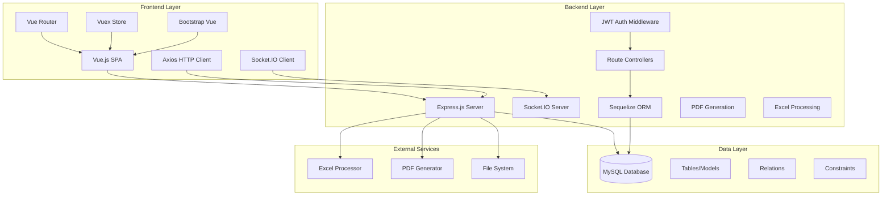
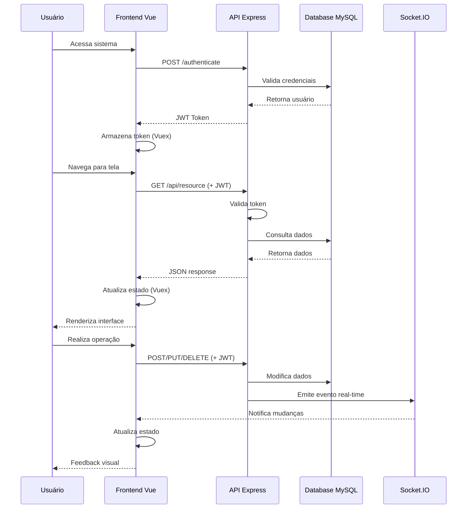
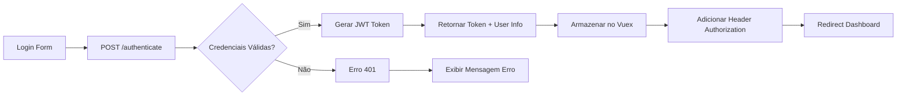

# 🏗️ Arquitetura do Sistema

## 📋 Sumário

- [📋 Sumário](#-sumário)
- [🎯 Visão Geral](#-visão-geral)
- [🏛️ Arquitetura de Alto Nível](#-arquitetura-de-alto-nível)
- [💻 Stack Tecnológico](#-stack-tecnológico)
  - [🖥️ Frontend](#-frontend)
  - [⚡ Backend](#-backend)
  - [🗄️ Banco de Dados](#-banco-de-dados)
  - [🔧 Ferramentas Auxiliares](#-ferramentas-auxiliares)
- [📁 Estrutura de Diretórios](#-estrutura-de-diretórios)
- [🔄 Fluxo de Dados](#-fluxo-de-dados)
- [🌐 Comunicação](#-comunicação)
- [⚠️ Pontos de Atenção e Melhorias](#-pontos-de-atenção-e-melhorias)

---

## 🎯 Visão Geral

O **Plano Departamental 2.0** é um sistema web full-stack desenvolvido com arquitetura **SPA (Single Page Application)** que segue o padrão **cliente-servidor** com **API RESTful**. O sistema é projetado para gerenciar o planejamento acadêmico de departamentos universitários.

### 🎨 Características Arquiteturais

- **Arquitetura**: Monolítica com separação clara entre frontend e backend
- **Padrão**: MVC (Model-View-Controller) no backend
- **Comunicação**: REST API + WebSockets (Socket.IO)
- **Banco de Dados**: Relacional (MySQL) com ORM Sequelize
- **Autenticação**: JWT (JSON Web Tokens)

---

## 🏛️ Arquitetura de Alto Nível



---

## 💻 Stack Tecnológico

### 🖥️ Frontend

| Tecnologia | Versão | Propósito |
|------------|--------|-----------|
| **Vue.js** | v2.5.13 | Framework principal SPA |
| **Vue Router** | v3.0.1 | Roteamento client-side |
| **Vuex** | v3.1.1 | Gerenciamento de estado |
| **Bootstrap Vue** | v2.20.1 | Componentes UI responsivos |
| **Axios** | v0.18.0 | Cliente HTTP para API |
| **Socket.IO Client** | v2.1.0 | WebSocket para tempo real |
| **Vuelidate** | v0.7.6 | Validação de formulários |
| **Day.js** | v1.8.35 | Manipulação de datas |
| **PDFMake** | v0.2.5 | Geração de PDFs no cliente |
| **XLSX** | v0.14.1 | Processamento de planilhas |

**Estrutura do Frontend:**
```
plano-front/
├── src/
│   ├── components/        # Componentes reutilizáveis
│   ├── views/            # Páginas/telas do sistema
│   ├── router/           # Configuração de rotas
│   ├── store/            # Vuex store modules
│   ├── services/         # Serviços (API calls)
│   ├── mixins/           # Mixins compartilhados
│   └── assets/           # Recursos estáticos
├── public/               # Arquivos públicos
└── dist/                 # Build de produção
```

### ⚡ Backend

| Tecnologia | Versão | Propósito |
|------------|--------|-----------|
| **Node.js** | v12+ | Runtime JavaScript |
| **Express.js** | v4.16.3 | Framework web |
| **Sequelize** | v4.37.6 | ORM para MySQL |
| **MySQL2** | v1.5.3 | Driver MySQL |
| **Socket.IO** | v2.1.0 | WebSocket server |
| **Express JWT** | v5.3.1 | Middleware de autenticação |
| **JsonWebToken** | v8.2.1 | Geração/validação JWT |
| **PDFMake** | v0.1.56 | Geração de relatórios PDF |
| **XLSX** | v0.14.1 | Import/Export Excel |
| **Lodash** | v4.17.11 | Utilitários JavaScript |
| **Password Hash** | v1.2.2 | Hash de senhas |
| **CORS** | v2.8.4 | Cross-Origin Resource Sharing |

**Estrutura do Backend:**
```
plano-back/
├── routes/               # Controladores de rotas
├── models/               # Modelos Sequelize
├── library/              # Bibliotecas auxiliares
├── config/               # Configurações
├── bin/                  # Scripts de inicialização
└── public/               # Arquivos públicos servidos
```

### 🗄️ Banco de Dados

| Componente | Tecnologia | Descrição |
|------------|------------|-----------|
| **SGBD** | MySQL 5.7+ | Sistema de gerenciamento |
| **ORM** | Sequelize v4 | Mapeamento objeto-relacional |
| **Migrations** | Sequelize CLI | Controle de versão do schema |
| **Conexão** | Connection Pool | Pool de conexões otimizado |

**Características do Schema:**
- **27 tabelas principais** para entidades acadêmicas
- **Relacionamentos complexos** entre cursos, disciplinas, docentes
- **Constraints de integridade** rigorosas
- **Índices otimizados** para consultas frequentes

### 🔧 Ferramentas Auxiliares

| Ferramenta | Uso | Configuração |
|------------|-----|--------------|
| **Morgan** | Logging HTTP | Middleware Express |
| **Body Parser** | Parsing requisições | JSON/URL encoded |
| **CORS** | Cross-origin requests | Configurado para desenvolvimento |
| **History API** | SPA routing | Fallback para Vue Router |
| **JSZip** | Compressão arquivos | Backup e downloads |
| **MySQLDump** | Backup banco | Exports automáticos |

---

## 📁 Estrutura de Diretórios

### 🎯 Estrutura Completa

```
Plano-Departamental-2.0/
├── 📁 plano-front/                    # Frontend Vue.js
│   ├── 📁 src/
│   │   ├── 📁 components/             # Componentes Vue reutilizáveis
│   │   │   ├── 📄 ModalDelete.vue     # Modal de confirmação
│   │   │   ├── 📄 ModalAjuda.vue      # Modal de ajuda
│   │   │   └── 📄 Loading.vue         # Componente loading
│   │   ├── 📁 views/                  # Páginas principais
│   │   │   ├── 📄 Home.vue            # Dashboard principal
│   │   │   ├── 📄 Planos.vue          # Gestão de planos
│   │   │   ├── 📄 Cursos.vue          # CRUD de cursos
│   │   │   ├── 📄 Disciplinas.vue     # CRUD de disciplinas
│   │   │   ├── 📄 Docentes.vue        # CRUD de docentes
│   │   │   └── 📄 Relatorios.vue      # Geração de relatórios
│   │   ├── 📁 router/
│   │   │   └── 📄 index.js            # Configuração de rotas
│   │   ├── 📁 store/
│   │   │   └── 📄 index.js            # Vuex store principal
│   │   ├── 📁 services/
│   │   │   ├── 📄 axios.js            # Configuração HTTP client
│   │   │   └── 📄 api.js              # Endpoints da API
│   │   └── 📄 socketInstance.js       # Socket.IO client
│   ├── 📁 public/                     # Arquivos estáticos
│   ├── 📄 package.json               # Dependências frontend
│   └── 📄 vue.config.js              # Configuração Vue CLI
├── 📁 plano-back/                     # Backend Express.js
│   ├── 📁 routes/                     # Controllers REST
│   │   ├── 📄 authenticate.js         # Login/logout
│   │   ├── 📄 curso.js               # CRUD cursos
│   │   ├── 📄 disciplina.js          # CRUD disciplinas
│   │   ├── 📄 docente.js             # CRUD docentes
│   │   ├── 📄 plano.js               # Gestão de planos
│   │   ├── 📄 pedido.js              # Pedidos de matrícula
│   │   ├── 📄 turma.js               # Gestão de turmas
│   │   ├── 📄 grade.js               # Grades curriculares
│   │   ├── 📄 vaga.js                # Controle de vagas
│   │   ├── 📄 pdfs.js                # Geração PDFs
│   │   └── 📄 xlsx.js                # Import/Export Excel
│   ├── 📁 models/                     # Modelos Sequelize
│   │   ├── 📄 index.js               # Configuração ORM
│   │   ├── 📄 Curso.js               # Modelo Curso
│   │   ├── 📄 Disciplina.js          # Modelo Disciplina
│   │   ├── 📄 Docente.js             # Modelo Docente
│   │   ├── 📄 Turma.js               # Modelo Turma
│   │   ├── 📄 Grade.js               # Modelo Grade
│   │   ├── 📄 Pedido.js              # Modelo Pedido
│   │   ├── 📄 Vaga.js                # Modelo Vaga
│   │   └── 📄 Usuario.js             # Modelo Usuario
│   ├── 📁 library/                    # Bibliotecas auxiliares
│   │   ├── 📄 socketIO.js            # Configuração WebSocket
│   │   ├── 📄 pdfs.js                # Utils geração PDF
│   │   ├── 📄 createFiles.js         # Utils arquivos
│   │   ├── 📄 ValidationError.js     # Tratamento erros
│   │   └── 📄 CustomError.js         # Erros customizados
│   ├── 📁 config/                     # Configurações
│   │   ├── 📄 config.json            # Config banco de dados
│   │   └── 📄 index.js               # Config geral
│   ├── 📄 app.js                     # Aplicação Express
│   └── 📄 package.json               # Dependências backend
├── 📁 Acessar o servidor/             # Documentação acesso
├── 📁 Informações úteis/              # Documentação adicional
├── 📁 Video sobre o projeto/          # Material multimídia
└── 📄 README.md                      # Documentação raiz
```

---

## 🔄 Fluxo de Dados

### 📊 Fluxo Principal



### 🔒 Fluxo de Autenticação



---

## 🌐 Comunicação

### 🔌 APIs e Endpoints

**Padrão REST:**
- `GET /api/resource` - Listagem
- `GET /api/resource/:id` - Detalhes
- `POST /api/resource` - Criação
- `PUT /api/resource/:id` - Atualização
- `DELETE /api/resource/:id` - Exclusão

**Principais Endpoints:**

| Método | Endpoint | Descrição |
|--------|----------|-----------|
| POST | `/authenticate` | Login de usuário |
| GET | `/api/cursos` | Listar cursos |
| GET | `/api/disciplinas` | Listar disciplinas |
| GET | `/api/docentes` | Listar docentes |
| GET | `/api/planos` | Listar planos departamentais |
| POST | `/api/pedidos` | Criar pedido de matrícula |
| GET | `/api/turmas` | Listar turmas |
| POST | `/api/pdfs/plano` | Gerar PDF do plano |
| POST | `/api/xlsx/export` | Exportar dados Excel |

### ⚡ WebSocket (Socket.IO)

**Eventos Emitidos pelo Servidor:**
- `turmaCreated` - Nova turma criada
- `turmaUpdated` - Turma atualizada
- `turmaDeleted` - Turma excluída
- `pedidoCreated` - Novo pedido criado
- `planoUpdated` - Plano modificado

**Uso:**
```javascript
// Cliente Vue.js
this.$socket.on('turmaCreated', (turma) => {
  this.$store.commit('ADD_TURMA', turma)
})

// Servidor Express
io.emit('turmaCreated', novaTurma)
```

---

## ⚠️ Pontos de Atenção e Melhorias

### 🚨 Problemas Identificados

#### 🔒 Segurança
- **❌ Falta de validação de entrada** em alguns endpoints
- **❌ JWT sem refresh token** (tokens de longa duração)
- **❌ Senhas em hash MD5** (algoritmo inseguro)
- **❌ CORS configurado para "*"** em produção
- **❌ Logs sensíveis** podem vazar informações

#### 🧪 Qualidade de Código
- **❌ Ausência de testes unitários**
- **❌ Ausência de testes de integração**
- **❌ Ausência de testes E2E**
- **❌ Linting inconsistente**
- **❌ Documentação de código limitada**

#### 🚀 Performance
- **❌ Consultas N+1** em alguns relacionamentos
- **❌ Falta de cache** em consultas frequentes
- **❌ Bundle frontend não otimizado**
- **❌ Imagens não otimizadas**

#### 🔧 Manutenibilidade
- **❌ Dependências desatualizadas**
- **❌ Padrões de commit inconsistentes**
- **❌ Falta de pipeline CI/CD**
- **❌ Ambiente de staging não configurado**

### ✅ Melhorias Recomendadas

#### 🛡️ Segurança
- **Implementar validação robusta** com Joi ou Yup
- **Migrar para bcrypt** para hash de senhas
- **Configurar refresh tokens JWT**
- **Restringir CORS** para domínios específicos
- **Implementar rate limiting**
- **Adicionar helmet.js** para headers de segurança
- **Configurar HTTPS** obrigatório

#### 📊 Monitoramento
- **Implementar logging estruturado** (Winston + ELK)
- **Métricas de performance** (Prometheus)
- **Monitoramento de uptime**
- **Alertas automatizados**
- **Health checks** nos endpoints

#### 🧪 Testes
- **Cobertura mínima 80%** de testes unitários
- **Testes de integração** para APIs críticas
- **Testes E2E** com Cypress
- **Testes de performance** com Artillery
- **Testes de segurança** com OWASP ZAP

#### 🚀 DevOps
- **Pipeline CI/CD** (GitHub Actions/GitLab CI)
- **Docker containers** para deployment
- **Infrastructure as Code** (Terraform)
- **Ambientes isolados** (dev/staging/prod)
- **Backup automatizado** do banco
- **Rollback automático** em falhas

#### 📈 Performance
- **Implementar Redis** para cache
- **Otimizar queries** com EXPLAIN
- **Lazy loading** no frontend
- **Code splitting** no Vue.js
- **CDN** para assets estáticos
- **Compressão gzip/brotli**

---

### 🎯 Roadmap de Modernização

#### Fase 1 - Estabilização (1-2 meses)
- [ ] Atualizar dependências críticas
- [ ] Implementar testes básicos
- [ ] Configurar linting e prettier
- [ ] Melhorias de segurança básicas

#### Fase 2 - Qualidade (2-3 meses)
- [ ] Suite completa de testes
- [ ] Pipeline CI/CD
- [ ] Monitoramento e logging
- [ ] Documentação técnica

#### Fase 3 - Performance (1-2 meses)
- [ ] Otimizações de banco
- [ ] Implementar cache
- [ ] Otimizar frontend
- [ ] Load testing

#### Fase 4 - Escalabilidade (3-4 meses)
- [ ] Containerização
- [ ] Microserviços (se necessário)
- [ ] Auto-scaling
- [ ] Multi-região

---

<div align="center">

**📝 Documento vivo - Atualizado constantemente pela equipe de desenvolvimento**

</div>